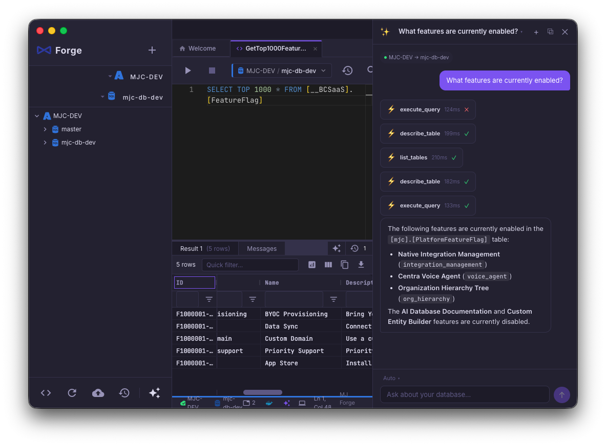

<p align="center">
  
</p>

<h1 align="center">MJ Forge</h1>

<p align="center">
  <strong>An AI-native SQL IDE for SQL Server, PostgreSQL, and MySQL — on macOS & Windows</strong>
</p>

<p align="center">
  Query · Explore · Visualize · Chat with your data<br>
  The database tool that thinks alongside you.
</p>

<p align="center">
  <a href="https://github.com/MemberJunction/Forge/releases/latest"><strong>⬇️ Download Latest Release</strong></a>
</p>

<p align="center">
  <a href="#features">Features</a> •
  <a href="#ai-assistant">AI Assistant</a> •
  <a href="#download">Download</a> •
  <a href="#screenshots">Screenshots</a> •
  <a href="#why-mj-forge">Why MJ Forge?</a> •
  <a href="#contributing">Contributing</a>
</p>

<p align="center">
  
  
  
  
  
</p>

---

## What is MJ Forge?

MJ Forge is a desktop database IDE with a built-in AI assistant that can query your data, explain schemas, generate SQL, and execute actions — all through natural conversation. It speaks **SQL Server**, **PostgreSQL**, and **MySQL** natively, with engine-aware tools, dialect-aware SQL conversion, and unified workflows across all three.

Think of it as **SSMS / pgAdmin / Workbench meets Cursor** — a multi-engine database management environment where AI understands your schema and can take action.

---

## Features

### Multi-Engine, One Workflow

MJ Forge speaks three database dialects fluently:

- **SQL Server** (2017+, including Azure SQL Database)
- **PostgreSQL** (12+)
- **MySQL** (5.7+ / 8.0+)

Every feature works across all three engines: query execution, object explorer, ERD, backup/restore, AI tools, and execution plans. SQL is generated per-engine via a dialect abstraction, and `@memberjunction/sqlglot-ts` powers cross-dialect conversion when you need it.

### Connectivity That Just Works

- **SSH tunneling** for any database — with auto-reconnect after idle disconnects
- **Microsoft Entra ID auth** for Azure SQL Database (interactive flow + token caching)
- **Docker auto-detection** — finds local SQL Server, PostgreSQL, and MySQL containers and understands their volume mounts
- **Per-tab connection context** — each query tab tracks the connection it was opened against, so you never run a query in the wrong place
- **macOS Keychain / Windows Credential Store** for credentials — never plaintext

### AI Chat Assistant

An agentic AI that doesn't just answer questions — it acts. The assistant has access to your database schema and can:

- **Query your data** — ask in plain English, get results instantly
- **Read your active editor** — the AI sees what you're currently writing and can refine it
- **Create and modify databases** — with confirmation before destructive operations
- **Explain schemas** — understand relationships, indexes, and constraints across any engine
- **Generate engine-aware SQL** — knows the dialect of the active connection
- **Open query tabs** — with auto-execute, so you see results immediately
- **Navigate your database** — switch databases, open settings, all from chat

The AI uses an **agentic tool-calling loop** — it can chain multiple operations, reason over intermediate results, and synthesize a final answer. Destructive operations (DROP, DELETE, CREATE) require explicit user confirmation.

**Bring your own keys** — works with Google Gemini, Anthropic Claude, OpenAI, Groq, and Cerebras.

### Multi-Tab Query Editor

- **Monaco editor** with full SQL syntax highlighting per engine
- **Engine-aware execution** — each tab carries its own connection context
- **Multiple result sets** in a virtualized AG Grid (handles 100K+ rows)
- **Find & Replace** across your queries
- **Query history** — every execution saved, searchable, re-runnable
- **Export results** — CSV, JSON, clipboard (with hardened SAVE_TO_FILE IPC)
- **Copy-as-JSON** for one-click structured paste into other tools
- **Flyway / Skyway placeholder detection** — prompts for values before executing parameterized migration scripts
- **Tab management** — pin, rename, duplicate, reorder via drag & drop

### Visual Execution Plans

See exactly what the optimizer is doing — across **all three engines**. SQL Server's XML showplan, PostgreSQL's `EXPLAIN (FORMAT JSON, ANALYZE)`, and MySQL's `EXPLAIN FORMAT=JSON` are all rendered as an interactive visual tree with cost annotations.

### Interactive ERD Visualization

- **Visual schema explorer** — see table relationships at a glance
- **Theme-aware** — adapts to dark and light modes
- **Double-click to query** — click any table to open a SELECT query
- **Focus depth** — zoom into specific table neighborhoods

### Object Explorer

- **Engine-aware tree** — databases, schemas, tables, views, stored procedures, functions
- **Lazy-loaded** — expands on demand, handles large catalogs
- **Devicon brand icons** — instantly tell which engine a connection is
- **Column details** — types, nullability, keys, defaults
- **Quick actions** — script objects, view definitions

### Database Operations

- **Create / Rename / Delete** databases with safety confirmations
- **Backup**:
  - SQL Server — native streaming backup with compression
  - PostgreSQL — `pg_dump` / `pg_restore` with format options
  - MySQL — `mysqldump` (skip-opt by default for permission-friendly dumps, with GTID handling)
- **Restore** with file relocation wizard (SQL Server)
- **SQL transparency** — every operation shows the exact SQL/command being executed

### Professional UX

- **Dark + light themes** — designed for long sessions, follows system preference
- **Resizable, collapsible sidebar** — preference persisted across sessions
- **Resizable chat panel** — width persisted across sessions
- **Connection color coding** — visually distinguish Dev / Staging / Prod
- **Status bar engine icon** — always know which engine you're on
- **Keyboard shortcuts** — Cmd+Enter to execute, Cmd+N for new tab, and more
- **GoldenLayout tabs** — split, stack, and rearrange your workspace

---

## AI Assistant

The AI assistant is the heart of MJ Forge. Here's what a typical interaction looks like:

**You:** "Show me the top 10 customers by total order value"

**AI:** _Calls `list_tables` → finds Customers and Orders → calls `execute_query` with a JOIN and SUM (in the dialect of the active connection) → presents results in a formatted table → opens a query tab with the SQL for you to modify_

**You:** "Help me clean up the WHERE clause I'm writing"

**AI:** _Calls `read_editor_content` → sees your active query → suggests improvements grounded in your actual SQL_

### Available Tools

The AI has access to these tools — each one is schema-aware and engine-aware:

| Tool                                                      | Description                                        |
| --------------------------------------------------------- | -------------------------------------------------- |
| `execute_query`                                           | Run any SQL query and analyze results              |
| `execute_ddl`                                             | Execute DDL with explicit confirmation             |
| `list_databases`                                          | Show all databases on the server                   |
| `list_tables`                                             | Show tables with row counts and sizes              |
| `describe_table`                                          | Column details, keys, nullability                  |
| `get_object_definition`                                   | Full DDL for a table, view, procedure, or function |
| `get_table_indexes` / `get_foreign_keys`                  | Constraint and index introspection                 |
| `get_table_row_count`                                     | Fast row count                                     |
| `list_views` / `list_stored_procedures`                   | Object listings                                    |
| `get_server_info`                                         | Engine, version, edition, encoding                 |
| `read_editor_content` / `search_editor_content`           | See and search the user's active query tab         |
| `create_database` / `rename_database` / `delete_database` | Lifecycle operations (require confirmation)        |
| `open_query_tab`                                          | Open a new query tab, optionally auto-execute      |
| `navigate_to_database`                                    | Switch the active database                         |
| `open_settings`                                           | Open app settings                                  |

### Multi-Provider Support

| Provider      | Models                      | Streaming | Tool Calling |
| ------------- | --------------------------- | --------- | ------------ |
| Google Gemini | Gemini 2.5 Pro, Flash, etc. | ✅        | ✅           |
| Anthropic     | Claude 4, 3.5 Sonnet, etc.  | ✅        | ✅           |
| OpenAI        | GPT-4o, GPT-4, etc.         | ✅        | ✅           |
| Groq          | Llama, Mixtral (ultra-fast) | ✅        | ✅           |
| Cerebras      | Llama (ultra-fast)          | ✅        | ✅           |

---

## Download

<p align="center">
  <a href="https://github.com/MemberJunction/Forge/releases/latest">
    
  </a>
</p>

### macOS

| Chip          | Installer                                                               | Portable                                                        |
| ------------- | ----------------------------------------------------------------------- | --------------------------------------------------------------- |
| Apple Silicon | [MJ Forge.dmg](https://github.com/MemberJunction/Forge/releases/latest) | [.zip](https://github.com/MemberJunction/Forge/releases/latest) |
| Intel         | [MJ Forge.dmg](https://github.com/MemberJunction/Forge/releases/latest) | [.zip](https://github.com/MemberJunction/Forge/releases/latest) |

### Windows

| Architecture   | Installer                                                                     | Portable                                                        |
| -------------- | ----------------------------------------------------------------------------- | --------------------------------------------------------------- |
| x64 (most PCs) | [MJ Forge Setup.exe](https://github.com/MemberJunction/Forge/releases/latest) | [.zip](https://github.com/MemberJunction/Forge/releases/latest) |
| ARM64          | [MJ Forge Setup.exe](https://github.com/MemberJunction/Forge/releases/latest) | [.zip](https://github.com/MemberJunction/Forge/releases/latest) |

All downloads available on the **[Releases page](https://github.com/MemberJunction/Forge/releases/latest)**.

> **macOS:** On first launch, right-click → Open to bypass Gatekeeper (not yet notarized).
>
> **Windows:** If SmartScreen warns you, click "More info" → "Run anyway" (not yet code-signed).

### Requirements

- **macOS** 13 (Ventura) or later — Apple Silicon or Intel
- **Windows** 10/11 — x64 or ARM64
- One or more database engines:
  - **SQL Server** 2017+ (local Docker, remote, or Azure SQL with SQL or Entra ID auth)
  - **PostgreSQL** 12+
  - **MySQL** 5.7+ / 8.0+
- **Docker** (optional) — for local containers (auto-detected)

---

## Screenshots



_The AI assistant chains `list_tables` → `describe_table` → `execute_query` tool calls and synthesizes a grounded answer about feature flags, alongside the query editor and results grid._

<!--
  TODO before merge: capture light-mode pair as ai-assistant-light.png and switch to:
  
  
  Additional shots planned: multi-engine sidebar, ERD, visual execution plan, object explorer expanded.
-->

---

## Why MJ Forge?

| Feature                               | MJ Forge | Azure Data Studio | TablePlus | DBeaver | DataGrip |
| ------------------------------------- | :------: | :---------------: | :-------: | :-----: | :------: |
| macOS + Windows                       |    ✅    |        ✅         |    ✅     |   ✅    |    ✅    |
| MSSQL + Postgres + MySQL              |    ✅    |      partial      |    ✅     |   ✅    |    ✅    |
| Engine-aware AI Chat                  |    ✅    |        ❌         |    ❌     |   ❌    |    ❌    |
| Agentic Tool Calling                  |    ✅    |        ❌         |    ❌     |   ❌    |    ❌    |
| Multi-LLM Provider                    |    ✅    |        ❌         |    ❌     |   ❌    |    ❌    |
| AI sees active editor                 |    ✅    |        ❌         |    ❌     |   ❌    |    ❌    |
| SSH tunneling w/ auto-reconnect       |    ✅    |      partial      |    ✅     |   ✅    |    ✅    |
| Entra ID auth (Azure SQL)             |    ✅    |        ✅         |    ❌     | partial |    ✅    |
| Visual execution plan (all 3 engines) |    ✅    |      partial      |    ❌     | partial |    ✅    |
| Backup & Restore (per engine)         |    ✅    |      partial      |    ❌     | partial | partial  |
| Docker container detection            |    ✅    |        ❌         |    ❌     |   ❌    |    ❌    |
| ERD Visualization                     |    ✅    |        ❌         |    ✅     |   ✅    |    ✅    |
| Keychain / Credential Store           |    ✅    |      partial      |    ✅     | partial |    ✅    |
| Open Source                           |    ✅    |        ✅         |    ❌     |   ✅    |    ❌    |

---

## Quick Start

### From Release

1. Download the installer for your platform from [Releases](https://github.com/MemberJunction/Forge/releases/latest)
2. Install and launch MJ Forge
3. Click **"Detect Docker Containers"** or **"Add Connection"**
4. Pick your engine (SQL Server / PostgreSQL / MySQL) and start querying

### From Source

```bash
git clone https://github.com/MemberJunction/Forge.git
cd Forge
npm install
npm run dev          # Development mode with hot reload
```

### Build Installers

```bash
npm run package:mac  # Build macOS DMG (arm64 + x64)
npm run package      # Build for current platform
```

Windows builds are produced automatically by [GitHub Actions](.github/workflows/build-release.yml) on every tagged release.

### Set Up AI

1. Open Settings (gear icon or Cmd+,)
2. Navigate to the AI tab
3. Enter an API key for any supported provider
4. Open the AI chat panel (✨ icon in the sidebar)

---

## Tech Stack

| Layer              | Technology                                                        |
| ------------------ | ----------------------------------------------------------------- |
| Desktop Shell      | Electron 41                                                       |
| UI Framework       | Angular 18 (standalone components, signals)                       |
| State Management   | Angular signals + RxJS                                            |
| SQL Connectivity   | `mssql` (SQL Server, TDS), `pg` (PostgreSQL), `mysql2` (MySQL)    |
| Dialect Conversion | `@memberjunction/sqlglot-ts`                                      |
| Auth               | SQL auth, Windows auth, Microsoft Entra ID (`@azure/msal-node`)   |
| AI Abstraction     | Multi-provider LLM layer (Gemini, Claude, OpenAI, Groq, Cerebras) |
| Query Editor       | Monaco editor                                                     |
| Results Grid       | AG Grid                                                           |
| ERD                | D3.js                                                             |
| Tab Layout         | GoldenLayout                                                      |
| SSH Tunneling      | `ssh2` (with idle-reconnect)                                      |
| Credential Storage | macOS Keychain / Windows Credential Store (`keytar`)              |
| Docker Integration | `dockerode`                                                       |
| Build System       | Turborepo + electron-builder                                      |
| Test Runner        | Vitest                                                            |
| CI/CD              | GitHub Actions                                                    |

---

## Architecture

```
┌─────────────────────────────────────────────────────┐
│                    Electron Shell                    │
├──────────────────┬───────────────────────────────────┤
│   Main Process   │         Renderer Process          │
│                  │                                   │
│  ┌────────────┐  │  ┌──────────────────────────────┐ │
│  │ SQL Layer  │  │  │     Angular 18 Application   │ │
│  │ ┌────────┐ │  │  │                              │ │
│  │ │MSSQL   │ │  │  │  ┌──────────┐ ┌────────────┐ │ │
│  │ │Postgres│ │  │  │  │  Query   │ │   AI Chat  │ │ │
│  │ │MySQL   │ │  │  │  │  Editor  │ │   Panel    │ │ │
│  │ └────────┘ │  │  │  ├──────────┤ ├────────────┤ │ │
│  │ Dialect +  │  │  │  │  Object  │ │    ERD     │ │ │
│  │  Provider  │  │  │  │ Explorer │ │ Visualizer │ │ │
│  ├────────────┤  │  │  ├──────────┤ ├────────────┤ │ │
│  │ AI Service │◄─┼──┤  │ Per-tab  │ │ Execution  │ │ │
│  │(LLM Layer) │  │  │  │ Conn ctx │ │   Plan     │ │ │
│  ├────────────┤  │  │  └──────────┘ └────────────┘ │ │
│  │ SSH Tunnel │  │  │                              │ │
│  │  Manager   │  │  └──────────────────────────────┘ │
│  ├────────────┤  │                                   │
│  │  Docker    │  │                                   │
│  │ Detection  │  │                                   │
│  ├────────────┤  │                                   │
│  │  Keychain  │  │                                   │
│  │  Storage   │  │                                   │
│  └────────────┘  │                                   │
├──────────────────┴───────────────────────────────────┤
│              IPC Bridge (Typed Channels)             │
└──────────────────────────────────────────────────────┘
```

### Project Structure

```
mj-forge/
├── packages/
│   ├── main/              # Electron main process
│   │   └── src/
│   │       ├── ipc/       # IPC handler registration
│   │       └── services/
│   │           ├── ai/    # LLM providers, chat service, tool registry
│   │           ├── sql/   # Multi-engine SQL: dialect/, provider/, pool routing
│   │           ├── ssh/   # SSH tunnel manager (idle reconnect)
│   │           ├── docker/# Container detection
│   │           ├── keychain/ # Credential storage
│   │           └── config/# App state persistence
│   ├── renderer/          # Angular application
│   │   └── src/app/
│   │       ├── core/      # Singleton services, state (signals)
│   │       ├── features/  # Chat, ERD, query, explorer, exec-plan, welcome
│   │       ├── shared/    # Settings dialog, reusable components
│   │       └── layout/    # Shell, sidebar, GoldenLayout container
│   ├── shared/            # Types shared between main & renderer
│   │   └── src/
│   │       ├── types/     # TypeScript interfaces
│   │       └── config/    # ai-vendors.json
│   └── preload/           # Electron context bridge
├── .github/workflows/     # CI/CD (build on tag push)
├── scripts/               # Build helpers
├── resources/             # App icons
└── plans/                 # Design documents
```

---

## Roadmap

### v0.1–0.3 — Foundation ✅

- [x] Connection management with Keychain storage
- [x] Docker container auto-detection
- [x] Object explorer (databases, tables, views, procedures, functions)
- [x] Multi-tab query editor with results grid
- [x] Create / Rename / Delete database
- [x] Backup with streaming progress
- [x] Restore with file relocation wizard
- [x] Dark + light themes with connection color coding
- [x] Tab context menu, pinning, keyboard shortcuts
- [x] Query history, find & replace, export
- [x] ERD visualization
- [x] AI chat with agentic tool calling
- [x] Multi-provider LLM support (5 providers)
- [x] Resizable, persistent chat panel
- [x] Resizable, collapsible sidebar
- [x] Windows + macOS builds via GitHub Actions

### v0.4 — Multi-Engine, Auth, and Reach ✅

- [x] PostgreSQL support (query, explorer, backup/restore, exec plan)
- [x] MySQL support (query, explorer, backup/restore, exec plan)
- [x] SSH tunneling with idle auto-reconnect
- [x] Microsoft Entra ID auth for Azure SQL
- [x] Visual execution plan tree across all engines
- [x] Per-tab connection context
- [x] AI sees active editor contents
- [x] SQL dialect conversion via `@memberjunction/sqlglot-ts`
- [x] Flyway / Skyway placeholder detection
- [x] Test suite migrated to Vitest, CI coverage gates

### Coming Soon

- [ ] Schema-aware SQL autocomplete in the editor
- [ ] AI "Fix this error" — one-click error resolution
- [ ] Cmd+K command palette
- [ ] Query snippets and templates
- [ ] Global schema search
- [ ] Result set export to Excel

### Future

- [ ] Backup scheduling
- [ ] Schema scripting and diffing
- [ ] Connection groups and folders
- [ ] Plugin system
- [ ] Code signing & notarization

---

## Contributing

We welcome contributions! See [CONTRIBUTING.md](CONTRIBUTING.md) for setup instructions and guidelines.

### Quick Links

- **Report Bugs** — [Open an issue](https://github.com/MemberJunction/Forge/issues)
- **Request Features** — [Start a discussion](https://github.com/MemberJunction/Forge/discussions)
- **Submit PRs** — Fork, branch, and open a pull request

---

## Acknowledgments

MJ Forge is built by the team behind [MemberJunction](https://github.com/MemberJunction/MJ), the open-source metadata-driven application platform.

<p align="center">
  <a href="https://github.com/MemberJunction/MJ">
    
  </a>
</p>

---

## License

MIT License — see [LICENSE](LICENSE) for details.

---

<p align="center">
  Made with ❤️ for developers who work with relational databases
</p>

<p align="center">
  <a href="https://github.com/MemberJunction/Forge/stargazers">⭐ Star us on GitHub</a> ·
  <a href="https://github.com/MemberJunction/Forge/releases/latest">Download Latest Release</a>
</p>
