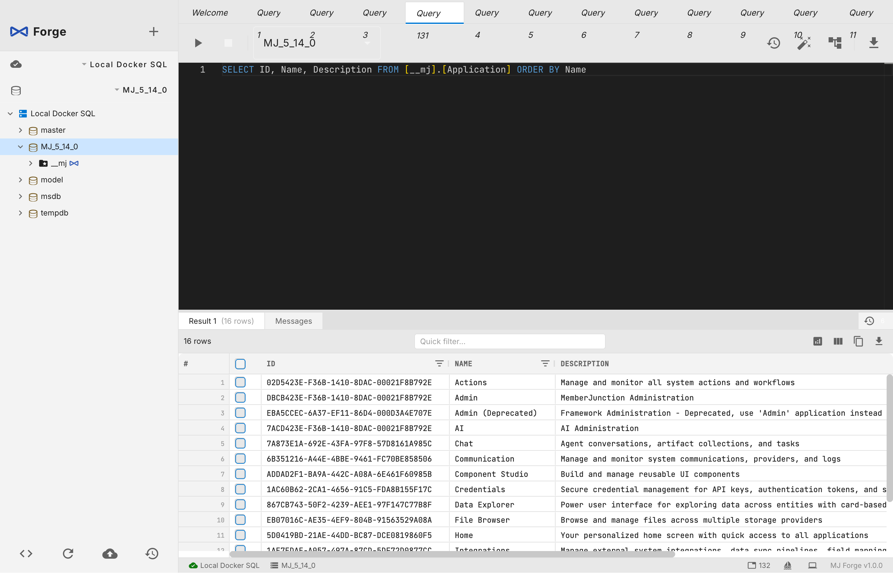
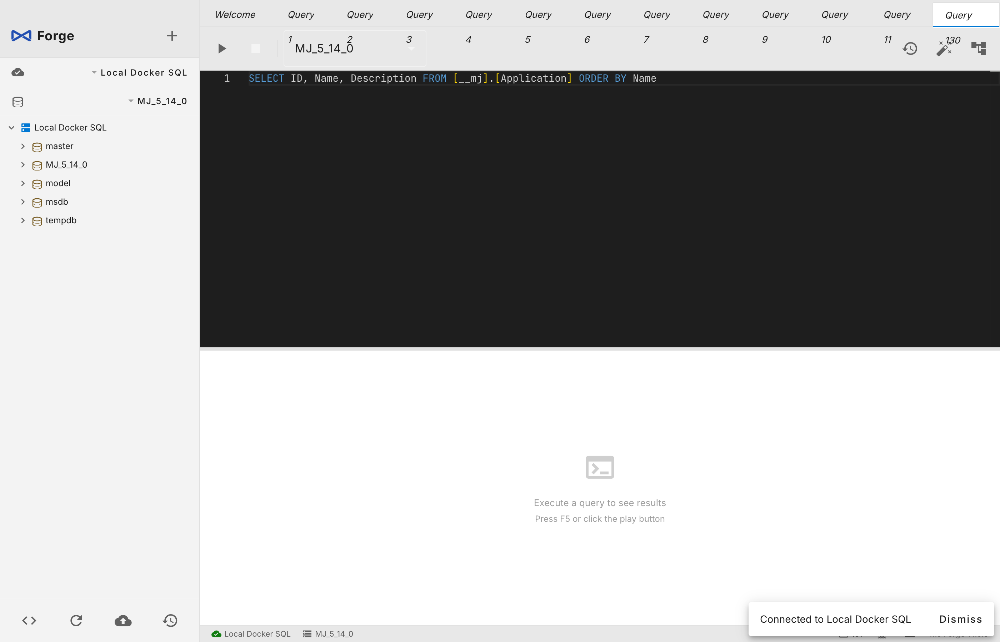

<p align="center">
  
</p>

<h1 align="center">MJ Forge</h1>

<p align="center">
  <strong>A powerful, AI-native SQL Server IDE for macOS & Windows</strong>
</p>

<p align="center">
  Query · Explore · Visualize · Chat with your data<br>
  The database tool that thinks alongside you.
</p>

<p align="center">
  <a href="https://github.com/MemberJunction/Forge/releases/latest"><strong>⬇️ Download Latest Release</strong></a>
</p>

<p align="center">
  <a href="#features">Features</a> •
  <a href="#ai-assistant">AI Assistant</a> •
  <a href="#download">Download</a> •
  <a href="#screenshots">Screenshots</a> •
  <a href="#why-mj-forge">Why MJ Forge?</a> •
  <a href="#contributing">Contributing</a>
</p>

<p align="center">
  
  
  
  
  
</p>

---

## What is MJ Forge?

MJ Forge is a desktop SQL Server IDE with a built-in AI assistant that can query your database, explain schemas, generate SQL, and execute actions — all through natural conversation. It combines the power of a professional database tool with the intelligence of modern LLMs.

Think of it as **SSMS meets Cursor** — a full-featured database management environment where AI understands your schema and can take action.

---

## Features

### AI Chat Assistant

An agentic AI that doesn't just answer questions — it acts. The assistant has access to your database schema and can:

- **Query your data** — ask in plain English, get results instantly
- **Create and modify databases** — with confirmation before destructive operations
- **Explain schemas** — understand relationships, indexes, and constraints
- **Generate SQL** — from natural language descriptions
- **Open query tabs** — with auto-execute, so you see results immediately
- **Navigate your database** — switch databases, open settings, all from chat

The AI uses an **agentic tool-calling loop** — it can chain multiple operations, reason over intermediate results, and synthesize a final answer. Destructive operations (DROP, DELETE, CREATE) require explicit user confirmation.

**Bring your own keys** — works with Google Gemini, Anthropic Claude, OpenAI, Groq, and Cerebras. Configure one or all.

### Multi-Tab Query Editor

- **Syntax highlighting** with full SQL Server keyword support
- **Multiple result sets** in a virtualized grid (handles 100K+ rows)
- **Find & Replace** across your queries
- **Query history** — every execution saved, searchable, re-runnable
- **Export** results to CSV, JSON, or clipboard
- **Auto-execute** — open a tab with SQL that runs immediately
- **Tab management** — pin, rename, duplicate, reorder via drag & drop

### Interactive ERD Visualization

- **Visual schema explorer** — see table relationships at a glance
- **Theme-aware** — adapts to dark and light modes
- **Double-click to query** — click any table to open a SELECT query
- **Focus depth** — zoom into specific table neighborhoods

### Object Explorer

- **Full tree navigation** — databases, tables, views, stored procedures, functions, schemas
- **Lazy-loaded** — expands on demand, handles large catalogs
- **Column details** — types, nullability, keys, defaults
- **Quick actions** — script objects, view definitions

### Docker-Aware Connections

MJ Forge automatically detects SQL Server containers running on your machine. It understands volume mounts so backup/restore paths just work.

### Database Operations

- **Create / Rename / Delete** databases with safety confirmations
- **Backup** with streaming progress, compression options
- **Restore** with file relocation wizard
- **T-SQL transparency** — every operation shows the exact SQL being executed

### Professional UX

- **Refined dark theme** — designed for long sessions
- **Resizable panels** — chat panel width persisted across sessions
- **Connection color coding** — visually distinguish Dev / Staging / Prod
- **Keyboard shortcuts** — Cmd+Enter to execute, Cmd+N for new tab, and more
- **GoldenLayout tabs** — split, stack, and rearrange your workspace
- **macOS Keychain** — credentials stored securely, never in plaintext

---

## AI Assistant

The AI assistant is the heart of MJ Forge. Here's what a typical interaction looks like:

**You:** "Show me the top 10 customers by total order value"

**AI:** *Calls `list_tables` → finds Customers and Orders → calls `execute_query` with a JOIN and SUM → presents results in a formatted table → opens a query tab with the SQL for you to modify*

**You:** "Create a backup of this database before I make changes"

**AI:** *Confirms the operation → triggers the backup dialog → reports progress*

### Available Tools

The AI has access to these tools, each with schema awareness:

| Tool | Description |
|------|-------------|
| `execute_query` | Run any SQL query and analyze results |
| `list_databases` | Show all databases on the server |
| `list_tables` | Show tables with row counts and sizes |
| `list_columns` | Show column details for any table |
| `get_table_schema` | Full DDL including indexes and constraints |
| `create_database` | Create a new database (requires confirmation) |
| `open_query_tab` | Open a new query tab, optionally auto-execute |
| `navigate_to_database` | Switch the active database |
| `open_settings` | Open app settings |

### Multi-Provider Support

| Provider | Models | Streaming | Tool Calling |
|----------|--------|-----------|--------------|
| Google Gemini | Gemini 2.5 Pro, Flash, etc. | ✅ | ✅ |
| Anthropic | Claude 4, 3.5 Sonnet, etc. | ✅ | ✅ |
| OpenAI | GPT-4o, GPT-4, etc. | ✅ | ✅ |
| Groq | Llama, Mixtral (ultra-fast) | ✅ | ✅ |
| Cerebras | Llama (ultra-fast) | ✅ | ✅ |

---

## Download

<p align="center">
  <a href="https://github.com/MemberJunction/Forge/releases/latest">
    
  </a>
</p>

### macOS

| Chip | Installer | Portable |
|------|-----------|----------|
| Apple Silicon (M1–M4) | [MJ Forge.dmg](https://github.com/MemberJunction/Forge/releases/latest) | [.zip](https://github.com/MemberJunction/Forge/releases/latest) |
| Intel | [MJ Forge.dmg](https://github.com/MemberJunction/Forge/releases/latest) | [.zip](https://github.com/MemberJunction/Forge/releases/latest) |

### Windows

| Architecture | Installer | Portable |
|-------------|-----------|----------|
| x64 (most PCs) | [MJ Forge Setup.exe](https://github.com/MemberJunction/Forge/releases/latest) | [.zip](https://github.com/MemberJunction/Forge/releases/latest) |
| ARM64 | [MJ Forge Setup.exe](https://github.com/MemberJunction/Forge/releases/latest) | [.zip](https://github.com/MemberJunction/Forge/releases/latest) |

All downloads available on the **[Releases page](https://github.com/MemberJunction/Forge/releases/latest)**.

> **macOS:** On first launch, right-click → Open to bypass Gatekeeper (not yet notarized).
>
> **Windows:** If SmartScreen warns you, click "More info" → "Run anyway" (not yet code-signed).

### Requirements

- **macOS** 13 (Ventura) or later — Apple Silicon or Intel
- **Windows** 10/11 — x64 or ARM64
- **SQL Server** 2017+ (local Docker, remote, or Azure SQL)
- **Docker** (optional) — for local SQL Server containers

---

## Screenshots

<p align="center">
  
  <br><em>Multi-tab query editor with results grid</em>
</p>

<p align="center">
  
  <br><em>Object explorer with database tree navigation</em>
</p>

---

## Why MJ Forge?

| Feature | MJ Forge | Azure Data Studio | TablePlus | SSMS |
|---------|:--------:|:-----------------:|:---------:|:----:|
| macOS + Windows | ✅ | ✅ | ✅ (Mac) | ❌ (Win) |
| AI Chat Assistant | ✅ | ❌ | ❌ | ❌ |
| Agentic Tool Calling | ✅ | ❌ | ❌ | ❌ |
| Multi-LLM Provider | ✅ | ❌ | ❌ | ❌ |
| Create/Rename/Delete DB | ✅ | ❌ | ❌ | ✅ |
| Backup & Restore | ✅ | ❌ | ❌ | ✅ |
| Docker Detection | ✅ | ❌ | ❌ | ❌ |
| ERD Visualization | ✅ | ❌ | ✅ | ✅ |
| T-SQL Transparency | ✅ | N/A | N/A | ❌ |
| Query History & Diff | ✅ | ❌ | ❌ | ❌ |
| Keychain Credentials | ✅ | ❌ | ✅ | N/A |
| Open Source | ✅ | ✅ | ❌ | ❌ |

---

## Quick Start

### From Release

1. Download the installer for your platform from [Releases](https://github.com/MemberJunction/Forge/releases/latest)
2. Install and launch MJ Forge
3. Click **"Detect Docker SQL Server"** or **"Add Connection"**
4. Start querying!

### From Source

```bash
git clone https://github.com/MemberJunction/Forge.git
cd Forge
npm install
npm run dev          # Development mode with hot reload
```

### Build Installers

```bash
npm run package:mac  # Build macOS DMG (arm64 + x64)
npm run package      # Build for current platform
```

Windows builds are produced automatically by [GitHub Actions](.github/workflows/build-release.yml) on every tagged release.

### Set Up AI

1. Open Settings (gear icon or Cmd+,)
2. Navigate to the AI tab
3. Enter an API key for any supported provider
4. Open the AI chat panel (✨ icon in the sidebar)

---

## Tech Stack

| Layer | Technology |
|-------|-----------|
| Desktop Shell | Electron 41 |
| UI Framework | Angular 18 (standalone components, signals) |
| State Management | Angular signals + RxJS |
| SQL Connectivity | node-mssql / tedious (TDS protocol) |
| AI Abstraction | Multi-provider LLM layer (Gemini, Claude, OpenAI, Groq, Cerebras) |
| Query Editor | CodeMirror 6 |
| Results Grid | AG Grid |
| ERD | D3.js |
| Tab Layout | GoldenLayout |
| Credential Storage | macOS Keychain (keytar) / Windows Credential Store |
| Docker Integration | dockerode |
| Build System | Turborepo + electron-builder |
| CI/CD | GitHub Actions |

---

## Architecture

```
┌─────────────────────────────────────────────────────┐
│                    Electron Shell                     │
├──────────────────┬──────────────────────────────────┤
│   Main Process   │         Renderer Process          │
│                  │                                    │
│  ┌────────────┐  │  ┌──────────────────────────────┐ │
│  │ SQL Service │  │  │     Angular 18 Application    │ │
│  │  (mssql)   │  │  │                                │ │
│  ├────────────┤  │  │  ┌──────────┐ ┌────────────┐  │ │
│  │ AI Service │◄─┼──┤  │  Query   │ │   AI Chat  │  │ │
│  │(LLM Layer) │  │  │  │  Editor  │ │   Panel    │  │ │
│  ├────────────┤  │  │  ├──────────┤ ├────────────┤  │ │
│  │  Docker    │  │  │  │  Object  │ │    ERD     │  │ │
│  │ Detection  │  │  │  │ Explorer │ │ Visualizer │  │ │
│  ├────────────┤  │  │  └──────────┘ └────────────┘  │ │
│  │  Keychain  │  │  │                                │ │
│  │  Storage   │  │  └──────────────────────────────┘ │
│  └────────────┘  │                                    │
├──────────────────┴──────────────────────────────────┤
│              IPC Bridge (Typed Channels)              │
└─────────────────────────────────────────────────────┘
```

### Project Structure

```
mj-forge/
├── packages/
│   ├── main/              # Electron main process
│   │   └── src/
│   │       ├── ipc/       # IPC handler registration
│   │       └── services/
│   │           ├── ai/    # LLM providers, chat service, tool registry
│   │           ├── sql/   # SQL Server operations
│   │           ├── docker/# Container detection
│   │           └── config/# App state persistence
│   ├── renderer/          # Angular application
│   │   └── src/app/
│   │       ├── core/      # Singleton services, state (signals)
│   │       ├── features/  # Chat, ERD, query, explorer, welcome
│   │       ├── shared/    # Settings dialog, reusable components
│   │       └── layout/    # Shell, sidebar, GoldenLayout container
│   ├── shared/            # Types shared between main & renderer
│   │   └── src/
│   │       ├── types/     # TypeScript interfaces
│   │       └── config/    # ai-vendors.json
│   └── preload/           # Electron context bridge
├── .github/workflows/     # CI/CD (build on tag push)
├── scripts/               # Build helpers
├── resources/             # App icons
└── plans/                 # Design documents
```

---

## Roadmap

### v0.1 — Foundation ✅

- [x] Connection management with Keychain storage
- [x] Docker SQL Server auto-detection
- [x] Object explorer (databases, tables, views, procedures, functions)
- [x] Multi-tab query editor with results grid
- [x] Create / Rename / Delete database
- [x] Backup with streaming progress
- [x] Restore with file relocation wizard
- [x] Dark theme with connection color coding
- [x] Tab context menu, pinning, keyboard shortcuts
- [x] Query history, find & replace, export
- [x] ERD visualization
- [x] AI chat with agentic tool calling
- [x] Multi-provider LLM support (5 providers)
- [x] Independent chat tab instances
- [x] Resizable, persistent chat panel
- [x] Windows + macOS builds via GitHub Actions

### v0.2 — Coming Soon

- [ ] Schema-aware SQL autocomplete in the editor
- [ ] AI "Fix this error" — one-click error resolution
- [ ] Cmd+K command palette
- [ ] Query snippets and templates
- [ ] Global schema search
- [ ] Result set export to Excel

### v1.0 — Future

- [ ] Azure AD / Entra ID authentication
- [ ] Backup scheduling
- [ ] Schema scripting and diffing
- [ ] Connection groups and folders
- [ ] Plugin system
- [ ] Light theme

---

## Contributing

We welcome contributions! See [CONTRIBUTING.md](CONTRIBUTING.md) for setup instructions and guidelines.

### Quick Links

- **Report Bugs** — [Open an issue](https://github.com/MemberJunction/Forge/issues)
- **Request Features** — [Start a discussion](https://github.com/MemberJunction/Forge/discussions)
- **Submit PRs** — Fork, branch, and open a pull request

---

## Acknowledgments

MJ Forge is built by the team behind [MemberJunction](https://github.com/MemberJunction/MJ), the open-source metadata-driven application platform.

<p align="center">
  <a href="https://github.com/MemberJunction/MJ">
    
  </a>
</p>

---

## License

MIT License — see [LICENSE](LICENSE) for details.

---

<p align="center">
  Made with ❤️ for developers who work with SQL Server
</p>

<p align="center">
  <a href="https://github.com/MemberJunction/Forge/stargazers">⭐ Star us on GitHub</a> ·
  <a href="https://github.com/MemberJunction/Forge/releases/latest">Download Latest Release</a>
</p>
