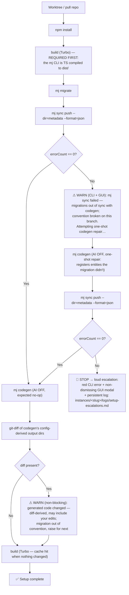

# MJ Dev — the setup / build loop (in-depth)

The authoritative, in-depth reference for how `mjdev setup <slug> all` (core MJ) and
`mjdev app setup <slug> <app>` (open app) bring a worktree to "ready." This is the **dev-agent**
doc (repo-only, not synced to `~/MJDev`); the agent-facing short version + the same diagram live in
`packages/orchestrator/docs/agent/DEV-LOOPS.md` §C. The **decision** (with the supersession history
and the resolution of every prior objection) is **ADR-009** in `mj-dev-manager-decisions.md` — read
that for _why we chose this_; read this for _how the flow works and what each signal means_.

---

## The flow

(For an **open app**, the early `build` node is skipped — the instance MJ is already built — and the
trailing `build` is the app's own `buildApp` over its workspace sub-packages.)

---

## Why this exact shape

### 1. Build **before** migrate (and again at the end)

The `mj` CLI is TypeScript compiled to `dist/`; `migrate`, `sync`, and `codegen` all shell
`node packages/MJCLI/bin/run.js …`, so the workspace **must be built first** or those commands don't
exist. That's why `build` leads. We then build **again at the end** because codegen may have
regenerated source. The trailing build is cheap: Turbo's `build` task is cached
(`turbo.json` `cache: true`, outputs `build/**`,`dist/**`), so a no-change second build is a "FULL
TURBO" cache hit (~100–500× cheaper than cold) — near-free insurance that compiled output matches
whatever codegen produced. Running build unconditionally last is correct _because_ it's cached.

### 2. Sync **before** codegen

`mj sync push` populates the DB's `__mj` metadata (entity-field values, reference/seed data).
Codegen **reads the DB** to regenerate code. If codegen ran against a DB whose metadata is stale, it
regenerates from the wrong source and **clobbers** committed generated files. Sync-first makes the DB
current before codegen reads it — structurally eliminating the stale-DB clobber that made ADR-007
keep codegen out of setup entirely.

### 3. Codegen as a **verification no-op**, with a one-shot **repair**

On a convention-compliant branch, entity registration + metadata already travel in the committed
migrations, so: sync succeeds with zero changes, and the trailing codegen regenerates **nothing**.
Codegen here is a _check_, not a _mutation_. The one place it does real work is the **repair branch**:
if sync fails because entities aren't registered (the pre-release / accounting case — a migration
that creates tables but no `__mj.Entity` rows), codegen scans the schema and registers them, then we
re-run sync. This repair runs **once**; a second failure is escalated (see §"Escalation").

### 4. `--format=json` — non-interactive, parseable, never hangs

`mj sync push` has three interactive prompts (validation-continue, deletion-confirm,
commit-on-errors). The original production incident was a sync hanging ~45 min on the validation y/N
with no stdin. `--format=json` sets the CLI's `nonInteractive` path (`nonInteractive = ci || !isText`),
so it **never prompts** (validation failure → immediate fail; commit-on-errors → suppressed) and it
emits a machine-readable `PushResult`. We branch on `errorCount` from that JSON — a deterministic
signal, not a guess. (Deletions auto-approve in this mode; that is accepted — deletions are normal
declarative reconciliation, and a constraint-violating delete fails the transactional push and rolls
back → lands on escalation. See ADR-009's "Deletions" note.)

### 5. AI ("Advanced Generation") **OFF** in the loop

Codegen's advanced-generation step makes 7 LLM calls (smart-field ID, form layout, entity
names/descriptions, check-constraint parsing, virtual-field decoration, transitive joins). It is **on
by default and not gated on an API key**, and a fresh instance treats every entity as "new" — so a
naive setup would burn tokens on **every** create. Because we create instances constantly (swarms),
all setup/repair/verify codegen runs with `advancedGeneration.enableAdvancedGeneration: false`
(instance: a root `.mjrc.cjs` overlay; app: a member-level overlay). **Instance creation is
token-free, deterministically** — not merely token-free by the accident of missing creds. The
enrichment is a separate, clearly-labeled opt-in (`mjdev codegen --ai` / `mjdev app codegen --ai` +
a GUI toggle, default off) that flips the switch on and restores it.

---

## What each surfaced signal means (and why)

| Signal                    | Where                                                        | Meaning                                                                                | Why it fires                                                                                                                                                                                                   | What to do                                                                                                                                                                            |
| ------------------------- | ------------------------------------------------------------ | -------------------------------------------------------------------------------------- | -------------------------------------------------------------------------------------------------------------------------------------------------------------------------------------------------------------- | ------------------------------------------------------------------------------------------------------------------------------------------------------------------------------------- |
| **(silent happy path)**   | —                                                            | Branch is convention-compliant: committed generated code matches committed migrations. | sync = 0 errors + 0 changes; codegen no-op; clean diff.                                                                                                                                                        | Nothing.                                                                                                                                                                              |
| **First-failure warning** | CLI + GUI (non-blocking)                                     | The migrations are out of sync with codegen on this branch — the convention is broken. | First `mj sync push` returned `errorCount > 0`. We then run a one-shot codegen repair.                                                                                                                         | Even if the repair succeeds, **raise it for `next`**: someone committed metadata without the matching migration, or an app hasn't baked entity registration into its migration yet.   |
| **Tripwire warning**      | CLI + GUI (non-blocking)                                     | Generated code drifted — codegen changed files that were supposed to already match.    | After the trailing codegen, a `git diff` of codegen's output dirs was non-empty.                                                                                                                               | Commit the regenerated code **and** its migration, or raise upstream. Note: the diff is **diff-derived** and may include _your own_ edits to generated files — read it before acting. |
| **Escalation**            | red CLI text + **non-dismissing** GUI modal + persistent log | A real problem the loop can't self-heal.                                               | `mj sync push` failed **again** after the one-shot codegen repair — i.e. not a registration gap codegen can fix (e.g. the `next` integration PK divergence / a `UQ_*` violation, a true DB-execution failure). | **Stop.** Copy the persistent log (`instances/<slug>/logs/setup-escalations.md`) into your report and/or raise it upstream. Do not loop.                                              |

### Why these signals are _reliable_ (not heuristic)

- **Sync outcome** comes from the parsed `PushResult.errorCount` — a number the CLI computed, not text we guessed.
- **Codegen no-op** is detected by **git-diff of codegen's output dirs**, because nothing else is
  trustworthy: `mj codegen --format=json` reports `entityCount` (total entities, not _changed_) with
  no changed-vs-no-op signal; the on-disk `~/.mj/codegen-state/run-*.json` counters are partial
  (`filesWritten` is dead code); and the auto-deleted-when-empty migration file is unreliable
  (RelatedEntityJoinFields base-view regen, custom-view refreshes, forced regen, and
  description-comment headers can leave a non-empty `CodeGen_Run_*.sql` with no real change). The
  output-dir set is read from the worktree's resolved codegen config
  (`configInfo.output[].directory` + `SQLOutput.folderPath`), so the tripwire **auto-adapts** when MJ
  adds a new generated folder; `**/generated/**` is only a backstop.

---

## Scope & the `next` consequence

The loop is identical for core MJ and open apps; the same convention applies to all MJ-interfacing
projects. Because we develop on `next` — where the integration metadata↔migration PK divergence is
not yet fixed upstream — a core `mj sync push` will, today, fail and land on the **escalation** path.
That is **expected and correct**: it surfaces a real upstream problem loudly and with the evidence
attached, instead of the old manual "ask the user first" gate (former TE-1, now removed). The upstream
fix is tracked in `mj-dev-manager-backlog.md` → "Upstream hand-offs".

---

## See also

- **ADR-009** (`mj-dev-manager-decisions.md`) — the decision, supersession of ADR-007, and the
  point-by-point resolution of every prior objection.
- **DEV-LOOPS.md §C** (agent docs) — the agent-facing short version + the same diagram.
- **mj-dev-manager-backlog.md** — deferred items (#62 sync-exclude; deletions-response planning) +
  the upstream hand-offs that drive the `next` escalations.
