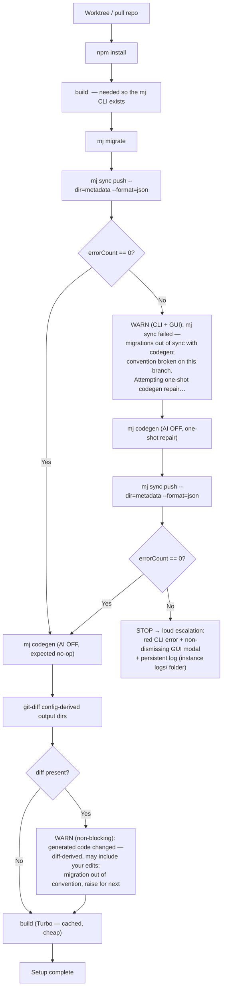

# Dev loops

Concrete edit→verify loops for the two kinds of work in this workspace. Both end
in the **dual CLI+GUI validation** from @.mjdev-docs/TEST-PROTOCOL.md.

## Keep the instance work logs current (every instance has them)

Each instance carries three agent-maintained files at its root
(`~/MJDev/instances/<slug>/`): **`TASKS.md`** (what you're actively doing here), **`BACKLOG.md`**
(wanted-but-not-started work), **`BUGS.md`** (bugs in the code you're developing here). The tool
auto-creates them and never clobbers them — **you keep them current as you work:**

- **TASKS.md** — add a task when you start it, update status (TODO → IN-PROGRESS → DONE) as it
  moves. **BACKLOG.md** — drop work you've identified but aren't doing yet; promote it to TASKS.md
  when you pick it up. **BUGS.md** — log bugs you find in the MJ/app code here (a suspected
  _mjdev-tool_ bug goes to `~/MJDev/MJDEV-ISSUES.md` instead).
- **Same convention as chat** (see ORCHESTRATION.md → "Reporting back"): a `<batch><letter>` id +
  short name + branch + this instance; reference a task by both id and name. For TASKS/BACKLOG
  entries also give **Target** (files/sections you'll change), **Goal**, and **Plan**. The entry
  templates are seeded at the top of each file.

## A. Developing MJ Dev Manager itself (the tool)

You're editing `packages/*` in the Forge repo (use the **dev worktree**, not the
human's running checkout).

```sh
npm run build            # affected packages (turbo)
npm test                 # orchestrator/shared/etc unit tests
npm run test:e2e         # seeded + exploratory + visual GUI specs
npm run dev:isolated     # relaunch the Electron app against ~/MJDev-dev / ~/.mjdev-dev
# commit (never push)
```

- Renderer/main or workflow changes → add/extend a **seeded GUI spec** that asserts
  the control is present AND does its job (presence + behavior).
- Engine semantics → unit + integration; only spin a live instance when a behavior
  can't be faked.
- No main-process hot-reload — build + relaunch is the loop (acceptable).

## B. Developing an open app (or MJ) INSIDE an instance

You're editing app/MJ source in `instances/<slug>/mj/...` (or the dev-linked app
member). **Order matters** on schema/data changes:

> **Linking the app first:** `mjdev app link <slug> <ref>` needs
> `--allow-double-underscore-schema` for first-party MJ apps whose manifest declares a
> reserved `__mj_*` schema (e.g. `bizapps-common`, `bizapps-accounting`) — without it the
> link fails at schema-create with `reserved for MJ internals`. Use `--ignore-version-range`
> to link an off-tag app onto a newer MJ. (Full flag list in CLI-REFERENCE.md.)
>
> ⚠ **Don't mix topologies in one instance:** keep an instance's apps **all dev-linked or all
> installed** — never some of each. Mixing very likely nests a second `@memberjunction/*` copy
> (installed app's published deps vs the dev-link workspace dedupe) → split class factory →
> silent registration failure. See SAFETY.md ("Don't mix dev-linked and installed apps").

```sh
# code-only change (server or client):
mjdev app build <slug> <app>           # rebuild the app's workspace sub-packages
mjdev run <slug> api                    # (restart api to pick up server dist; no HMR)

# schema change:
mjdev app migrate <slug> <app>          # apply new migration files
mjdev app codegen <slug> <app>          # regenerate entities/resolvers (AI off; add --ai to enrich)
mjdev app build <slug> <app>

# reference-data seed:
mjdev app sync <slug> <app>             # push metadata (e.g. currencies) — uses --format=json

# one-shot "bring to ready" — runs the full convention loop (see §C):
mjdev app setup <slug> <app>            # migrate -> sync -> [repair codegen] -> codegen -> diff -> build

# verify:
mjdev e2e <slug> --check apps           # app renders + GraphQL live
mjdev app list <slug>                    # per-app status: migrated/codegen/built/synced
```

- **Edit → see live:** server changes need a **rebuild + API restart** (plain `node`,
  no HMR). Client changes HMR off the rebuilt dist (`mjdev app watch-targets` prints
  the turbo watch filter).
- Per-app status (`mjdev app list`) tracks migrate/codegen/build/sync **independently**
  of instance-level `setup.*` flags — an instance can be "built" while a freshly-linked
  app still needs its own setup.
- Edited an already-applied migration? `mjdev app drift` detects checksum drift;
  `mjdev app reset-schema` (destructive) is the fix; `repair-schema` only realigns
  history rows and does NOT re-run SQL.

## C. The setup loop — how migrate / sync / codegen / build fit together (ADR-009)

`mjdev setup <slug> all` (instance core MJ) and `mjdev app setup <slug> <app>` (open app) both run
the **same convention-verification loop**. It is non-interactive, token-free, and never hangs:



**What each branch means for you:**

- **Happy path** (sync ok, codegen no-op, clean diff): the branch is convention-compliant — committed
  generated code matches committed migrations. Nothing to do.
- **First-failure warning** (sync failed once, repair attempted): migrations are out of sync with
  codegen on this branch — the convention is broken. Even if the repair then succeeds, **raise it for
  `next`** (someone committed metadata without its matching migration).
- **Tripwire warning** (codegen changed generated files): the same signal from the other side.
  Non-blocking; it notes it's diff-derived and may include your own edits. Commit the regen + its
  migration, or raise upstream.
- **Escalation** (sync still fails after the one-shot codegen repair): **STOP.** A real problem the
  loop can't fix (e.g. the DB-execution PK divergence on `next`). Surfaced three ways so you can't
  miss it: **red CLI error**, a **non-dismissing GUI modal**, and a **persistent log at
  `~/MJDev/instances/<slug>/logs/setup-escalations.md`** — copy it into your report / raise upstream.

**Trust the committed code, but verify it.** On a convention-compliant branch the whole loop is
effectively a no-op (sync succeeds with 0 changes, codegen regenerates nothing, diff is clean). The
loop exists to make a _broken_ branch fail **loudly and early** instead of silently shipping a bad
instance — which matters because we work on `next`, where the convention regularly wobbles.

**Key facts:**

- **Build runs twice for an instance** (`deps → build → migrate → … → build`): the early build makes
  the `mj` CLI runnable (it's TS compiled to `dist/`); the trailing build compiles anything codegen
  regenerated. The second build is a Turbo cache hit (near-instant) when nothing changed — so always
  building last is essentially free insurance. (App setup skips the early build — the instance MJ is
  already built — and the trailing build is the app's own `buildApp`.)
- **AI codegen is OFF inside the loop** (token-free, because we create instances constantly). To run
  the LLM "Advanced Generation" enrichment deliberately: `mjdev codegen <slug> --ai` (core) /
  `mjdev app codegen <slug> <app> --ai` (app) — a token-spending, opt-in action (also a GUI toggle).
- **No manual `mj sync push` judgment needed for setup anymore.** The loop runs it for you with
  `--format=json` (non-interactive, never hangs, parseable outcome) and reacts to `errorCount`. You
  can still run a scoped `mj sync push` by hand for your own metadata authoring, but it is no longer
  a required setup step, and there is no manual dry-run/exclude gate to remember.
- **`mj sync push` is the single-author tool for your own edits**, **not** how teammates' metadata
  reaches you — that's migrations (`*_Metadata_Sync`). See ADR-009 + CLI-REFERENCE.md.

## GUI control inventory (what the exploratory test walks)

The Instances + Open-Apps panels expose (drive each; fail on any console/pageerror):

- **Create dialog** (name, baseRef/branch, optional port overrides).
- **Setup steps** (deps / build / migrate / sync / codegen / run-all) with status indicators and the
  loop's non-silent states (first-failure warning, diff tripwire warning, non-dismissing escalation
  modal), **plus** an "Advanced — schema/metadata tools" card with the opt-in **AI codegen
  enrichment** control (token-spending; default off).
- **Process launcher** (Start MJAPI / Explorer / run-script) + running-process list (stop/logs).
- **Branch panel** (Branch + Based-on rows + Pull + Merge-from-base buttons).
- **Persona** roster + active-identity picker + per-instance persona + "Open Explorer as…".
- **App access** toggles (enable/disable per app).
- **Open Apps card**: link app, dev⇄install toggle, unlink, reset-schema, repair-schema,
  Light test, Full installer test, dependency popup, recents dropdown, advanced/mixed-mode warning.
- **Activity log** tail.

For each control note its show/enable guard (e.g. setup buttons gated on prior step;
merge hidden when no baseRef) — the seeded specs assert these guards.
