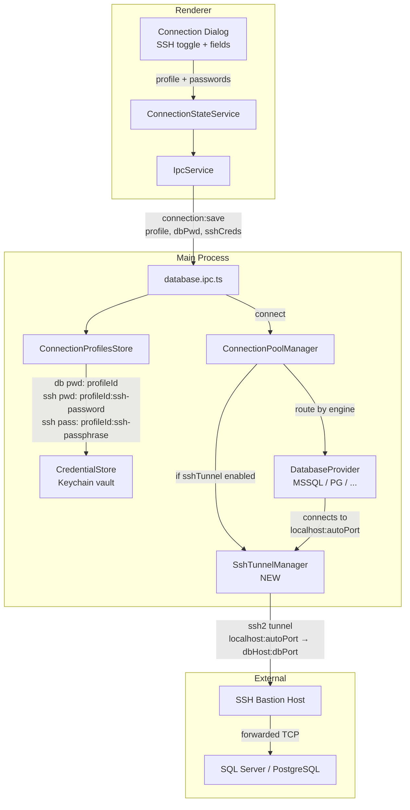

# SSH Tunnel Support for Database Connections

## Context

MJ Forge connects to SQL Server and PostgreSQL (via `feature/multi-db-provider`). Many production databases sit behind firewalls accessible only via SSH bastion hosts. This feature adds SSH tunnel support so users can connect through an SSH jump host, with SSH passwords and key passphrases stored securely in the macOS Keychain alongside existing DB credentials.

**Base branch:** `feature/multi-db-provider` (not `main`) — this feature builds on top of the multi-database provider architecture.

## Architecture

SSH tunneling is **engine-agnostic** — it sits between the `ConnectionPoolManager` and the network, before any engine-specific provider code runs. The tunnel forwards a random local port to the remote database host:port through the SSH bastion.



## Credential Storage Strategy

Reuse the existing `CredentialStore` (single Keychain JSON vault). Key naming:

- `{profileId}` — SQL password (unchanged)
- `{profileId}:ssh-password` — SSH login password
- `{profileId}:ssh-passphrase` — SSH private key passphrase

Private key **file paths** are stored in the `ConnectionProfile` (non-secret metadata), not in the Keychain.

## Changes by File (in dependency order)

### 1. Install `ssh2` dependency

**File:** `packages/main/package.json`  
Add `"ssh2": "^1.16.0"` to dependencies and `"@types/ssh2": "^1.15.0"` to devDependencies.

### 2. Shared types — `packages/shared/src/types/connection.types.ts`

Add SSH tunnel config to `ConnectionProfile`:

```typescript
export type SshAuthType = 'password' | 'privateKey';

export interface SshTunnelConfig {
  enabled: boolean;
  host: string;
  port: number; // default 22
  username: string;
  authType: SshAuthType;
  privateKeyPath?: string; // only for authType === 'privateKey'
}

// Add to ConnectionProfile:
export interface ConnectionProfile {
  // ... existing fields ...
  sshTunnel?: SshTunnelConfig;
}
```

Add SSH credentials to `SaveConnectionRequest`:

```typescript
export interface SaveConnectionRequest {
  profile: Omit<ConnectionProfile, 'id' | 'createdAt' | 'updatedAt'> & { id?: string };
  password?: string;
  sshPassword?: string; // NEW
  sshPassphrase?: string; // NEW
}
```

### 3. SSH Tunnel Manager — `packages/main/src/services/ssh/ssh-tunnel-manager.ts` (NEW)

Singleton service managing SSH tunnels keyed by connection profile ID.

**Key behavior:**

- `openTunnel(profileId, sshConfig, targetHost, targetPort)` → returns `{ localHost: '127.0.0.1', localPort: number }`
- Uses `ssh2` `Client` to connect to the bastion, then `forwardOut()` for each incoming connection on a local `net.Server` listening on a random port
- `closeTunnel(profileId)` — closes the local server and SSH client
- `closeAll()` — for app shutdown
- Retrieves SSH password/passphrase from `CredentialStore` using the `{profileId}:ssh-*` keys
- Reads private key from disk using `fs.readFile(sshConfig.privateKeyPath)`

**Error handling:** Surface SSH-specific errors (auth failure, host unreachable, key parse failure) with user-friendly messages.

### 4. Connection Profiles Store — `packages/main/src/services/config/connection-profiles.ts`

Extend `save()` to accept and store SSH credentials:

```typescript
async save(request: SaveConnectionRequest): Promise<ConnectionProfile> {
  // ... existing profile save logic ...

  // Store SSH credentials if provided
  if (request.sshPassword) {
    await this.credentialStore.set(`${profile.id}:ssh-password`, request.sshPassword);
  }
  if (request.sshPassphrase) {
    await this.credentialStore.set(`${profile.id}:ssh-passphrase`, request.sshPassphrase);
  }

  return profile;
}
```

Extend `delete()` to clean up SSH credentials:

```typescript
async delete(id: string): Promise<boolean> {
  // ... existing logic ...
  await this.credentialStore.delete(`${id}:ssh-password`);
  await this.credentialStore.delete(`${id}:ssh-passphrase`);
  return true;
}
```

Add helpers:

```typescript
async getSshPassword(id: string): Promise<string | null> {
  return this.credentialStore.get(`${id}:ssh-password`);
}

async getSshPassphrase(id: string): Promise<string | null> {
  return this.credentialStore.get(`${id}:ssh-passphrase`);
}
```

### 5. Connection Pool Manager — `packages/main/src/services/sql/connection-pool.ts`

The multi-db branch's `ConnectionPoolManager` routes to engine-specific providers (`DatabaseProvider` subclasses for MSSQL and PG). SSH tunneling intercepts **before** engine routing — it modifies the effective server/port the provider connects to.

**`testConnection(profile, password)`:** If `profile.sshTunnel?.enabled`, open a temporary SSH tunnel first, create a modified profile with `server: '127.0.0.1', port: tunnelPort`, pass that to the engine-specific test, then close tunnel in `finally`.

**`getPool(profileId)`:** If profile has SSH tunnel enabled, open a persistent tunnel via `SshTunnelManager`, then create the engine-specific pool connecting to `localhost:tunnelPort` instead of `profile.server:profile.port`. The tunnel endpoint is engine-agnostic — both MSSQL and PG providers connect to the same local forwarded port.

**`closePool(profileId)`:** Also close the SSH tunnel via `SshTunnelManager.closeTunnel(profileId)`.

**`closeAll()`:** Also call `SshTunnelManager.closeAll()`.

The `PoolEntry` interface gains an optional `tunnelLocalPort?: number` for tracking.

### 6. IPC Handlers — `packages/main/src/ipc/database.ipc.ts`

> **Note:** On the multi-db branch, connection IPC handlers live in `database.ipc.ts`, not `connection.ipc.ts`.

Update the SAVE handler to pass SSH credentials through:

```typescript
safeHandle(
  IPC_CHANNELS.CONNECTION.SAVE,
  async (
    _event,
    profile: ConnectionProfile,
    password?: string,
    sshPassword?: string,
    sshPassphrase?: string
  ): Promise<ConnectionProfile> => {
    return profileStore.save({ profile, password, sshPassword, sshPassphrase });
  }
);
```

Update TEST handler similarly — it needs to pass SSH credentials for tunnel creation during test.

### 7. Preload Bridge — `packages/preload/src/index.ts`

Update the `connection.save` and `connection.test` calls to pass SSH credentials:

```typescript
connection: {
  save: (profile, password, sshPassword, sshPassphrase) =>
    ipcRenderer.invoke(IPC_CHANNELS.CONNECTION.SAVE, profile, password, sshPassword, sshPassphrase),
  test: (profile, password, sshPassword, sshPassphrase) =>
    ipcRenderer.invoke(IPC_CHANNELS.CONNECTION.TEST, profile, password, sshPassword, sshPassphrase),
  // ... rest unchanged
}
```

Update the `ForgeAPI` interface type in the preload file to match.

### 8. Renderer IPC Service — `packages/renderer/src/app/core/services/ipc.service.ts`

Update `saveConnection()` and `testConnection()` method signatures to accept SSH credentials and pass them through.

### 9. Connection State Service — `packages/renderer/src/app/core/state/connection.state.ts`

Update `saveProfile()` and `testConnection()` to accept and forward SSH credentials.

### 10. Connection Dialog — `packages/renderer/src/app/shared/components/connection-dialog/connection-dialog.component.ts`

Add an **SSH Tunnel** section to the dialog template (between Options and the divider above it):

```html
<mat-divider />
<h3>SSH Tunnel</h3>
<mat-checkbox [(ngModel)]="formData.sshEnabled">Connect via SSH tunnel</mat-checkbox>

@if (formData.sshEnabled) {
<div class="form-row">
  <mat-form-field appearance="outline" class="flex-2">
    <mat-label>SSH Host</mat-label>
    <input matInput [(ngModel)]="formData.sshHost" placeholder="bastion.example.com" />
  </mat-form-field>
  <mat-form-field appearance="outline" class="flex-1">
    <mat-label>SSH Port</mat-label>
    <input matInput type="number" [(ngModel)]="formData.sshPort" />
  </mat-form-field>
</div>

<mat-form-field appearance="outline" class="full-width">
  <mat-label>SSH Username</mat-label>
  <input matInput [(ngModel)]="formData.sshUsername" />
</mat-form-field>

<mat-form-field appearance="outline" class="full-width">
  <mat-label>SSH Auth Type</mat-label>
  <mat-select [(ngModel)]="formData.sshAuthType">
    <mat-option value="password">Password</mat-option>
    <mat-option value="privateKey">Private Key</mat-option>
  </mat-select>
</mat-form-field>

@if (formData.sshAuthType === 'password') {
<mat-form-field appearance="outline" class="full-width">
  <mat-label>SSH Password</mat-label>
  <input matInput type="password" [(ngModel)]="formData.sshPassword" />
</mat-form-field>
} @if (formData.sshAuthType === 'privateKey') {
<mat-form-field appearance="outline" class="full-width">
  <mat-label>Private Key Path</mat-label>
  <input matInput [(ngModel)]="formData.sshPrivateKeyPath" placeholder="~/.ssh/id_rsa" />
</mat-form-field>
<mat-form-field appearance="outline" class="full-width">
  <mat-label>Passphrase (optional)</mat-label>
  <input matInput type="password" [(ngModel)]="formData.sshPassphrase" />
</mat-form-field>
} }
```

Add `formData` fields: `sshEnabled`, `sshHost`, `sshPort` (default 22), `sshUsername`, `sshAuthType` (default 'password'), `sshPassword`, `sshPrivateKeyPath`, `sshPassphrase`.

Update `buildProfile()` and `buildTestProfile()` to include `sshTunnel` config.  
Update `saveConnection()`, `testConnection()`, `connectNow()` to pass SSH credentials through the IPC calls.  
Update `isValid()` — when SSH is enabled, require `sshHost`, `sshUsername`, and either `sshPassword` or `sshPrivateKeyPath`.

## Files Modified (Summary)

| File                                                                                           | Change                                                                                    |
| ---------------------------------------------------------------------------------------------- | ----------------------------------------------------------------------------------------- |
| `packages/main/package.json`                                                                   | Add `ssh2` + `@types/ssh2`                                                                |
| `packages/shared/src/types/connection.types.ts`                                                | Add `SshTunnelConfig`, `SshAuthType`; extend `ConnectionProfile`, `SaveConnectionRequest` |
| `packages/main/src/services/ssh/ssh-tunnel-manager.ts`                                         | **NEW** — SSH tunnel lifecycle management                                                 |
| `packages/main/src/services/config/connection-profiles.ts`                                     | Store/delete/retrieve SSH credentials                                                     |
| `packages/main/src/services/sql/connection-pool.ts`                                            | Integrate tunnel into `testConnection()`, `getPool()`, `closePool()`                      |
| `packages/main/src/ipc/database.ipc.ts`                                                        | Pass SSH credentials in SAVE and TEST handlers                                            |
| `packages/main/src/index.ts`                                                                   | Add `SshTunnelManager.closeAll()` to shutdown sequence                                    |
| `packages/preload/src/index.ts`                                                                | Update `ForgeAPI` type + `save`/`test` calls                                              |
| `packages/renderer/src/app/core/services/ipc.service.ts`                                       | Update `saveConnection()`, `testConnection()` signatures                                  |
| `packages/renderer/src/app/core/state/connection.state.ts`                                     | Forward SSH credentials                                                                   |
| `packages/renderer/src/app/shared/components/connection-dialog/connection-dialog.component.ts` | SSH Tunnel UI section                                                                     |

## Compatibility with Multi-DB Provider Architecture

This plan targets `feature/multi-db-provider`, not `main`. Key integration notes:

- **Engine-agnostic:** SSH tunneling works identically for MSSQL, PostgreSQL, and any future engine. The tunnel just forwards TCP — the engine provider sees `localhost:localPort` and doesn't know it's tunneled.
- **ConnectionProfile now has `engine: DatabaseEngine`:** The `sshTunnel` field is orthogonal to `engine`. Both MSSQL and PG connections can optionally enable SSH.
- **Connection handlers are in `database.ipc.ts`:** Not `connection.ipc.ts` as on `main`.
- **Provider abstraction:** `DatabaseProvider` subclasses (MSSQL, PG) receive a `ConnectionProfile` with `server`/`port`. The pool manager swaps these to the tunnel endpoint before passing to the provider — providers need zero SSH awareness.
- **PG pool-per-database:** PostgreSQL creates separate pools per database. All of them connect through the same SSH tunnel (one tunnel per profileId, multiple DB pools share it).
- **Backward compat:** Profiles without `sshTunnel` field (or `sshTunnel.enabled === false`) work exactly as before — no migration needed.

## Verification

1. **Build check:** `npm run typecheck` — ensure no TypeScript errors across all packages
2. **Manual test — password auth:**
   - Create a connection with SSH tunnel enabled, password auth
   - Test Connection → verify tunnel opens, SQL connects, tunnel closes
   - Save → verify SSH password stored in Keychain (not in profile JSON)
   - Connect → verify persistent tunnel + SQL pool
   - Disconnect → verify tunnel cleaned up
3. **Manual test — private key auth:**
   - Same flow with private key path + optional passphrase
   - Verify key file is read from disk, passphrase from Keychain
4. **Manual test — no SSH (regression):**
   - Existing connections without SSH tunnel should work unchanged
5. **Delete profile:** Verify SSH credentials are cleaned up from Keychain
6. **Edit profile:** Verify SSH fields pre-populate (except passwords)
