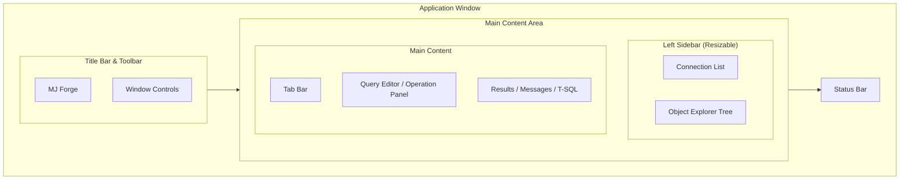
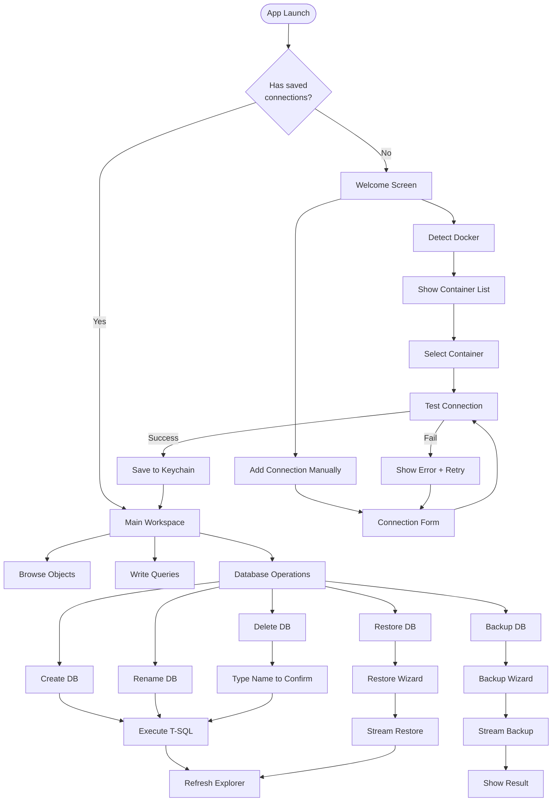
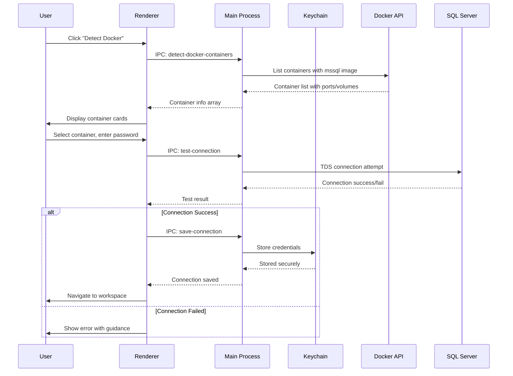
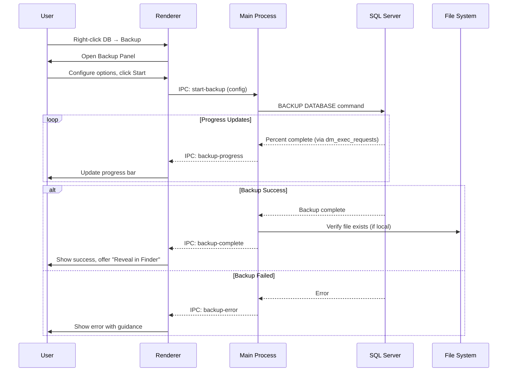
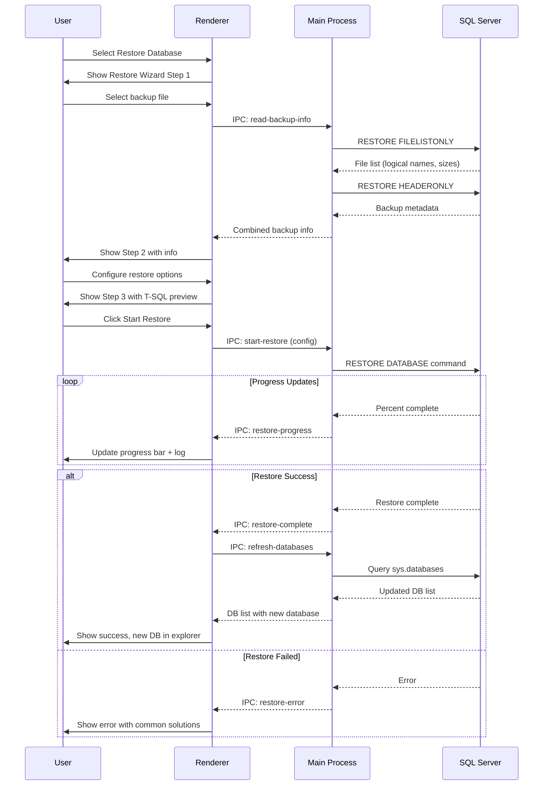

# Part II: UX Design & Mockups

## Design Philosophy

### Core Principles

```
┌─────────────────────────────────────────────────────────────────────────────┐
│                         MJ FORGE DESIGN PRINCIPLES                          │
├─────────────────────────────────────────────────────────────────────────────┤
│                                                                             │
│  1. TRANSPARENCY        Show the T-SQL. Always. Users should never wonder  │
│                         "what did the app actually do?"                     │
│                                                                             │
│  2. PROGRESSIVE         Simple path for common cases. Advanced options     │
│     DISCLOSURE          available but not overwhelming.                    │
│                                                                             │
│  3. SAFE BY DEFAULT     Destructive actions require explicit confirmation. │
│                         System databases hidden from dangerous operations. │
│                                                                             │
│  4. CONTEXT PRESERVED   Never lose user's work. Tabs persist across        │
│                         sessions. Unsaved queries prompt on close.         │
│                                                                             │
│  5. KEYBOARD FIRST      Power users can do everything without mouse.       │
│                         Cmd+Enter runs query. Cmd+K opens command palette. │
│                                                                             │
└─────────────────────────────────────────────────────────────────────────────┘
```

---

## Application Layout

### Main Window Structure

```
┌─────────────────────────────────────────────────────────────────────────────┐
│  MJ Forge                                                    ─ □ ✕         │
├────────────────────┬────────────────────────────────────────────────────────┤
│ ┌────────────────┐ │ ┌──────────────────────────────────────────────────┐   │
│ │ 🔌 Connections │ │ │ Query 1    Query 2    + New Query                │   │
│ ├────────────────┤ │ ├──────────────────────────────────────────────────┤   │
│ │                │ │ │                                                  │   │
│ │ ▼ 🐳 Local     │ │ │  SELECT TOP 100 *                                │   │
│ │   └─ Dev       │ │ │  FROM Customers                                  │   │
│ │      └─ 📊 DB1 │ │ │  WHERE Country = 'USA'                           │   │
│ │      └─ 📊 DB2 │ │ │  ORDER BY LastName                               │   │
│ │                │ │ │                                                  │   │
│ │ ▶ 🌐 Azure     │ │ │  ▶ Run (⌘↵)    📋 Copy    💾 Save               │   │
│ │ ▶ 🌐 On-Prem   │ │ │                                                  │   │
│ │                │ │ ├──────────────────────────────────────────────────┤   │
│ ├────────────────┤ │ │  Results  │  Messages  │  T-SQL                  │   │
│ │                │ │ ├──────────────────────────────────────────────────┤   │
│ │ ▼ 📁 Dev       │ │ │ CustomerID │ Name      │ Country │ Email        │   │
│ │   ├─ 📋 Tables │ │ │────────────┼───────────┼─────────┼──────────────│   │
│ │   │  ├─ Users  │ │ │ 1          │ John Doe  │ USA     │ john@...     │   │
│ │   │  └─ Orders │ │ │ 2          │ Jane Smith│ USA     │ jane@...     │   │
│ │   ├─ 👁 Views  │ │ │ 3          │ Bob Jones │ USA     │ bob@...      │   │
│ │   └─ ⚙ Procs  │ │ │            │           │         │              │   │
│ │                │ │ ├──────────────────────────────────────────────────┤   │
│ └────────────────┘ │ │ ✓ 100 rows returned in 45ms                      │   │
│                    │ └──────────────────────────────────────────────────┘   │
├────────────────────┴────────────────────────────────────────────────────────┤
│  ● Connected: Dev@localhost:1433  │  DB: AdventureWorks  │  100 rows       │
└─────────────────────────────────────────────────────────────────────────────┘
```

### Layout Regions



---

## Screen Mockups

### 1. Welcome / First Run Screen

```
┌─────────────────────────────────────────────────────────────────────────────┐
│  MJ Forge                                                    ─ □ ✕         │
├─────────────────────────────────────────────────────────────────────────────┤
│                                                                             │
│                                                                             │
│                         ╔═══════════════════════════════╗                   │
│                         ║                               ║                   │
│                         ║        ⚒️  MJ FORGE           ║                   │
│                         ║                               ║                   │
│                         ║   SQL Server Management       ║                   │
│                         ║        for macOS              ║                   │
│                         ║                               ║                   │
│                         ╚═══════════════════════════════╝                   │
│                                                                             │
│                                                                             │
│           ┌─────────────────────────────────────────────────┐               │
│           │                                                 │               │
│           │  🐳  Detect Docker SQL Server                   │               │
│           │      Automatically find local containers        │               │
│           │                                                 │               │
│           └─────────────────────────────────────────────────┘               │
│                                                                             │
│           ┌─────────────────────────────────────────────────┐               │
│           │                                                 │               │
│           │  ➕  Add Connection Manually                    │               │
│           │      Connect to any SQL Server                  │               │
│           │                                                 │               │
│           └─────────────────────────────────────────────────┘               │
│                                                                             │
│                                                                             │
│                       Recent Connections                                    │
│                       ──────────────────                                    │
│                       No recent connections                                 │
│                                                                             │
│                                                                             │
└─────────────────────────────────────────────────────────────────────────────┘
```

### 2. Docker Detection Screen

```
┌─────────────────────────────────────────────────────────────────────────────┐
│  MJ Forge                                                    ─ □ ✕         │
├─────────────────────────────────────────────────────────────────────────────┤
│                                                                             │
│     🐳 Docker SQL Server Detection                                          │
│     ━━━━━━━━━━━━━━━━━━━━━━━━━━━━━━                                          │
│                                                                             │
│     Found 2 SQL Server containers:                                          │
│                                                                             │
│     ┌───────────────────────────────────────────────────────────────────┐   │
│     │  ● RUNNING                                                        │   │
│     │                                                                   │   │
│     │  📦 sql-server-dev                                                │   │
│     │     Image: mcr.microsoft.com/mssql/server:2022-latest             │   │
│     │     Port:  localhost:1433                                         │   │
│     │                                                                   │   │
│     │     Volume Mounts:                                                │   │
│     │     • ~/backups → /var/opt/mssql/backups                          │   │
│     │                                                                   │   │
│     │                               [ Test Connection ]  [ Connect → ]  │   │
│     └───────────────────────────────────────────────────────────────────┘   │
│                                                                             │
│     ┌───────────────────────────────────────────────────────────────────┐   │
│     │  ○ STOPPED                                                        │   │
│     │                                                                   │   │
│     │  📦 sql-server-old                                                │   │
│     │     Image: mcr.microsoft.com/mssql/server:2019-latest             │   │
│     │     Port:  localhost:1434 (when running)                          │   │
│     │                                                                   │   │
│     │                                        [ Start Container ]        │   │
│     └───────────────────────────────────────────────────────────────────┘   │
│                                                                             │
│     ──────────────────────────────────────────────────────────────────────  │
│                                                                             │
│     [ ← Back ]                                    [ Add Manually Instead ]  │
│                                                                             │
└─────────────────────────────────────────────────────────────────────────────┘
```

### 3. Connection Form

```
┌─────────────────────────────────────────────────────────────────────────────┐
│  MJ Forge                                                    ─ □ ✕         │
├─────────────────────────────────────────────────────────────────────────────┤
│                                                                             │
│     New Connection                                                          │
│     ━━━━━━━━━━━━━━━                                                         │
│                                                                             │
│     Connection Name                                                         │
│     ┌───────────────────────────────────────────────────────────────────┐   │
│     │ Dev Server                                                        │   │
│     └───────────────────────────────────────────────────────────────────┘   │
│                                                                             │
│     ┌─────────────────────────────────────┐ ┌─────────────────────────────┐ │
│     │ Host                                │ │ Port                        │ │
│     │ ┌─────────────────────────────────┐ │ │ ┌─────────────────────────┐ │ │
│     │ │ localhost                       │ │ │ │ 1433                    │ │ │
│     │ └─────────────────────────────────┘ │ │ └─────────────────────────┘ │ │
│     └─────────────────────────────────────┘ └─────────────────────────────┘ │
│                                                                             │
│     Authentication                                                          │
│     ┌───────────────────────────────────────────────────────────────────┐   │
│     │ ○ SQL Server Authentication                                       │   │
│     │ ○ Azure Active Directory (coming soon)                            │   │
│     └───────────────────────────────────────────────────────────────────┘   │
│                                                                             │
│     ┌─────────────────────────────────────┐ ┌─────────────────────────────┐ │
│     │ Username                            │ │ Password                    │ │
│     │ ┌─────────────────────────────────┐ │ │ ┌─────────────────────────┐ │ │
│     │ │ sa                              │ │ │ │ ••••••••••              │ │ │
│     │ └─────────────────────────────────┘ │ │ └─────────────────────────┘ │ │
│     └─────────────────────────────────────┘ └─────────────────────────────┘ │
│                                                                             │
│     ▶ Advanced Options                                                      │
│     ┌───────────────────────────────────────────────────────────────────┐   │
│     │ ☑ Encrypt connection                                              │   │
│     │ ☑ Trust server certificate                                        │   │
│     │                                                                   │   │
│     │ Connection Timeout     Request Timeout                            │   │
│     │ ┌───────────────────┐  ┌───────────────────┐                      │   │
│     │ │ 15 seconds        │  │ 30 seconds        │                      │   │
│     │ └───────────────────┘  └───────────────────┘                      │   │
│     │                                                                   │   │
│     │ Default Database (optional)                                       │   │
│     │ ┌───────────────────────────────────────────────────────────────┐ │   │
│     │ │                                                               │ │   │
│     │ └───────────────────────────────────────────────────────────────┘ │   │
│     └───────────────────────────────────────────────────────────────────┘   │
│                                                                             │
│     ┌────────────────┐                    ┌────────────┐ ┌────────────────┐ │
│     │ Test Connection│                    │   Cancel   │ │ Save & Connect │ │
│     └────────────────┘                    └────────────┘ └────────────────┘ │
│                                                                             │
└─────────────────────────────────────────────────────────────────────────────┘
```

### 4. Main Workspace with Object Explorer

```
┌─────────────────────────────────────────────────────────────────────────────┐
│  MJ Forge                                                    ─ □ ✕         │
├─────────────────────────────────────────────────────────────────────────────┤
│  ┌─ Connections ──────┐  ┌─────────────────────────────────────────────────┐│
│  │                    │  │ + New Query │ Query 1 ✕│ customers.sql ✕│      ││
│  │ ▼ 🐳 Local Docker  │  ├─────────────────────────────────────────────────┤│
│  │   ├─ ● Dev (conn.) │  │ Connection: Dev@localhost  │  DB: [Northwind ▼]││
│  │   │                │  ├─────────────────────────────────────────────────┤│
│  │   └─ ○ Test        │  │                                                 ││
│  │                    │  │  1 │ -- Get top customers by order value        ││
│  │ ▶ 🌐 Remote        │  │  2 │ SELECT TOP 20                              ││
│  │                    │  │  3 │   c.CustomerID,                            ││
│  ├────────────────────┤  │  4 │   c.CompanyName,                           ││
│  │ 🔍 Filter objects  │  │  5 │   SUM(od.Quantity * od.UnitPrice) as Total ││
│  ├────────────────────┤  │  6 │ FROM Customers c                           ││
│  │                    │  │  7 │ JOIN Orders o ON c.CustomerID = o.Customer ││
│  │ ▼ 📊 Northwind     │  │  8 │ JOIN [Order Details] od ON o.OrderID = od. ││
│  │   ├─ 📋 Tables     │  │  9 │ GROUP BY c.CustomerID, c.CompanyName       ││
│  │   │   ├─ Categories│  │ 10 │ ORDER BY Total DESC                        ││
│  │   │   ├─ Customers │  │                                                 ││
│  │   │   ├─ Employees │  │                                                 ││
│  │   │   ├─ Orders    │  │ [ ▶ Run (⌘↵) ]  [ Run Selection ]  [ 💾 Save ] ││
│  │   │   ├─ Products  │  ├─────────────────────────────────────────────────┤│
│  │   │   └─ ...       │  │ Results │ Messages │ T-SQL                      ││
│  │   ├─ 👁 Views      │  ├─────────────────────────────────────────────────┤│
│  │   │   ├─ vwSales   │  │ CustomerID │ CompanyName          │ Total      ││
│  │   │   └─ ...       │  │────────────┼──────────────────────┼────────────││
│  │   └─ ⚙ Procedures │  │ QUICK      │ QUICK-Stop           │ $117,483   ││
│  │       ├─ CustOrder │  │ SAVEA      │ Save-a-lot Markets   │ $115,673   ││
│  │       └─ ...       │  │ ERNSH      │ Ernst Handel         │ $104,874   ││
│  │                    │  │ RATTC      │ Rattlesnake Canyon   │ $52,245    ││
│  │ ▶ 📊 master        │  │ HUNGO      │ Hungry Owl Stores    │ $49,979    ││
│  │ ▶ 📊 AdventureWrks │  │            │                      │            ││
│  │                    │  │ ◀ 1 2 3 4 5 ▶        Showing 1-20 of 89 rows   ││
│  └────────────────────┘  └─────────────────────────────────────────────────┘│
├─────────────────────────────────────────────────────────────────────────────┤
│ ● Connected: Dev@localhost:1433 │ Northwind │ Query: 45ms │ 89 rows        │
└─────────────────────────────────────────────────────────────────────────────┘
```

### 5. Database Context Menu (Right-Click)

```
┌─────────────────────────────────────────────────────────────────────────────┐
│                                                                             │
│  ▼ 📊 Northwind ◄───────────────────────────┐                               │
│    ├─ 📋 Tables     ┌───────────────────────┴─────────────────────┐         │
│    │   ├─ Categor   │                                             │         │
│    │   ├─ Customer  │  📝  New Query                    ⌘N        │         │
│    │   ├─ Employees │  ──────────────────────────────────────     │         │
│    │   ├─ Orders    │  ➕  Create Database...                     │         │
│    │   ├─ Products  │  ✏️   Rename Database...                    │         │
│    │   └─ ...       │  🗑️  Delete Database...           ⌘⌫       │         │
│    ├─ 👁 Views      │  ──────────────────────────────────────     │         │
│    └─ ⚙ Procedures │  💾  Backup Database...            ⌘B        │         │
│                     │  📥  Restore Database...           ⌘R        │         │
│                     │  ──────────────────────────────────────     │         │
│                     │  🔄  Refresh                       ⌘⇧R      │         │
│                     │  📋  Copy Connection String                  │         │
│                     │                                             │         │
│                     └─────────────────────────────────────────────┘         │
│                                                                             │
└─────────────────────────────────────────────────────────────────────────────┘
```

### 6. Create Database Dialog

```
┌─────────────────────────────────────────────────────────────────────────────┐
│                                                                             │
│  ┌───────────────────────────────────────────────────────────────────────┐  │
│  │                                                                       │  │
│  │   ➕ Create New Database                                              │  │
│  │   ━━━━━━━━━━━━━━━━━━━━━                                               │  │
│  │                                                                       │  │
│  │   Server: Dev@localhost:1433                                          │  │
│  │                                                                       │  │
│  │   Database Name *                                                     │  │
│  │   ┌───────────────────────────────────────────────────────────────┐   │  │
│  │   │ MyNewDatabase                                                 │   │  │
│  │   └───────────────────────────────────────────────────────────────┘   │  │
│  │                                                                       │  │
│  │   ▶ Advanced Options                                                  │  │
│  │   ┌───────────────────────────────────────────────────────────────┐   │  │
│  │   │                                                               │   │  │
│  │   │  Collation                                                    │   │  │
│  │   │  ┌─────────────────────────────────────────────────────────┐  │   │  │
│  │   │  │ SQL_Latin1_General_CP1_CI_AS (server default)        ▼ │  │   │  │
│  │   │  └─────────────────────────────────────────────────────────┘  │   │  │
│  │   │                                                               │   │  │
│  │   │  Recovery Model                                               │   │  │
│  │   │  ┌─────────────────────────────────────────────────────────┐  │   │  │
│  │   │  │ Simple (recommended for dev)                         ▼ │  │   │  │
│  │   │  └─────────────────────────────────────────────────────────┘  │   │  │
│  │   │                                                               │   │  │
│  │   └───────────────────────────────────────────────────────────────┘   │  │
│  │                                                                       │  │
│  │   ┌─ T-SQL Preview ───────────────────────────────────────────────┐   │  │
│  │   │                                                               │   │  │
│  │   │  CREATE DATABASE [MyNewDatabase]                              │   │  │
│  │   │  COLLATE SQL_Latin1_General_CP1_CI_AS;                        │   │  │
│  │   │                                                               │   │  │
│  │   │  ALTER DATABASE [MyNewDatabase]                               │   │  │
│  │   │  SET RECOVERY SIMPLE;                                         │   │  │
│  │   │                                                    [ 📋 Copy ]│   │  │
│  │   └───────────────────────────────────────────────────────────────┘   │  │
│  │                                                                       │  │
│  │                                      ┌──────────┐  ┌────────────────┐ │  │
│  │                                      │  Cancel  │  │    Create      │ │  │
│  │                                      └──────────┘  └────────────────┘ │  │
│  │                                                                       │  │
│  └───────────────────────────────────────────────────────────────────────┘  │
│                                                                             │
└─────────────────────────────────────────────────────────────────────────────┘
```

### 7. Delete Database Confirmation (Safety-First Design)

```
┌─────────────────────────────────────────────────────────────────────────────┐
│                                                                             │
│  ┌───────────────────────────────────────────────────────────────────────┐  │
│  │                                                                       │  │
│  │   ⚠️  Delete Database                                                 │  │
│  │   ━━━━━━━━━━━━━━━━━━━                                                 │  │
│  │                                                                       │  │
│  │   ┌───────────────────────────────────────────────────────────────┐   │  │
│  │   │                                                               │   │  │
│  │   │   🗄️  Northwind                                               │   │  │
│  │   │                                                               │   │  │
│  │   │   Size: 156 MB                                                │   │  │
│  │   │   Tables: 13                                                  │   │  │
│  │   │   Last Modified: 2 hours ago                                  │   │  │
│  │   │                                                               │   │  │
│  │   └───────────────────────────────────────────────────────────────┘   │  │
│  │                                                                       │  │
│  │   ⚠️  This action cannot be undone. The database and all its data    │  │
│  │       will be permanently deleted.                                    │  │
│  │                                                                       │  │
│  │   ☑ Close existing connections (required for delete)                  │  │
│  │                                                                       │  │
│  │   Type the database name to confirm:                                  │  │
│  │   ┌───────────────────────────────────────────────────────────────┐   │  │
│  │   │                                                               │   │  │
│  │   └───────────────────────────────────────────────────────────────┘   │  │
│  │                                                                       │  │
│  │   ┌─ T-SQL Preview ───────────────────────────────────────────────┐   │  │
│  │   │                                                               │   │  │
│  │   │  ALTER DATABASE [Northwind]                                   │   │  │
│  │   │  SET SINGLE_USER WITH ROLLBACK IMMEDIATE;                     │   │  │
│  │   │                                                               │   │  │
│  │   │  DROP DATABASE [Northwind];                                   │   │  │
│  │   │                                                    [ 📋 Copy ]│   │  │
│  │   └───────────────────────────────────────────────────────────────┘   │  │
│  │                                                                       │  │
│  │                                      ┌──────────┐  ┌────────────────┐ │  │
│  │                                      │  Cancel  │  │ Delete Forever │ │  │
│  │                                      └──────────┘  └────────────────┘ │  │
│  │                                                           ▲           │  │
│  │                                              (disabled until name     │  │
│  │                                               is typed correctly)     │  │
│  │                                                                       │  │
│  └───────────────────────────────────────────────────────────────────────┘  │
│                                                                             │
└─────────────────────────────────────────────────────────────────────────────┘
```

### 8. Backup Database Panel

```
┌─────────────────────────────────────────────────────────────────────────────┐
│  MJ Forge                                                    ─ □ ✕         │
├─────────────────────────────────────────────────────────────────────────────┤
│  ┌─ Connections ──────┐  ┌─────────────────────────────────────────────────┐│
│  │                    │  │ Query 1 │ 💾 Backup: Northwind ✕│              ││
│  │ ▼ 🐳 Local Docker  │  ├─────────────────────────────────────────────────┤│
│  │   └─ ● Dev (conn.) │  │                                                 ││
│  │                    │  │  💾 Backup Database                             ││
│  ├────────────────────┤  │  ━━━━━━━━━━━━━━━━━━                              ││
│  │                    │  │                                                 ││
│  │ ▼ 📊 Northwind ◄─  │  │  Source Database                                ││
│  │   ├─ 📋 Tables     │  │  ┌───────────────────────────────────────────┐  ││
│  │   ├─ 👁 Views      │  │  │ 🗄️  Northwind  (156 MB)                   │  ││
│  │   └─ ⚙ Procedures │  │  └───────────────────────────────────────────┘  ││
│  │                    │  │                                                 ││
│  └────────────────────┘  │  Backup Type                                    ││
│                          │  ○ Full Backup (complete copy)                  ││
│                          │  ○ Full Backup with COPY_ONLY (no log chain)    ││
│                          │                                                 ││
│                          │  Destination                                    ││
│                          │  ┌───────────────────────────────────────────┐  ││
│                          │  │ 📁 /var/opt/mssql/backups/                │  ││
│                          │  │    Northwind_20260122_143052.bak          │  ││
│                          │  │                                           │  ││
│                          │  │    [ 📂 Browse... ]                       │  ││
│                          │  └───────────────────────────────────────────┘  ││
│                          │                                                 ││
│                          │  🐳 Docker Volume Detected                      ││
│                          │  ┌───────────────────────────────────────────┐  ││
│                          │  │ Container path: /var/opt/mssql/backups/   │  ││
│                          │  │ Maps to local:  ~/sql-backups/            │  ││
│                          │  │                                           │  ││
│                          │  │ ✓ Backup will be accessible on your Mac   │  ││
│                          │  └───────────────────────────────────────────┘  ││
│                          │                                                 ││
│                          │  ▶ Advanced Options                             ││
│                          │  ┌───────────────────────────────────────────┐  ││
│                          │  │ ☑ Use compression                         │  ││
│                          │  │ ☐ Verify backup after completion          │  ││
│                          │  └───────────────────────────────────────────┘  ││
│                          │                                                 ││
│                          │  ┌─ T-SQL ───────────────────────────────────┐  ││
│                          │  │ BACKUP DATABASE [Northwind]               │  ││
│                          │  │ TO DISK = N'/var/opt/mssql/backups/       │  ││
│                          │  │   Northwind_20260122_143052.bak'          │  ││
│                          │  │ WITH COMPRESSION, INIT;          [ 📋 ]   │  ││
│                          │  └───────────────────────────────────────────┘  ││
│                          │                                                 ││
│                          │           [ Cancel ]  [ ▶ Start Backup ]        ││
│                          │                                                 ││
│                          └─────────────────────────────────────────────────┘│
├─────────────────────────────────────────────────────────────────────────────┤
│ ● Connected: Dev@localhost:1433                                             │
└─────────────────────────────────────────────────────────────────────────────┘
```

### 9. Backup In Progress

```
┌─────────────────────────────────────────────────────────────────────────────┐
│  MJ Forge                                                    ─ □ ✕         │
├─────────────────────────────────────────────────────────────────────────────┤
│  ┌─ Connections ──────┐  ┌─────────────────────────────────────────────────┐│
│  │                    │  │ Query 1 │ 💾 Backup: Northwind ✕│              ││
│  │ ...                │  ├─────────────────────────────────────────────────┤│
│  │                    │  │                                                 ││
│  └────────────────────┘  │  💾 Backing Up: Northwind                       ││
│                          │  ━━━━━━━━━━━━━━━━━━━━━━━━━━                      ││
│                          │                                                 ││
│                          │  ┌───────────────────────────────────────────┐  ││
│                          │  │                                           │  ││
│                          │  │   ████████████████████████░░░░░░  67%     │  ││
│                          │  │                                           │  ││
│                          │  │   Processed: 104 MB / 156 MB              │  ││
│                          │  │   Elapsed: 00:12                          │  ││
│                          │  │   Speed: 8.7 MB/s                         │  ││
│                          │  │                                           │  ││
│                          │  └───────────────────────────────────────────┘  ││
│                          │                                                 ││
│                          │  ┌─ Live Log ────────────────────────────────┐  ││
│                          │  │ [14:30:52] Starting backup...             │  ││
│                          │  │ [14:30:52] Database: Northwind            │  ││
│                          │  │ [14:30:52] Destination: /var/opt/mssql/.. │  ││
│                          │  │ [14:30:53] Processed 10%                  │  ││
│                          │  │ [14:30:55] Processed 20%                  │  ││
│                          │  │ [14:30:58] Processed 30%                  │  ││
│                          │  │ [14:31:01] Processed 40%                  │  ││
│                          │  │ [14:31:03] Processed 50%                  │  ││
│                          │  │ [14:31:05] Processed 60%                  │  ││
│                          │  │ [14:31:07] Processed 67%                  │  ││
│                          │  │                                           │  ││
│                          │  │                               [ 📋 Copy ] │  ││
│                          │  └───────────────────────────────────────────┘  ││
│                          │                                                 ││
│                          │                      [ Cancel Backup ]          ││
│                          │                                                 ││
│                          └─────────────────────────────────────────────────┘│
├─────────────────────────────────────────────────────────────────────────────┤
│ ● Connected: Dev@localhost:1433  │  ⏳ Backup in progress: 67%             │
└─────────────────────────────────────────────────────────────────────────────┘
```

### 10. Restore Database Wizard - Step 1: Select Source

```
┌─────────────────────────────────────────────────────────────────────────────┐
│  MJ Forge                                                    ─ □ ✕         │
├─────────────────────────────────────────────────────────────────────────────┤
│                                                                             │
│     📥 Restore Database                                        Step 1 of 3 │
│     ━━━━━━━━━━━━━━━━━━━                                                     │
│                                                                             │
│     ┌─────────────────────────────────────────────────────────────────────┐ │
│     │  ○ Step 1          ○ Step 2          ○ Step 3                       │ │
│     │  Select Source     Configure         Review & Execute               │ │
│     │  ─────────────     ─────────         ────────────────               │ │
│     └─────────────────────────────────────────────────────────────────────┘ │
│                                                                             │
│     Select Backup Source                                                    │
│                                                                             │
│     ○ Browse server paths                                                   │
│       (backup files accessible to SQL Server)                               │
│                                                                             │
│     ● Browse local files                                                    │
│       (if using Docker with volume mounts)                                  │
│                                                                             │
│     ┌─────────────────────────────────────────────────────────────────────┐ │
│     │                                                                     │ │
│     │   📂 ~/sql-backups/                                                 │ │
│     │   ───────────────────────────────────────────────────────────────   │ │
│     │                                                                     │ │
│     │   📄 Northwind_20260120_093045.bak          245 MB    Jan 20       │ │
│     │   📄 Northwind_20260115_143022.bak          238 MB    Jan 15       │ │
│     │   📄 AdventureWorks_20260118_110000.bak     1.2 GB    Jan 18       │ │
│     │   📄 TestDB_backup.bak                       45 MB    Jan 10       │ │
│     │                                                                     │ │
│     │                                             [ 📂 Choose Folder ]    │ │
│     │                                                                     │ │
│     └─────────────────────────────────────────────────────────────────────┘ │
│                                                                             │
│     Selected: Northwind_20260120_093045.bak                                 │
│                                                                             │
│     🐳 Docker Volume Mapping                                                │
│     ┌─────────────────────────────────────────────────────────────────────┐ │
│     │ Local:     ~/sql-backups/Northwind_20260120_093045.bak              │ │
│     │ Container: /var/opt/mssql/backups/Northwind_20260120_093045.bak     │ │
│     │                                                                     │ │
│     │ ✓ Path is accessible to SQL Server in container                     │ │
│     └─────────────────────────────────────────────────────────────────────┘ │
│                                                                             │
│                                                  [ Cancel ]  [ Next → ]     │
│                                                                             │
└─────────────────────────────────────────────────────────────────────────────┘
```

### 11. Restore Database Wizard - Step 2: Configure

```
┌─────────────────────────────────────────────────────────────────────────────┐
│  MJ Forge                                                    ─ □ ✕         │
├─────────────────────────────────────────────────────────────────────────────┤
│                                                                             │
│     📥 Restore Database                                        Step 2 of 3 │
│     ━━━━━━━━━━━━━━━━━━━                                                     │
│                                                                             │
│     ┌─────────────────────────────────────────────────────────────────────┐ │
│     │  ● Step 1          ○ Step 2          ○ Step 3                       │ │
│     │  Select Source     Configure         Review & Execute               │ │
│     │  ✓ Complete        ─────────         ────────────────               │ │
│     └─────────────────────────────────────────────────────────────────────┘ │
│                                                                             │
│     Backup Information                                                      │
│     ┌─────────────────────────────────────────────────────────────────────┐ │
│     │ Database Name:    Northwind                                         │ │
│     │ Backup Date:      Jan 20, 2026 09:30:45 AM                          │ │
│     │ Backup Size:      245 MB                                            │ │
│     │ SQL Server Ver:   16.0.1135.2 (SQL Server 2022)                     │ │
│     └─────────────────────────────────────────────────────────────────────┘ │
│                                                                             │
│     Restore As                                                              │
│     ┌─────────────────────────────────────────────────────────────────────┐ │
│     │ Database Name                                                       │ │
│     │ ┌───────────────────────────────────────────────────────────────┐   │ │
│     │ │ Northwind_restored                                            │   │ │
│     │ └───────────────────────────────────────────────────────────────┘   │ │
│     │                                                                     │ │
│     │ ☐ Overwrite existing database (WITH REPLACE)                        │ │
│     │   ⚠️ Warning: This will delete all current data in Northwind        │ │
│     └─────────────────────────────────────────────────────────────────────┘ │
│                                                                             │
│     File Locations                                                          │
│     ┌─────────────────────────────────────────────────────────────────────┐ │
│     │                                                                     │ │
│     │ Logical Name          Type    Original Path              Restore To │ │
│     │ ─────────────────────────────────────────────────────────────────── │ │
│     │ Northwind             Data    D:\Data\Northwind.mdf                 │ │
│     │                               ┌─────────────────────────────────┐   │ │
│     │                               │ /var/opt/mssql/data/Northwind_ │   │ │
│     │                               │ restored.mdf                   │   │ │
│     │                               └─────────────────────────────────┘   │ │
│     │                                                                     │ │
│     │ Northwind_log         Log     D:\Data\Northwind_log.ldf             │ │
│     │                               ┌─────────────────────────────────┐   │ │
│     │                               │ /var/opt/mssql/data/Northwind_ │   │ │
│     │                               │ restored_log.ldf               │   │ │
│     │                               └─────────────────────────────────┘   │ │
│     │                                                                     │ │
│     │                                          [ Reset to Defaults ]      │ │
│     └─────────────────────────────────────────────────────────────────────┘ │
│                                                                             │
│                                         [ ← Back ]  [ Cancel ]  [ Next → ] │
│                                                                             │
└─────────────────────────────────────────────────────────────────────────────┘
```

### 12. Restore Database Wizard - Step 3: Review & Execute

```
┌─────────────────────────────────────────────────────────────────────────────┐
│  MJ Forge                                                    ─ □ ✕         │
├─────────────────────────────────────────────────────────────────────────────┤
│                                                                             │
│     📥 Restore Database                                        Step 3 of 3 │
│     ━━━━━━━━━━━━━━━━━━━                                                     │
│                                                                             │
│     ┌─────────────────────────────────────────────────────────────────────┐ │
│     │  ● Step 1          ● Step 2          ○ Step 3                       │ │
│     │  Select Source     Configure         Review & Execute               │ │
│     │  ✓ Complete        ✓ Complete        ────────────────               │ │
│     └─────────────────────────────────────────────────────────────────────┘ │
│                                                                             │
│     Review Restore Operation                                                │
│                                                                             │
│     ┌─────────────────────────────────────────────────────────────────────┐ │
│     │                                                                     │ │
│     │ Source:     Northwind_20260120_093045.bak                           │ │
│     │ Target DB:  Northwind_restored (new database)                       │ │
│     │ Overwrite:  No                                                      │ │
│     │                                                                     │ │
│     │ Data File:  /var/opt/mssql/data/Northwind_restored.mdf              │ │
│     │ Log File:   /var/opt/mssql/data/Northwind_restored_log.ldf          │ │
│     │                                                                     │ │
│     └─────────────────────────────────────────────────────────────────────┘ │
│                                                                             │
│     T-SQL to Execute                                                        │
│     ┌─────────────────────────────────────────────────────────────────────┐ │
│     │                                                                     │ │
│     │  RESTORE DATABASE [Northwind_restored]                              │ │
│     │  FROM DISK = N'/var/opt/mssql/backups/                              │ │
│     │      Northwind_20260120_093045.bak'                                 │ │
│     │  WITH                                                               │ │
│     │      MOVE N'Northwind' TO                                           │ │
│     │          N'/var/opt/mssql/data/Northwind_restored.mdf',             │ │
│     │      MOVE N'Northwind_log' TO                                       │ │
│     │          N'/var/opt/mssql/data/Northwind_restored_log.ldf',         │ │
│     │      STATS = 10;                                                    │ │
│     │                                                                     │ │
│     │                                                         [ 📋 Copy ] │ │
│     └─────────────────────────────────────────────────────────────────────┘ │
│                                                                             │
│     ☑ I understand this operation may take several minutes                  │
│                                                                             │
│                              [ ← Back ]  [ Cancel ]  [ ▶ Start Restore ]   │
│                                                                             │
└─────────────────────────────────────────────────────────────────────────────┘
```

---

## User Flow Diagrams

### Overall Application Flow



### Connection Establishment Flow



### Backup Flow



### Restore Flow



---

## Component Specifications

### Status Bar States

```
┌─────────────────────────────────────────────────────────────────────────────┐
│ CONNECTED STATE                                                             │
│ ● Connected: DevServer@localhost:1433 │ DB: Northwind │ Query: 45ms │ 89 rows│
├─────────────────────────────────────────────────────────────────────────────┤
│ DISCONNECTED STATE                                                          │
│ ○ Not connected │ Click to connect...                                       │
├─────────────────────────────────────────────────────────────────────────────┤
│ CONNECTING STATE                                                            │
│ ◐ Connecting to DevServer@localhost:1433...                                 │
├─────────────────────────────────────────────────────────────────────────────┤
│ OPERATION IN PROGRESS                                                       │
│ ● Connected: Dev@localhost │ ⏳ Backup in progress: 67% (Northwind)         │
├─────────────────────────────────────────────────────────────────────────────┤
│ ERROR STATE                                                                 │
│ ⚠ Connection lost: DevServer@localhost:1433 │ [Reconnect]                   │
└─────────────────────────────────────────────────────────────────────────────┘
```

### Toast Notifications

```
┌───────────────────────────────────────────┐
│  ✓ Database Created                       │
│                                           │
│  "MyNewDatabase" created successfully     │
│                              [ Dismiss ]  │
└───────────────────────────────────────────┘

┌───────────────────────────────────────────┐
│  ✓ Backup Complete                        │
│                                           │
│  Northwind backed up to:                  │
│  ~/sql-backups/Northwind_20260122.bak     │
│                                           │
│  [ Reveal in Finder ]       [ Dismiss ]   │
└───────────────────────────────────────────┘

┌───────────────────────────────────────────┐
│  ✗ Restore Failed                         │
│                                           │
│  Cannot access backup file. Check that    │
│  the path is mounted in the container.    │
│                                           │
│  [ View Details ]           [ Dismiss ]   │
└───────────────────────────────────────────┘
```

---

## Keyboard Shortcuts

| Action | Shortcut | Context |
|--------|----------|---------|
| New Query Tab | ⌘N | Global |
| Run Query | ⌘↵ | Query Editor |
| Run Selection | ⌘⇧↵ | Query Editor |
| Save Query | ⌘S | Query Editor |
| Close Tab | ⌘W | Any Tab |
| Backup Database | ⌘B | Database Selected |
| Restore Database | ⌘R | Server Selected |
| Delete Database | ⌘⌫ | Database Selected |
| Refresh Explorer | ⌘⇧R | Global |
| Toggle Sidebar | ⌘\ | Global |
| Command Palette | ⌘K | Global |
| Switch Connection | ⌘⇧C | Global |
| Find in Results | ⌘F | Results Grid |
| Copy Cell | ⌘C | Results Grid |
| Export Results | ⌘E | Results Grid |

---

*Continue to [Part III: Interaction Design →](03-interaction-design.md)*
