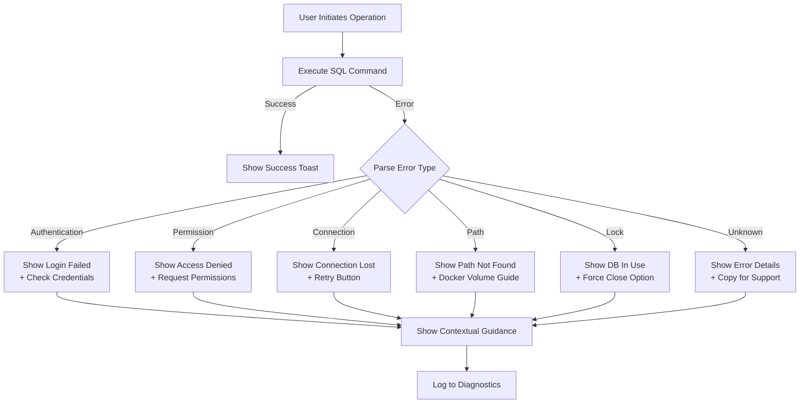
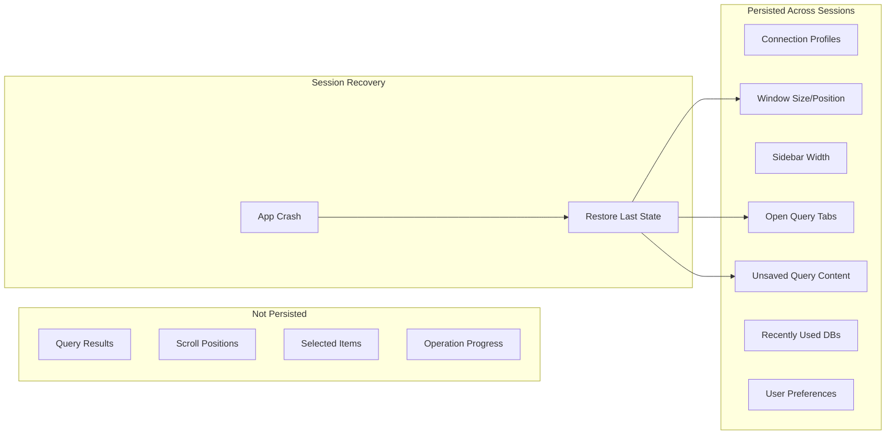
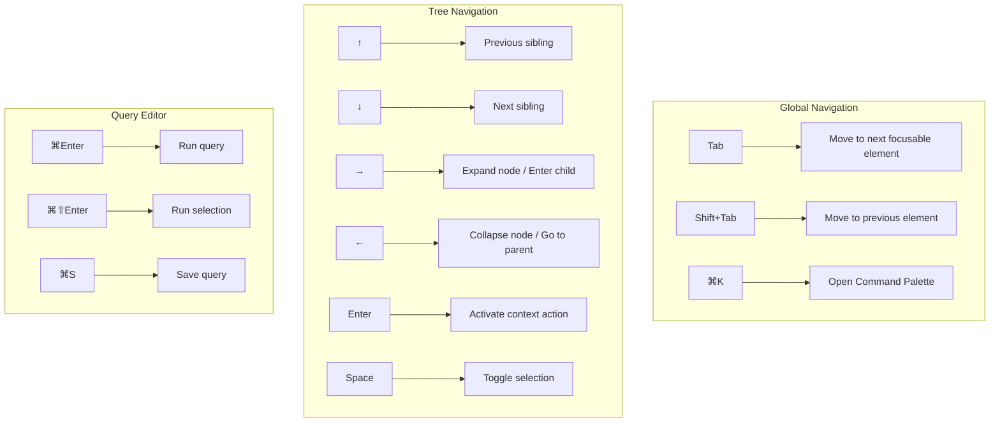

# Part III: Interaction Design

## Design System

### Color Palette

```
┌─────────────────────────────────────────────────────────────────────────────┐
│                           MJ FORGE COLOR SYSTEM                             │
├─────────────────────────────────────────────────────────────────────────────┤
│                                                                             │
│  PRIMARY                                                                    │
│  ─────────────────────────────────────────────────────────────────────────  │
│  ██████  #0078D4    Primary Blue       Actions, links, focus states         │
│  ██████  #106EBE    Primary Dark       Hover states                         │
│  ██████  #C7E0F4    Primary Light      Backgrounds, highlights              │
│                                                                             │
│  SEMANTIC                                                                   │
│  ─────────────────────────────────────────────────────────────────────────  │
│  ██████  #107C10    Success Green      Completed operations, connected      │
│  ██████  #FCE100    Warning Yellow     Caution states, pending              │
│  ██████  #D13438    Error Red          Failed operations, destructive       │
│  ██████  #00B7C3    Info Cyan          Informational, Docker                │
│                                                                             │
│  NEUTRAL                                                                    │
│  ─────────────────────────────────────────────────────────────────────────  │
│  ██████  #FFFFFF    Background         Main content area                    │
│  ██████  #F3F3F3    Surface            Panels, cards                        │
│  ██████  #E1E1E1    Border             Dividers, outlines                   │
│  ██████  #616161    Text Secondary     Labels, hints                        │
│  ██████  #323130    Text Primary       Main text, headings                  │
│  ██████  #1B1A19    Text Emphasis      Code, important text                 │
│                                                                             │
│  DARK MODE (v1.1)                                                           │
│  ─────────────────────────────────────────────────────────────────────────  │
│  ██████  #1E1E1E    Background         Main content area                    │
│  ██████  #252526    Surface            Panels, cards                        │
│  ██████  #3C3C3C    Border             Dividers, outlines                   │
│  ██████  #CCCCCC    Text Primary       Main text                            │
│                                                                             │
└─────────────────────────────────────────────────────────────────────────────┘
```

### Typography

```
┌─────────────────────────────────────────────────────────────────────────────┐
│                           MJ FORGE TYPOGRAPHY                               │
├─────────────────────────────────────────────────────────────────────────────┤
│                                                                             │
│  FONT FAMILIES                                                              │
│  ─────────────────────────────────────────────────────────────────────────  │
│                                                                             │
│  System UI    -apple-system, BlinkMacSystemFont, 'Segoe UI', Roboto        │
│               Used for: All UI text, labels, buttons                        │
│                                                                             │
│  Monospace    'SF Mono', 'Monaco', 'Menlo', 'Consolas', monospace           │
│               Used for: Query editor, T-SQL preview, results grid           │
│                                                                             │
│  TYPE SCALE                                                                 │
│  ─────────────────────────────────────────────────────────────────────────  │
│                                                                             │
│  Display      24px / 600    Page titles, welcome screen                     │
│  Heading 1    20px / 600    Section headers                                 │
│  Heading 2    16px / 600    Panel titles, dialog titles                     │
│  Body         14px / 400    Default text, labels                            │
│  Body Small   12px / 400    Secondary text, hints                           │
│  Code         13px / 400    Editor, T-SQL, results                          │
│  Caption      11px / 400    Timestamps, metadata                            │
│                                                                             │
└─────────────────────────────────────────────────────────────────────────────┘
```

### Spacing System

```
┌─────────────────────────────────────────────────────────────────────────────┐
│                           SPACING SCALE (8px base)                          │
├─────────────────────────────────────────────────────────────────────────────┤
│                                                                             │
│  --space-1     4px      Tight spacing, inline elements                      │
│  --space-2     8px      Default gap between related elements                │
│  --space-3    12px      Form field gaps                                     │
│  --space-4    16px      Section padding, card padding                       │
│  --space-5    24px      Large section gaps                                  │
│  --space-6    32px      Page margins, major sections                        │
│  --space-8    48px      Feature sections                                    │
│                                                                             │
│  LAYOUT                                                                     │
│  ─────────────────────────────────────────────────────────────────────────  │
│                                                                             │
│  Sidebar width:        260px (min) - 400px (max)                            │
│  Panel min height:     200px                                                │
│  Dialog max width:     600px (standard), 800px (wizard)                     │
│  Toast width:          360px                                                │
│  Button min width:     80px                                                 │
│                                                                             │
└─────────────────────────────────────────────────────────────────────────────┘
```

---

## Component Library

### Button Variants

```
┌─────────────────────────────────────────────────────────────────────────────┐
│                              BUTTON STYLES                                  │
├─────────────────────────────────────────────────────────────────────────────┤
│                                                                             │
│  PRIMARY                                                                    │
│  ┌────────────────┐  ┌────────────────┐  ┌────────────────┐                │
│  │    Connect     │  │    Connect     │  │    Connect     │                │
│  │                │  │   (hover)      │  │   (disabled)   │                │
│  └────────────────┘  └────────────────┘  └────────────────┘                │
│  bg: #0078D4         bg: #106EBE         bg: #C7E0F4                        │
│  text: white         text: white         text: #A0A0A0                      │
│                                                                             │
│  SECONDARY                                                                  │
│  ┌────────────────┐  ┌────────────────┐  ┌────────────────┐                │
│  │    Cancel      │  │    Cancel      │  │    Cancel      │                │
│  │                │  │   (hover)      │  │   (disabled)   │                │
│  └────────────────┘  └────────────────┘  └────────────────┘                │
│  bg: transparent     bg: #F3F3F3         bg: transparent                    │
│  border: #E1E1E1     border: #0078D4     border: #E1E1E1                    │
│  text: #323130       text: #323130       text: #A0A0A0                      │
│                                                                             │
│  DESTRUCTIVE                                                                │
│  ┌────────────────┐  ┌────────────────┐  ┌────────────────┐                │
│  │ Delete Forever │  │ Delete Forever │  │ Delete Forever │                │
│  │                │  │   (hover)      │  │   (disabled)   │                │
│  └────────────────┘  └────────────────┘  └────────────────┘                │
│  bg: #D13438         bg: #A4262C         bg: #F4C7C7                        │
│  text: white         text: white         text: #A0A0A0                      │
│                                                                             │
│  GHOST (Icon buttons, toolbar actions)                                      │
│  ┌────┐  ┌────┐  ┌────┐                                                    │
│  │ 🔄 │  │ 🔄 │  │ 🔄 │                                                    │
│  └────┘  └────┘  └────┘                                                    │
│  bg: transparent     bg: #F3F3F3         bg: transparent                    │
│                                                                             │
└─────────────────────────────────────────────────────────────────────────────┘
```

### Form Controls

```
┌─────────────────────────────────────────────────────────────────────────────┐
│                             FORM CONTROLS                                   │
├─────────────────────────────────────────────────────────────────────────────┤
│                                                                             │
│  TEXT INPUT                                                                 │
│  ─────────────────────────────────────────────────────────────────────────  │
│                                                                             │
│  Default                 Focused                  Error                     │
│  Database Name           Database Name            Database Name             │
│  ┌──────────────────┐    ┌──────────────────┐    ┌──────────────────┐      │
│  │ MyDatabase       │    │ MyDatabase       │    │ My Database!     │      │
│  └──────────────────┘    └──────────────────┘    └──────────────────┘      │
│  border: #E1E1E1         border: #0078D4         border: #D13438           │
│                          shadow: focus ring      ⚠ Invalid characters       │
│                                                                             │
│  SELECT / DROPDOWN                                                          │
│  ─────────────────────────────────────────────────────────────────────────  │
│                                                                             │
│  Collation                                                                  │
│  ┌──────────────────────────────────────────────────────────────┬───┐      │
│  │ SQL_Latin1_General_CP1_CI_AS                                 │ ▼ │      │
│  └──────────────────────────────────────────────────────────────┴───┘      │
│                                                                             │
│  Expanded:                                                                  │
│  ┌──────────────────────────────────────────────────────────────────┐      │
│  │ SQL_Latin1_General_CP1_CI_AS (Server default)              ✓    │      │
│  │ Latin1_General_CI_AS                                            │      │
│  │ Latin1_General_CS_AS                                            │      │
│  │ SQL_Latin1_General_CP1_CS_AS                                    │      │
│  └──────────────────────────────────────────────────────────────────┘      │
│                                                                             │
│  CHECKBOX                                                                   │
│  ─────────────────────────────────────────────────────────────────────────  │
│                                                                             │
│  ☐ Unchecked              ☑ Checked               ☐ Disabled               │
│    Use compression          Use compression         Use compression        │
│                                                                             │
│  RADIO                                                                      │
│  ─────────────────────────────────────────────────────────────────────────  │
│                                                                             │
│  ○ Full Backup                                                              │
│  ● Full Backup with COPY_ONLY                                               │
│                                                                             │
└─────────────────────────────────────────────────────────────────────────────┘
```

### Tree View Component

```
┌─────────────────────────────────────────────────────────────────────────────┐
│                             TREE VIEW STATES                                │
├─────────────────────────────────────────────────────────────────────────────┤
│                                                                             │
│  STANDARD STATE                                                             │
│  ─────────────────────────────────────────────────────────────────────────  │
│                                                                             │
│  ▼ 📊 Northwind                    ◄── Expanded node                        │
│    ├─ 📋 Tables                                                             │
│    │   ├─ Customers                ◄── Leaf node                            │
│    │   ├─ Orders                                                            │
│    │   └─ Products                                                          │
│    ├─ 👁 Views                                                              │
│    └─ ⚙ Stored Procedures                                                  │
│  ▶ 📊 AdventureWorks               ◄── Collapsed node                       │
│  ▶ 📊 master                       ◄── System DB (dimmed)                   │
│                                                                             │
│  HOVER STATE                                                                │
│  ─────────────────────────────────────────────────────────────────────────  │
│                                                                             │
│  ▼ 📊 Northwind                                                             │
│    ├─ 📋 Tables                                                             │
│    │   ┌─────────────────────────────┐                                      │
│    │   │ ├─ Customers              │ ◄── Highlighted row                   │
│    │   └─────────────────────────────┘                                      │
│    │   ├─ Orders                                                            │
│                                                                             │
│  SELECTED STATE                                                             │
│  ─────────────────────────────────────────────────────────────────────────  │
│                                                                             │
│  ▼ 📊 Northwind                                                             │
│    ├─ 📋 Tables                                                             │
│    │   ███████████████████████████████                                      │
│    │   ██ Customers              ██  ◄── Selected (bg: primary light)      │
│    │   ███████████████████████████████                                      │
│    │   ├─ Orders                                                            │
│                                                                             │
│  LOADING STATE                                                              │
│  ─────────────────────────────────────────────────────────────────────────  │
│                                                                             │
│  ▼ 📊 Northwind                                                             │
│    ├─ 📋 Tables                                                             │
│    │   ○ Loading...                ◄── Spinner + text                       │
│                                                                             │
│  CONTEXT MENU ACTIVE                                                        │
│  ─────────────────────────────────────────────────────────────────────────  │
│                                                                             │
│  ▼ 📊 Northwind ◄────────────────┐                                          │
│    ├─ 📋 Tables  ┌───────────────┴─────────────────┐                        │
│    │   ├─ Custo  │  📝 New Query              ⌘N   │                        │
│    │   ├─ Orders │  ───────────────────────────    │                        │
│    │   └─ Produ  │  💾 Backup Database...      ⌘B   │                        │
│                  │  📥 Restore Database...     ⌘R   │                        │
│                  └─────────────────────────────────┘                        │
│                                                                             │
└─────────────────────────────────────────────────────────────────────────────┘
```

### Progress Indicators

```
┌─────────────────────────────────────────────────────────────────────────────┐
│                           PROGRESS INDICATORS                               │
├─────────────────────────────────────────────────────────────────────────────┤
│                                                                             │
│  DETERMINATE PROGRESS BAR                                                   │
│  ─────────────────────────────────────────────────────────────────────────  │
│                                                                             │
│  0%    ░░░░░░░░░░░░░░░░░░░░░░░░░░░░░░░░░░░░░░░░░░░░░░░░░░                   │
│                                                                             │
│  35%   ████████████████░░░░░░░░░░░░░░░░░░░░░░░░░░░░░░░░░░                   │
│                                                                             │
│  67%   ██████████████████████████████████░░░░░░░░░░░░░░░░                   │
│                                                                             │
│  100%  ██████████████████████████████████████████████████                   │
│                                                                             │
│  INDETERMINATE (Shimmer animation)                                          │
│  ─────────────────────────────────────────────────────────────────────────  │
│                                                                             │
│        ░░░░░░░░████████░░░░░░░░░░░░░░░░░░░░░░░░░░░░░░░░░░                   │
│               ─────────▶ (animating left to right)                          │
│                                                                             │
│  SPINNER (for quick operations)                                             │
│  ─────────────────────────────────────────────────────────────────────────  │
│                                                                             │
│        ◐  ◓  ◑  ◒    (rotating animation)                                   │
│                                                                             │
│  COMBINED PROGRESS DISPLAY                                                  │
│  ─────────────────────────────────────────────────────────────────────────  │
│                                                                             │
│  ┌───────────────────────────────────────────────────────────────────────┐ │
│  │                                                                       │ │
│  │   Backing up Northwind...                                             │ │
│  │                                                                       │ │
│  │   ██████████████████████████████████░░░░░░░░░░░░░░░░   67%            │ │
│  │                                                                       │ │
│  │   104 MB / 156 MB    •    00:12 elapsed    •    8.7 MB/s              │ │
│  │                                                                       │ │
│  └───────────────────────────────────────────────────────────────────────┘ │
│                                                                             │
└─────────────────────────────────────────────────────────────────────────────┘
```

---

## Interaction Patterns

### Confirmation Levels

```mermaid
flowchart TD
    subgraph Level1["Level 1: Simple Confirmation"]
        A1[Action: Create Database] --> B1[Single Click Confirm]
        B1 --> C1[Execute Immediately]
    end

    subgraph Level2["Level 2: Double Confirmation"]
        A2[Action: Rename Database] --> B2[Confirm Dialog]
        B2 --> C2[Check: Understands impact]
        C2 --> D2[Execute on Confirm]
    end

    subgraph Level3["Level 3: Triple Confirmation"]
        A3[Action: Delete Database] --> B3[Warning Dialog]
        B3 --> C3[Show DB Info]
        C3 --> D3[Type Name to Confirm]
        D3 -->|Name Matches| E3[Enable Delete Button]
        E3 --> F3[Execute on Click]
    end
```



### Error Handling Flow



### Drag and Drop Interactions

```
┌─────────────────────────────────────────────────────────────────────────────┐
│                         DRAG AND DROP INTERACTIONS                          │
├─────────────────────────────────────────────────────────────────────────────┤
│                                                                             │
│  SCENARIO 1: Drop .bak file onto app                                        │
│  ─────────────────────────────────────────────────────────────────────────  │
│                                                                             │
│  ┌───────────────────────────────────────────────────────────────────────┐ │
│  │                                                                       │ │
│  │                    ╔═══════════════════════════════╗                  │ │
│  │                    ║                               ║                  │ │
│  │                    ║   📥 Drop to Restore          ║                  │ │
│  │                    ║                               ║                  │ │
│  │                    ║   Northwind_backup.bak        ║                  │ │
│  │                    ║                               ║                  │ │
│  │                    ╚═══════════════════════════════╝                  │ │
│  │                                                                       │ │
│  │  (Overlay appears when dragging .bak file over window)                │ │
│  │                                                                       │ │
│  └───────────────────────────────────────────────────────────────────────┘ │
│                                                                             │
│  Result: Opens Restore Wizard with file pre-selected                        │
│                                                                             │
│                                                                             │
│  SCENARIO 2: Drop .sql file onto app                                        │
│  ─────────────────────────────────────────────────────────────────────────  │
│                                                                             │
│  ┌───────────────────────────────────────────────────────────────────────┐ │
│  │                                                                       │ │
│  │                    ╔═══════════════════════════════╗                  │ │
│  │                    ║                               ║                  │ │
│  │                    ║   📝 Drop to Open Query       ║                  │ │
│  │                    ║                               ║                  │ │
│  │                    ║   create_tables.sql           ║                  │ │
│  │                    ║                               ║                  │ │
│  │                    ╚═══════════════════════════════╝                  │ │
│  │                                                                       │ │
│  └───────────────────────────────────────────────────────────────────────┘ │
│                                                                             │
│  Result: Opens new query tab with file contents                             │
│                                                                             │
│                                                                             │
│  SCENARIO 3: Drag table from explorer to query editor                       │
│  ─────────────────────────────────────────────────────────────────────────  │
│                                                                             │
│  ┌──────────────────┬────────────────────────────────────────────────────┐ │
│  │                  │                                                    │ │
│  │   📋 Tables      │   SELECT * FROM [Customers]█                       │ │
│  │      └─ Custo... │                ▲                                   │ │
│  │          ─────▶  │   (Inserts table name at cursor)                   │ │
│  │      └─ Orders   │                                                    │ │
│  │                  │                                                    │ │
│  └──────────────────┴────────────────────────────────────────────────────┘ │
│                                                                             │
└─────────────────────────────────────────────────────────────────────────────┘
```

### State Persistence



---

## Error States & Messages

### Error Message Templates

```
┌─────────────────────────────────────────────────────────────────────────────┐
│                          ERROR MESSAGE PATTERNS                             │
├─────────────────────────────────────────────────────────────────────────────┤
│                                                                             │
│  STRUCTURE:                                                                 │
│  ─────────────────────────────────────────────────────────────────────────  │
│                                                                             │
│  ┌───────────────────────────────────────────────────────────────────────┐ │
│  │  ⚠️  [Error Title - What went wrong]                                  │ │
│  │                                                                       │ │
│  │  [Explanation in plain language - Why it happened]                    │ │
│  │                                                                       │ │
│  │  What you can try:                                                    │ │
│  │  • [Actionable step 1]                                                │ │
│  │  • [Actionable step 2]                                                │ │
│  │                                                                       │ │
│  │  ┌─ Technical Details ────────────────────────────────────────────┐   │ │
│  │  │ Error 18456: Login failed for user 'sa'                        │   │ │
│  │  │ State: 1, Server: localhost:1433                               │   │ │
│  │  │                                                    [ 📋 Copy ] │   │ │
│  │  └────────────────────────────────────────────────────────────────┘   │ │
│  │                                                                       │ │
│  │                                          [ Try Again ]  [ Cancel ]   │ │
│  └───────────────────────────────────────────────────────────────────────┘ │
│                                                                             │
└─────────────────────────────────────────────────────────────────────────────┘
```

### Common Error Scenarios

```
┌─────────────────────────────────────────────────────────────────────────────┐
│                                                                             │
│  CONNECTION FAILED                                                          │
│  ─────────────────────────────────────────────────────────────────────────  │
│                                                                             │
│  ┌───────────────────────────────────────────────────────────────────────┐ │
│  │  ⚠️  Cannot Connect to Server                                         │ │
│  │                                                                       │ │
│  │  The server at localhost:1433 is not responding. This usually means  │ │
│  │  SQL Server isn't running or the port is blocked.                     │ │
│  │                                                                       │ │
│  │  What you can try:                                                    │ │
│  │  • Make sure your SQL Server Docker container is running              │ │
│  │  • Verify the port number is correct (default: 1433)                  │ │
│  │  • Check if a firewall is blocking the connection                     │ │
│  │                                                                       │ │
│  │                                  [ Check Docker ]  [ Edit Connection ] │ │
│  └───────────────────────────────────────────────────────────────────────┘ │
│                                                                             │
│                                                                             │
│  BACKUP PATH ERROR                                                          │
│  ─────────────────────────────────────────────────────────────────────────  │
│                                                                             │
│  ┌───────────────────────────────────────────────────────────────────────┐ │
│  │  ⚠️  Cannot Write Backup File                                         │ │
│  │                                                                       │ │
│  │  SQL Server cannot access the path:                                   │ │
│  │  /Users/alex/backups/db.bak                                           │ │
│  │                                                                       │ │
│  │  🐳 Docker Detected: SQL Server runs inside a container and can only  │ │
│  │  access paths that are mounted as volumes.                            │ │
│  │                                                                       │ │
│  │  What you can try:                                                    │ │
│  │  • Use a path inside the container (e.g., /var/opt/mssql/backups/)    │ │
│  │  • Mount ~/backups to /var/opt/mssql/backups in your container        │ │
│  │                                                                       │ │
│  │  ┌─ How to Mount a Volume ────────────────────────────────────────┐   │ │
│  │  │ docker run ... -v ~/backups:/var/opt/mssql/backups ...         │   │ │
│  │  └────────────────────────────────────────────────────────────────┘   │ │
│  │                                                                       │ │
│  │                              [ Choose Different Path ]  [ Cancel ]    │ │
│  └───────────────────────────────────────────────────────────────────────┘ │
│                                                                             │
│                                                                             │
│  DATABASE IN USE                                                            │
│  ─────────────────────────────────────────────────────────────────────────  │
│                                                                             │
│  ┌───────────────────────────────────────────────────────────────────────┐ │
│  │  ⚠️  Database Is Currently In Use                                     │ │
│  │                                                                       │ │
│  │  The database "Northwind" has active connections that prevent this    │ │
│  │  operation.                                                           │ │
│  │                                                                       │ │
│  │  Active connections: 3                                                │ │
│  │                                                                       │ │
│  │  What you can try:                                                    │ │
│  │  • Close other applications using this database                       │ │
│  │  • Force close all connections (may interrupt active work)            │ │
│  │                                                                       │ │
│  │              [ Force Close Connections ]  [ Cancel Operation ]        │ │
│  └───────────────────────────────────────────────────────────────────────┘ │
│                                                                             │
└─────────────────────────────────────────────────────────────────────────────┘
```

---

## Accessibility

### Keyboard Navigation



### Screen Reader Announcements

| Action | Announcement |
|--------|--------------|
| Connection successful | "Connected to [server name]" |
| Connection failed | "Connection failed: [error summary]" |
| Database created | "Database [name] created successfully" |
| Backup started | "Backup started for [database]" |
| Backup progress | "[percent]% complete" (every 10%) |
| Backup complete | "Backup complete. File saved to [path]" |
| Query complete | "[count] rows returned in [time]" |
| Error occurred | "Error: [message]. Press Tab to view details" |

### Focus Management

```
┌─────────────────────────────────────────────────────────────────────────────┐
│                          FOCUS MANAGEMENT RULES                             │
├─────────────────────────────────────────────────────────────────────────────┤
│                                                                             │
│  DIALOGS                                                                    │
│  ─────────────────────────────────────────────────────────────────────────  │
│  • Focus moves to first interactive element when dialog opens               │
│  • Focus is trapped within dialog until closed                              │
│  • Escape key closes dialog and returns focus to trigger                    │
│  • Focus returns to triggering element when dialog closes                   │
│                                                                             │
│  TOASTS                                                                     │
│  ─────────────────────────────────────────────────────────────────────────  │
│  • Toasts announce via aria-live but don't steal focus                      │
│  • Dismiss button is focusable for keyboard users                           │
│  • Auto-dismiss after 5 seconds (10s for errors)                            │
│                                                                             │
│  TAB SWITCHING                                                              │
│  ─────────────────────────────────────────────────────────────────────────  │
│  • Focus moves to tab content when tab is activated                         │
│  • For query tabs: focus moves to editor                                    │
│  • For operation tabs: focus moves to first form field                      │
│                                                                             │
│  CONTEXT MENUS                                                              │
│  ─────────────────────────────────────────────────────────────────────────  │
│  • Opens with focus on first item                                           │
│  • Arrow keys navigate items                                                │
│  • Enter activates, Escape closes                                           │
│  • Focus returns to trigger on close                                        │
│                                                                             │
└─────────────────────────────────────────────────────────────────────────────┘
```

---

## Animation & Motion

### Timing Curves

```
┌─────────────────────────────────────────────────────────────────────────────┐
│                           ANIMATION SPECIFICATIONS                          │
├─────────────────────────────────────────────────────────────────────────────┤
│                                                                             │
│  EASING CURVES                                                              │
│  ─────────────────────────────────────────────────────────────────────────  │
│                                                                             │
│  ease-out       cubic-bezier(0, 0, 0.2, 1)     Entering elements            │
│  ease-in        cubic-bezier(0.4, 0, 1, 1)     Exiting elements             │
│  ease-in-out    cubic-bezier(0.4, 0, 0.2, 1)   Moving elements              │
│                                                                             │
│  DURATIONS                                                                  │
│  ─────────────────────────────────────────────────────────────────────────  │
│                                                                             │
│  instant        0ms          Immediate feedback (button press)              │
│  fast           100ms        Micro-interactions (hover, focus)              │
│  normal         200ms        Standard transitions (panel slide)             │
│  slow           300ms        Complex transitions (dialog open)              │
│  deliberate     500ms        Emphasized transitions (wizard steps)          │
│                                                                             │
│  ANIMATIONS                                                                 │
│  ─────────────────────────────────────────────────────────────────────────  │
│                                                                             │
│  Sidebar collapse:    200ms ease-in-out                                     │
│  Dialog open:         300ms ease-out (scale 0.95 → 1.0, opacity 0 → 1)      │
│  Dialog close:        200ms ease-in (reverse)                               │
│  Toast enter:         300ms ease-out (translate Y 100% → 0)                 │
│  Toast exit:          200ms ease-in (opacity 1 → 0)                         │
│  Progress bar:        100ms linear (width change)                           │
│  Tree expand:         200ms ease-out (height 0 → auto)                      │
│  Hover highlight:     100ms ease-out                                        │
│                                                                             │
│  REDUCED MOTION                                                             │
│  ─────────────────────────────────────────────────────────────────────────  │
│                                                                             │
│  When prefers-reduced-motion is enabled:                                    │
│  • All durations reduced to 0ms or instant                                  │
│  • Animations replaced with opacity crossfades                              │
│  • Progress spinners use static indicators                                  │
│                                                                             │
└─────────────────────────────────────────────────────────────────────────────┘
```

---

*Continue to [Part IV: Technical Architecture →](04-architecture.md)*
