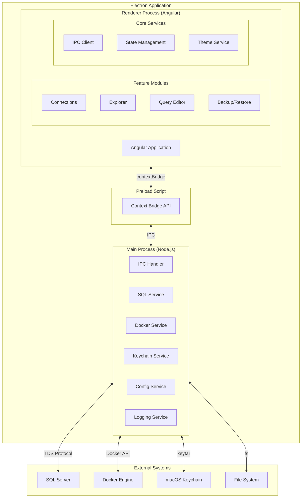
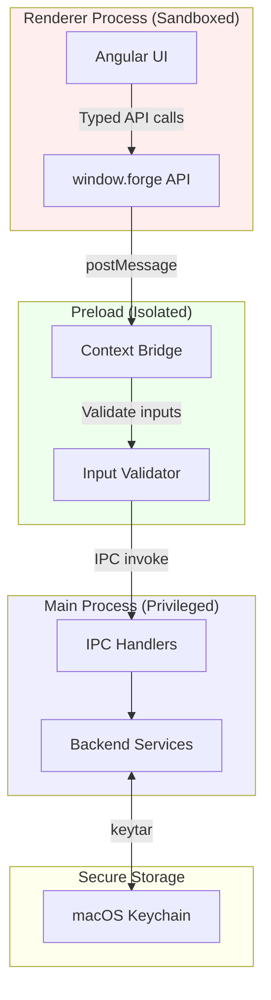

# Part IV: Technical Architecture

## System Overview



---

## Directory Structure

```
mj-forge/
├── src/
│   ├── main/                          # Electron main process
│   │   ├── index.ts                   # Main entry point
│   │   ├── window.ts                  # Window management
│   │   ├── menu.ts                    # Application menu
│   │   ├── ipc/                       # IPC handlers
│   │   │   ├── index.ts               # Handler registration
│   │   │   ├── connection.ipc.ts      # Connection operations
│   │   │   ├── database.ipc.ts        # Database CRUD
│   │   │   ├── backup.ipc.ts          # Backup operations
│   │   │   ├── restore.ipc.ts         # Restore operations
│   │   │   ├── query.ipc.ts           # Query execution
│   │   │   ├── explorer.ipc.ts        # Object explorer
│   │   │   └── docker.ipc.ts          # Docker detection
│   │   ├── services/                  # Backend services
│   │   │   ├── sql/
│   │   │   │   ├── connection-pool.ts # Connection pooling
│   │   │   │   ├── query-executor.ts  # Query execution
│   │   │   │   ├── metadata.ts        # Schema introspection
│   │   │   │   ├── backup.ts          # Backup operations
│   │   │   │   ├── restore.ts         # Restore operations
│   │   │   │   └── tsql-builder.ts    # T-SQL generation
│   │   │   ├── docker/
│   │   │   │   ├── detector.ts        # Container detection
│   │   │   │   └── volume-mapper.ts   # Volume path resolution
│   │   │   ├── keychain/
│   │   │   │   └── credential-store.ts# Secure storage
│   │   │   ├── config/
│   │   │   │   ├── settings.ts        # App settings
│   │   │   │   └── connections.ts     # Connection profiles
│   │   │   └── logging/
│   │   │       └── logger.ts          # Structured logging
│   │   └── utils/
│   │       ├── singleton.ts           # Singleton base (from MJ)
│   │       ├── object-cache.ts        # Caching (from MJ)
│   │       └── json-utils.ts          # JSON helpers (from MJ)
│   │
│   ├── preload/                       # Preload scripts
│   │   ├── index.ts                   # Main preload
│   │   └── api.ts                     # Exposed API definition
│   │
│   ├── renderer/                      # Angular application
│   │   ├── app/
│   │   │   ├── app.component.ts       # Root component
│   │   │   ├── app.config.ts          # App configuration
│   │   │   ├── app.routes.ts          # Route definitions
│   │   │   │
│   │   │   ├── core/                  # Singleton services
│   │   │   │   ├── services/
│   │   │   │   │   ├── ipc.service.ts # IPC communication
│   │   │   │   │   ├── connection.service.ts
│   │   │   │   │   ├── database.service.ts
│   │   │   │   │   ├── query.service.ts
│   │   │   │   │   ├── backup.service.ts
│   │   │   │   │   ├── notification.service.ts
│   │   │   │   │   └── theme.service.ts
│   │   │   │   ├── state/
│   │   │   │   │   ├── connection.state.ts
│   │   │   │   │   ├── explorer.state.ts
│   │   │   │   │   └── query.state.ts
│   │   │   │   └── guards/
│   │   │   │       └── connection.guard.ts
│   │   │   │
│   │   │   ├── shared/                # Shared components
│   │   │   │   ├── components/
│   │   │   │   │   ├── tree-view/
│   │   │   │   │   ├── dialog/
│   │   │   │   │   ├── toast/
│   │   │   │   │   ├── progress-bar/
│   │   │   │   │   ├── button/
│   │   │   │   │   ├── input/
│   │   │   │   │   └── tsql-preview/
│   │   │   │   ├── directives/
│   │   │   │   │   └── auto-focus.directive.ts
│   │   │   │   └── pipes/
│   │   │   │       ├── file-size.pipe.ts
│   │   │   │       └── duration.pipe.ts
│   │   │   │
│   │   │   ├── features/              # Feature modules
│   │   │   │   ├── welcome/
│   │   │   │   │   ├── welcome.component.ts
│   │   │   │   │   └── welcome.routes.ts
│   │   │   │   ├── connections/
│   │   │   │   │   ├── connection-list/
│   │   │   │   │   ├── connection-form/
│   │   │   │   │   ├── docker-detect/
│   │   │   │   │   └── connections.routes.ts
│   │   │   │   ├── explorer/
│   │   │   │   │   ├── explorer-tree/
│   │   │   │   │   ├── database-node/
│   │   │   │   │   ├── table-node/
│   │   │   │   │   └── context-menu/
│   │   │   │   ├── query/
│   │   │   │   │   ├── query-tabs/
│   │   │   │   │   ├── query-editor/
│   │   │   │   │   ├── results-grid/
│   │   │   │   │   ├── messages-panel/
│   │   │   │   │   └── query.routes.ts
│   │   │   │   ├── database/
│   │   │   │   │   ├── create-dialog/
│   │   │   │   │   ├── rename-dialog/
│   │   │   │   │   └── delete-dialog/
│   │   │   │   ├── backup/
│   │   │   │   │   ├── backup-panel/
│   │   │   │   │   └── backup-progress/
│   │   │   │   └── restore/
│   │   │   │       ├── restore-wizard/
│   │   │   │       ├── source-step/
│   │   │   │       ├── config-step/
│   │   │   │       ├── review-step/
│   │   │   │       └── restore-progress/
│   │   │   │
│   │   │   └── layout/                # App shell
│   │   │       ├── shell/
│   │   │       ├── sidebar/
│   │   │       ├── tab-bar/
│   │   │       └── status-bar/
│   │   │
│   │   ├── assets/
│   │   │   ├── icons/
│   │   │   └── themes/
│   │   ├── styles/
│   │   │   ├── _variables.scss
│   │   │   ├── _mixins.scss
│   │   │   └── global.scss
│   │   └── environments/
│   │       ├── environment.ts
│   │       └── environment.prod.ts
│   │
│   └── shared/                        # Shared between main/renderer
│       ├── types/
│       │   ├── connection.types.ts
│       │   ├── database.types.ts
│       │   ├── query.types.ts
│       │   ├── backup.types.ts
│       │   └── docker.types.ts
│       ├── constants/
│       │   ├── ipc-channels.ts
│       │   └── defaults.ts
│       └── validators/
│           └── db-name.validator.ts
│
├── resources/                         # Build resources
│   ├── icon.icns                      # macOS app icon
│   ├── icon.png                       # Source icon
│   └── entitlements.mac.plist         # macOS entitlements
│
├── scripts/                           # Build scripts
│   ├── build.ts
│   ├── package.ts
│   └── notarize.ts
│
├── tests/
│   ├── unit/
│   ├── integration/
│   └── e2e/
│
├── plans/                             # Planning documents
│   └── system-plan.md
│
├── package.json
├── tsconfig.json
├── angular.json
├── electron-builder.json
└── README.md
```

---

## IPC Architecture

### Channel Definitions

```typescript
// src/shared/constants/ipc-channels.ts

export const IPC_CHANNELS = {
  // Connection Management
  CONNECTION: {
    TEST: 'connection:test',
    SAVE: 'connection:save',
    DELETE: 'connection:delete',
    LIST: 'connection:list',
    CONNECT: 'connection:connect',
    DISCONNECT: 'connection:disconnect',
  },

  // Docker Detection
  DOCKER: {
    DETECT: 'docker:detect',
    GET_VOLUMES: 'docker:get-volumes',
    START_CONTAINER: 'docker:start-container',
  },

  // Database Operations
  DATABASE: {
    LIST: 'database:list',
    CREATE: 'database:create',
    RENAME: 'database:rename',
    DELETE: 'database:delete',
    GET_INFO: 'database:get-info',
  },

  // Object Explorer
  EXPLORER: {
    GET_TABLES: 'explorer:get-tables',
    GET_VIEWS: 'explorer:get-views',
    GET_PROCEDURES: 'explorer:get-procedures',
    GET_DEFINITION: 'explorer:get-definition',
  },

  // Query Execution
  QUERY: {
    EXECUTE: 'query:execute',
    CANCEL: 'query:cancel',
  },

  // Backup Operations
  BACKUP: {
    START: 'backup:start',
    CANCEL: 'backup:cancel',
    PROGRESS: 'backup:progress',  // Main → Renderer
    COMPLETE: 'backup:complete',  // Main → Renderer
    ERROR: 'backup:error',        // Main → Renderer
  },

  // Restore Operations
  RESTORE: {
    READ_INFO: 'restore:read-info',
    START: 'restore:start',
    CANCEL: 'restore:cancel',
    PROGRESS: 'restore:progress', // Main → Renderer
    COMPLETE: 'restore:complete', // Main → Renderer
    ERROR: 'restore:error',       // Main → Renderer
  },

  // Settings
  SETTINGS: {
    GET: 'settings:get',
    SET: 'settings:set',
  },
} as const;
```

### Type Definitions

```typescript
// src/shared/types/connection.types.ts

export interface ConnectionProfile {
  id: string;
  name: string;
  host: string;
  port: number;
  authType: 'sql' | 'aad';
  username?: string;
  // password stored in Keychain, never in profile
  encrypt: boolean;
  trustServerCertificate: boolean;
  connectionTimeout: number;
  requestTimeout: number;
  defaultDatabase?: string;
  isDocker: boolean;
  dockerContainerId?: string;
  volumeMappings?: VolumeMapping[];
}

export interface VolumeMapping {
  hostPath: string;
  containerPath: string;
}

export interface ConnectionTestResult {
  success: boolean;
  serverVersion?: string;
  error?: ConnectionError;
}

export interface ConnectionError {
  code: string;
  message: string;
  guidance: string[];
}

// src/shared/types/database.types.ts

export interface DatabaseInfo {
  name: string;
  sizeBytes: number;
  state: 'online' | 'offline' | 'restoring' | 'recovering';
  recoveryModel: 'simple' | 'full' | 'bulk_logged';
  collation: string;
  compatibilityLevel: number;
  isSystemDb: boolean;
  createdAt: Date;
  lastBackup?: Date;
}

export interface CreateDatabaseOptions {
  name: string;
  collation?: string;
  recoveryModel?: 'simple' | 'full';
}

export interface RenameDatabaseOptions {
  currentName: string;
  newName: string;
  closeConnections: boolean;
}

// src/shared/types/backup.types.ts

export interface BackupOptions {
  connectionId: string;
  databaseName: string;
  destinationPath: string;
  backupType: 'full' | 'full_copy_only';
  compression: boolean;
  verify: boolean;
}

export interface BackupProgress {
  percent: number;
  processedBytes: number;
  totalBytes: number;
  elapsedMs: number;
  estimatedRemainingMs?: number;
}

export interface BackupResult {
  success: boolean;
  filePath: string;
  sizeBytes: number;
  durationMs: number;
  error?: string;
}

// src/shared/types/restore.types.ts

export interface BackupFileInfo {
  databaseName: string;
  backupDate: Date;
  backupSizeBytes: number;
  compressedSizeBytes: number;
  serverVersion: string;
  files: BackupLogicalFile[];
}

export interface BackupLogicalFile {
  logicalName: string;
  physicalName: string;
  type: 'data' | 'log';
  sizeBytes: number;
}

export interface RestoreOptions {
  connectionId: string;
  sourcePath: string;
  targetDatabaseName: string;
  overwriteExisting: boolean;
  fileMoves: FileMove[];
}

export interface FileMove {
  logicalName: string;
  destinationPath: string;
}
```

### IPC Handler Pattern

```typescript
// src/main/ipc/database.ipc.ts

import { ipcMain, IpcMainInvokeEvent } from 'electron';
import { IPC_CHANNELS } from '@shared/constants/ipc-channels';
import { SqlService } from '../services/sql/sql.service';
import { TsqlBuilder } from '../services/sql/tsql-builder';
import {
  CreateDatabaseOptions,
  RenameDatabaseOptions,
  DatabaseInfo,
} from '@shared/types/database.types';

export function registerDatabaseHandlers(sqlService: SqlService): void {

  ipcMain.handle(
    IPC_CHANNELS.DATABASE.LIST,
    async (event: IpcMainInvokeEvent, connectionId: string): Promise<DatabaseInfo[]> => {
      const connection = await sqlService.getConnection(connectionId);

      const result = await connection.query<DatabaseInfo[]>`
        SELECT
          name,
          CAST(SUM(size) * 8 * 1024 AS BIGINT) as sizeBytes,
          state_desc as state,
          recovery_model_desc as recoveryModel,
          collation_name as collation,
          compatibility_level as compatibilityLevel,
          CASE WHEN database_id <= 4 THEN 1 ELSE 0 END as isSystemDb,
          create_date as createdAt
        FROM sys.databases d
        LEFT JOIN sys.master_files f ON d.database_id = f.database_id
        GROUP BY d.name, d.state_desc, d.recovery_model_desc,
                 d.collation_name, d.compatibility_level, d.database_id, d.create_date
        ORDER BY d.name
      `;

      return result.recordset;
    }
  );

  ipcMain.handle(
    IPC_CHANNELS.DATABASE.CREATE,
    async (
      event: IpcMainInvokeEvent,
      connectionId: string,
      options: CreateDatabaseOptions
    ): Promise<{ success: boolean; tsql: string; error?: string }> => {
      const connection = await sqlService.getConnection(connectionId);
      const tsql = TsqlBuilder.createDatabase(options);

      try {
        await connection.query(tsql);
        return { success: true, tsql };
      } catch (error) {
        return {
          success: false,
          tsql,
          error: error instanceof Error ? error.message : 'Unknown error',
        };
      }
    }
  );

  ipcMain.handle(
    IPC_CHANNELS.DATABASE.DELETE,
    async (
      event: IpcMainInvokeEvent,
      connectionId: string,
      databaseName: string,
      closeConnections: boolean
    ): Promise<{ success: boolean; tsql: string; error?: string }> => {
      const connection = await sqlService.getConnection(connectionId);
      const tsql = TsqlBuilder.dropDatabase(databaseName, closeConnections);

      try {
        await connection.query(tsql);
        return { success: true, tsql };
      } catch (error) {
        return {
          success: false,
          tsql,
          error: error instanceof Error ? error.message : 'Unknown error',
        };
      }
    }
  );
}
```

### Preload Bridge

```typescript
// src/preload/api.ts

import { contextBridge, ipcRenderer } from 'electron';
import { IPC_CHANNELS } from '@shared/constants/ipc-channels';

export interface ForgeAPI {
  // Connection
  connection: {
    test: (profile: ConnectionProfile) => Promise<ConnectionTestResult>;
    save: (profile: ConnectionProfile) => Promise<void>;
    delete: (id: string) => Promise<void>;
    list: () => Promise<ConnectionProfile[]>;
    connect: (id: string) => Promise<void>;
    disconnect: (id: string) => Promise<void>;
  };

  // Docker
  docker: {
    detect: () => Promise<DockerContainer[]>;
    getVolumes: (containerId: string) => Promise<VolumeMapping[]>;
  };

  // Database
  database: {
    list: (connectionId: string) => Promise<DatabaseInfo[]>;
    create: (connectionId: string, options: CreateDatabaseOptions) => Promise<OperationResult>;
    rename: (connectionId: string, options: RenameDatabaseOptions) => Promise<OperationResult>;
    delete: (connectionId: string, name: string, force: boolean) => Promise<OperationResult>;
  };

  // Backup
  backup: {
    start: (options: BackupOptions) => Promise<void>;
    cancel: (operationId: string) => Promise<void>;
    onProgress: (callback: (progress: BackupProgress) => void) => () => void;
    onComplete: (callback: (result: BackupResult) => void) => () => void;
    onError: (callback: (error: string) => void) => () => void;
  };

  // Restore
  restore: {
    readInfo: (path: string) => Promise<BackupFileInfo>;
    start: (options: RestoreOptions) => Promise<void>;
    cancel: (operationId: string) => Promise<void>;
    onProgress: (callback: (progress: RestoreProgress) => void) => () => void;
    onComplete: (callback: (result: RestoreResult) => void) => () => void;
    onError: (callback: (error: string) => void) => () => void;
  };

  // Query
  query: {
    execute: (connectionId: string, database: string, sql: string) => Promise<QueryResult>;
    cancel: (queryId: string) => Promise<void>;
  };
}

const api: ForgeAPI = {
  connection: {
    test: (profile) => ipcRenderer.invoke(IPC_CHANNELS.CONNECTION.TEST, profile),
    save: (profile) => ipcRenderer.invoke(IPC_CHANNELS.CONNECTION.SAVE, profile),
    delete: (id) => ipcRenderer.invoke(IPC_CHANNELS.CONNECTION.DELETE, id),
    list: () => ipcRenderer.invoke(IPC_CHANNELS.CONNECTION.LIST),
    connect: (id) => ipcRenderer.invoke(IPC_CHANNELS.CONNECTION.CONNECT, id),
    disconnect: (id) => ipcRenderer.invoke(IPC_CHANNELS.CONNECTION.DISCONNECT, id),
  },
  // ... rest of implementation
};

contextBridge.exposeInMainWorld('forge', api);

// Type declaration for renderer
declare global {
  interface Window {
    forge: ForgeAPI;
  }
}
```

---

## SQL Service Architecture

### Connection Pool Management

```typescript
// src/main/services/sql/connection-pool.ts

import sql, { ConnectionPool, config as SqlConfig } from 'mssql';
import { BaseSingleton } from '@memberjunction/global';
import { ConnectionProfile } from '@shared/types/connection.types';
import { CredentialStore } from '../keychain/credential-store';

interface PoolEntry {
  pool: ConnectionPool;
  profile: ConnectionProfile;
  lastUsed: Date;
  activeQueries: number;
}

export class ConnectionPoolManager extends BaseSingleton<ConnectionPoolManager> {
  private pools: Map<string, PoolEntry> = new Map();
  private cleanupInterval: NodeJS.Timeout | null = null;

  constructor() {
    super();
    this.startCleanupTimer();
  }

  async getPool(profile: ConnectionProfile): Promise<ConnectionPool> {
    const existing = this.pools.get(profile.id);

    if (existing?.pool.connected) {
      existing.lastUsed = new Date();
      return existing.pool;
    }

    // Get password from Keychain
    const password = await CredentialStore.getInstance().get(profile.id);

    const config: SqlConfig = {
      server: profile.host,
      port: profile.port,
      user: profile.username,
      password,
      database: profile.defaultDatabase || 'master',
      options: {
        encrypt: profile.encrypt,
        trustServerCertificate: profile.trustServerCertificate,
      },
      connectionTimeout: profile.connectionTimeout * 1000,
      requestTimeout: profile.requestTimeout * 1000,
      pool: {
        max: 10,
        min: 0,
        idleTimeoutMillis: 30000,
      },
    };

    const pool = new ConnectionPool(config);
    await pool.connect();

    this.pools.set(profile.id, {
      pool,
      profile,
      lastUsed: new Date(),
      activeQueries: 0,
    });

    return pool;
  }

  async closePool(connectionId: string): Promise<void> {
    const entry = this.pools.get(connectionId);
    if (entry) {
      await entry.pool.close();
      this.pools.delete(connectionId);
    }
  }

  async closeAll(): Promise<void> {
    for (const [id] of this.pools) {
      await this.closePool(id);
    }
  }

  private startCleanupTimer(): void {
    // Clean up idle connections every 5 minutes
    this.cleanupInterval = setInterval(() => {
      const now = new Date();
      for (const [id, entry] of this.pools) {
        const idleMs = now.getTime() - entry.lastUsed.getTime();
        if (idleMs > 300000 && entry.activeQueries === 0) { // 5 minutes
          this.closePool(id);
        }
      }
    }, 60000);
  }
}
```

### T-SQL Builder

```typescript
// src/main/services/sql/tsql-builder.ts

import {
  CreateDatabaseOptions,
  BackupOptions,
  RestoreOptions,
} from '@shared/types';

export class TsqlBuilder {
  /**
   * Safely escape a SQL identifier (database name, table name, etc.)
   */
  static escapeIdentifier(name: string): string {
    // Remove any existing brackets and escape internal brackets
    const cleaned = name.replace(/\[/g, '[[').replace(/\]/g, ']]');
    return `[${cleaned}]`;
  }

  /**
   * Safely escape a string literal
   */
  static escapeString(value: string): string {
    return value.replace(/'/g, "''");
  }

  static createDatabase(options: CreateDatabaseOptions): string {
    const name = this.escapeIdentifier(options.name);
    let sql = `CREATE DATABASE ${name}`;

    if (options.collation) {
      sql += `\nCOLLATE ${options.collation}`;
    }

    sql += ';';

    if (options.recoveryModel && options.recoveryModel !== 'full') {
      sql += `\n\nALTER DATABASE ${name}\nSET RECOVERY ${options.recoveryModel.toUpperCase()};`;
    }

    return sql;
  }

  static renameDatabase(currentName: string, newName: string, closeConnections: boolean): string {
    const current = this.escapeIdentifier(currentName);
    const next = this.escapeIdentifier(newName);

    let sql = '';

    if (closeConnections) {
      sql += `ALTER DATABASE ${current}\nSET SINGLE_USER WITH ROLLBACK IMMEDIATE;\n\n`;
    }

    sql += `ALTER DATABASE ${current}\nMODIFY NAME = ${next};\n\n`;
    sql += `ALTER DATABASE ${next}\nSET MULTI_USER;`;

    return sql;
  }

  static dropDatabase(name: string, closeConnections: boolean): string {
    const escaped = this.escapeIdentifier(name);

    let sql = '';

    if (closeConnections) {
      sql += `ALTER DATABASE ${escaped}\nSET SINGLE_USER WITH ROLLBACK IMMEDIATE;\n\n`;
    }

    sql += `DROP DATABASE ${escaped};`;

    return sql;
  }

  static backup(options: BackupOptions): string {
    const dbName = this.escapeIdentifier(options.databaseName);
    const path = this.escapeString(options.destinationPath);

    let sql = `BACKUP DATABASE ${dbName}\nTO DISK = N'${path}'\nWITH`;

    const withOptions: string[] = [];

    if (options.backupType === 'full_copy_only') {
      withOptions.push('COPY_ONLY');
    }

    withOptions.push('INIT'); // Overwrite existing file

    if (options.compression) {
      withOptions.push('COMPRESSION');
    }

    withOptions.push('STATS = 10'); // Report progress every 10%

    sql += ' ' + withOptions.join(', ') + ';';

    return sql;
  }

  static restore(options: RestoreOptions): string {
    const dbName = this.escapeIdentifier(options.targetDatabaseName);
    const path = this.escapeString(options.sourcePath);

    let sql = `RESTORE DATABASE ${dbName}\nFROM DISK = N'${path}'\nWITH`;

    const withOptions: string[] = [];

    for (const move of options.fileMoves) {
      const logical = this.escapeString(move.logicalName);
      const dest = this.escapeString(move.destinationPath);
      withOptions.push(`MOVE N'${logical}' TO N'${dest}'`);
    }

    if (options.overwriteExisting) {
      withOptions.push('REPLACE');
    }

    withOptions.push('STATS = 10');

    sql += '\n    ' + withOptions.join(',\n    ') + ';';

    return sql;
  }

  static getBackupFileInfo(path: string): string {
    const escaped = this.escapeString(path);
    return `RESTORE FILELISTONLY FROM DISK = N'${escaped}';`;
  }

  static getBackupHeaderInfo(path: string): string {
    const escaped = this.escapeString(path);
    return `RESTORE HEADERONLY FROM DISK = N'${escaped}';`;
  }
}
```

---

## Docker Service

```typescript
// src/main/services/docker/detector.ts

import Dockerode from 'dockerode';
import { DockerContainer, VolumeMapping } from '@shared/types/docker.types';

export class DockerDetector {
  private docker: Dockerode;

  constructor() {
    this.docker = new Dockerode({ socketPath: '/var/run/docker.sock' });
  }

  async isDockerRunning(): Promise<boolean> {
    try {
      await this.docker.ping();
      return true;
    } catch {
      return false;
    }
  }

  async findSqlServerContainers(): Promise<DockerContainer[]> {
    if (!(await this.isDockerRunning())) {
      return [];
    }

    const containers = await this.docker.listContainers({ all: true });

    const sqlContainers: DockerContainer[] = [];

    for (const container of containers) {
      const isSqlServer = container.Image.includes('mssql') ||
                          container.Image.includes('sqlserver');

      if (isSqlServer) {
        const portBinding = container.Ports.find(p => p.PrivatePort === 1433);

        sqlContainers.push({
          id: container.Id,
          name: container.Names[0]?.replace(/^\//, '') || 'unknown',
          image: container.Image,
          state: container.State as 'running' | 'exited' | 'paused',
          port: portBinding?.PublicPort || null,
          hostBinding: portBinding?.IP || 'localhost',
          volumeMappings: this.parseVolumeMappings(container.Mounts),
        });
      }
    }

    return sqlContainers;
  }

  private parseVolumeMappings(mounts: Dockerode.MountSettings[]): VolumeMapping[] {
    return mounts
      .filter(m => m.Type === 'bind')
      .map(m => ({
        hostPath: m.Source,
        containerPath: m.Destination,
      }));
  }

  async startContainer(containerId: string): Promise<void> {
    const container = this.docker.getContainer(containerId);
    await container.start();
  }

  translatePath(
    localPath: string,
    mappings: VolumeMapping[]
  ): { containerPath: string; isAccessible: boolean } {
    for (const mapping of mappings) {
      if (localPath.startsWith(mapping.hostPath)) {
        const relativePath = localPath.slice(mapping.hostPath.length);
        return {
          containerPath: mapping.containerPath + relativePath,
          isAccessible: true,
        };
      }
    }

    return { containerPath: localPath, isAccessible: false };
  }
}
```

---

## Angular Service Layer

### IPC Service

```typescript
// src/renderer/app/core/services/ipc.service.ts

import { Injectable, NgZone } from '@angular/core';

@Injectable({ providedIn: 'root' })
export class IpcService {
  constructor(private ngZone: NgZone) {}

  get api() {
    return window.forge;
  }

  /**
   * Wrapper to ensure callbacks run inside Angular zone
   */
  subscribe<T>(
    register: (callback: (data: T) => void) => () => void,
    handler: (data: T) => void
  ): () => void {
    return register((data: T) => {
      this.ngZone.run(() => handler(data));
    });
  }
}
```

### Connection State

```typescript
// src/renderer/app/core/state/connection.state.ts

import { Injectable, signal, computed } from '@angular/core';
import { ConnectionProfile, ConnectionStatus } from '@shared/types/connection.types';
import { IpcService } from '../services/ipc.service';

@Injectable({ providedIn: 'root' })
export class ConnectionState {
  // Signals for reactive state
  private _profiles = signal<ConnectionProfile[]>([]);
  private _activeConnectionId = signal<string | null>(null);
  private _connectionStatuses = signal<Map<string, ConnectionStatus>>(new Map());
  private _loading = signal(false);
  private _error = signal<string | null>(null);

  // Public readonly signals
  readonly profiles = this._profiles.asReadonly();
  readonly activeConnectionId = this._activeConnectionId.asReadonly();
  readonly loading = this._loading.asReadonly();
  readonly error = this._error.asReadonly();

  // Computed values
  readonly activeProfile = computed(() => {
    const id = this._activeConnectionId();
    return this._profiles().find(p => p.id === id) ?? null;
  });

  readonly connectedProfiles = computed(() => {
    const statuses = this._connectionStatuses();
    return this._profiles().filter(p => statuses.get(p.id) === 'connected');
  });

  constructor(private ipc: IpcService) {}

  async loadProfiles(): Promise<void> {
    this._loading.set(true);
    this._error.set(null);

    try {
      const profiles = await this.ipc.api.connection.list();
      this._profiles.set(profiles);
    } catch (e) {
      this._error.set(e instanceof Error ? e.message : 'Failed to load connections');
    } finally {
      this._loading.set(false);
    }
  }

  async connect(profileId: string): Promise<void> {
    this.updateStatus(profileId, 'connecting');

    try {
      await this.ipc.api.connection.connect(profileId);
      this.updateStatus(profileId, 'connected');
      this._activeConnectionId.set(profileId);
    } catch (e) {
      this.updateStatus(profileId, 'error');
      throw e;
    }
  }

  async disconnect(profileId: string): Promise<void> {
    await this.ipc.api.connection.disconnect(profileId);
    this.updateStatus(profileId, 'disconnected');

    if (this._activeConnectionId() === profileId) {
      this._activeConnectionId.set(null);
    }
  }

  private updateStatus(profileId: string, status: ConnectionStatus): void {
    this._connectionStatuses.update(map => {
      const updated = new Map(map);
      updated.set(profileId, status);
      return updated;
    });
  }
}
```

---

## Security Architecture



### Security Rules

```
┌─────────────────────────────────────────────────────────────────────────────┐
│                           SECURITY IMPLEMENTATION                           │
├─────────────────────────────────────────────────────────────────────────────┤
│                                                                             │
│  ELECTRON CONFIGURATION                                                     │
│  ─────────────────────────────────────────────────────────────────────────  │
│                                                                             │
│  new BrowserWindow({                                                        │
│    webPreferences: {                                                        │
│      nodeIntegration: false,        // ✓ No Node in renderer                │
│      contextIsolation: true,        // ✓ Separate contexts                  │
│      sandbox: true,                 // ✓ Renderer sandboxed                 │
│      preload: path.join(__dirname, 'preload.js'),                           │
│      webSecurity: true,             // ✓ Same-origin policy                 │
│    }                                                                        │
│  });                                                                        │
│                                                                             │
│  CREDENTIAL HANDLING                                                        │
│  ─────────────────────────────────────────────────────────────────────────  │
│                                                                             │
│  1. Passwords NEVER cross IPC boundary                                      │
│  2. Passwords stored ONLY in macOS Keychain via keytar                      │
│  3. Connection profiles store reference ID, not password                    │
│  4. Memory cleared after use (as much as JS allows)                         │
│                                                                             │
│  INPUT VALIDATION                                                           │
│  ─────────────────────────────────────────────────────────────────────────  │
│                                                                             │
│  1. All IPC inputs validated in main process                                │
│  2. Database names validated against SQL Server rules                       │
│  3. File paths validated and normalized                                     │
│  4. SQL injection prevented via parameterized queries                       │
│     (except for DDL which uses safe escaping)                               │
│                                                                             │
│  LOGGING                                                                    │
│  ─────────────────────────────────────────────────────────────────────────  │
│                                                                             │
│  1. Never log passwords or connection strings with passwords                │
│  2. Never log full SQL query results                                        │
│  3. Log connection attempts with sanitized info                             │
│  4. Log errors with context but not sensitive data                          │
│                                                                             │
└─────────────────────────────────────────────────────────────────────────────┘
```

---

## MemberJunction Integration

### Adopted Utilities

```typescript
// src/main/utils/singleton.ts
// Adapted from @memberjunction/global

const _globalObjectStore: Map<string, any> = new Map();

export abstract class BaseSingleton<T> {
  protected constructor() {}

  static getInstance<T extends BaseSingleton<T>>(this: new () => T): T {
    const className = this.name;

    if (!_globalObjectStore.has(className)) {
      _globalObjectStore.set(className, new this());
    }

    return _globalObjectStore.get(className) as T;
  }
}

// Usage:
// class ConnectionPoolManager extends BaseSingleton<ConnectionPoolManager> { ... }
// const manager = ConnectionPoolManager.getInstance();
```

```typescript
// src/main/utils/object-cache.ts
// Adapted from @memberjunction/global

export interface CacheOptions {
  ttlMs?: number;
  maxSize?: number;
}

export class ObjectCache<T> {
  private cache: Map<string, { value: T; timestamp: number }> = new Map();
  private ttlMs: number;
  private maxSize: number;

  constructor(options: CacheOptions = {}) {
    this.ttlMs = options.ttlMs ?? 300000; // 5 minutes default
    this.maxSize = options.maxSize ?? 1000;
  }

  get(key: string): T | undefined {
    const entry = this.cache.get(key);

    if (!entry) return undefined;

    if (Date.now() - entry.timestamp > this.ttlMs) {
      this.cache.delete(key);
      return undefined;
    }

    return entry.value;
  }

  set(key: string, value: T): void {
    if (this.cache.size >= this.maxSize) {
      // Remove oldest entry
      const oldestKey = this.cache.keys().next().value;
      if (oldestKey) this.cache.delete(oldestKey);
    }

    this.cache.set(key, { value, timestamp: Date.now() });
  }

  invalidate(key: string): void {
    this.cache.delete(key);
  }

  clear(): void {
    this.cache.clear();
  }
}

// Usage:
// const metadataCache = new ObjectCache<DatabaseInfo[]>({ ttlMs: 60000 });
// metadataCache.set(connectionId, databases);
```

```typescript
// src/main/utils/json-utils.ts
// Adapted from @memberjunction/global

/**
 * Safely parse JSON with fallback
 */
export function SafeJSONParse<T>(jsonString: string, fallback: T): T {
  try {
    return JSON.parse(jsonString) as T;
  } catch {
    return fallback;
  }
}

/**
 * Clean JSON string by removing common issues
 */
export function CleanJSON(jsonString: string): string {
  return jsonString
    .replace(/[\x00-\x1F\x7F]/g, '') // Remove control characters
    .replace(/,(\s*[}\]])/g, '$1')   // Remove trailing commas
    .trim();
}

/**
 * Combined clean and parse
 */
export function CleanAndParseJSON<T>(jsonString: string, fallback: T): T {
  return SafeJSONParse(CleanJSON(jsonString), fallback);
}
```

---

## Build & Packaging

### Electron Builder Configuration

```json
// electron-builder.json
{
  "appId": "com.memberjunction.forge",
  "productName": "MJ Forge",
  "directories": {
    "output": "dist",
    "buildResources": "resources"
  },
  "files": [
    "dist/main/**/*",
    "dist/renderer/**/*",
    "dist/preload/**/*"
  ],
  "mac": {
    "category": "public.app-category.developer-tools",
    "icon": "resources/icon.icns",
    "hardenedRuntime": true,
    "gatekeeperAssess": false,
    "entitlements": "resources/entitlements.mac.plist",
    "entitlementsInherit": "resources/entitlements.mac.plist",
    "target": [
      {
        "target": "dmg",
        "arch": ["x64", "arm64"]
      },
      {
        "target": "zip",
        "arch": ["x64", "arm64"]
      }
    ]
  },
  "dmg": {
    "contents": [
      { "x": 130, "y": 220 },
      { "x": 410, "y": 220, "type": "link", "path": "/Applications" }
    ]
  },
  "afterSign": "scripts/notarize.ts"
}
```

### macOS Entitlements

```xml
<!-- resources/entitlements.mac.plist -->
<?xml version="1.0" encoding="UTF-8"?>
<!DOCTYPE plist PUBLIC "-//Apple//DTD PLIST 1.0//EN" "http://www.apple.com/DTDs/PropertyList-1.0.dtd">
<plist version="1.0">
<dict>
    <key>com.apple.security.cs.allow-jit</key>
    <true/>
    <key>com.apple.security.cs.allow-unsigned-executable-memory</key>
    <true/>
    <key>com.apple.security.cs.allow-dyld-environment-variables</key>
    <true/>
    <key>com.apple.security.network.client</key>
    <true/>
    <key>com.apple.security.files.user-selected.read-write</key>
    <true/>
</dict>
</plist>
```

---

*Continue to [Part V: Implementation Task List →](05-task-list.md)*
