# MJ Forge — System Plan

> **Version:** 1.0.0
> **Last Updated:** January 2026
> **Status:** Implementation Complete - All core features implemented, testing and documentation pending

---

# Part I: Business Overview

## Executive Summary

**MJ Forge** is a native macOS desktop application that delivers SSMS-style database management workflows to Mac developers working with SQL Server. It fills a critical gap in the Mac developer toolchain by providing an intuitive, UI-first experience for database operations that currently require either running Windows VMs or executing fragile CLI commands.

### The Opportunity

The rise of containerized development has made SQL Server accessible to Mac developers via Docker, yet the tooling hasn't kept pace. Azure Data Studio and VS Code extensions handle querying well, but fall short on the core DBA-lite operations developers need daily:

- **Create** new databases for feature branches
- **Clone** production data via backup/restore for local testing
- **Rename** databases during migration testing
- **Delete** old development databases to reclaim space

### Our Solution

MJ Forge is a purpose-built, Mac-native application that makes these operations as simple as they are in SSMS on Windows — while adding modern touches like Docker container detection, streaming progress visualization, and full T-SQL transparency.

---

## Problem Statement

### The Current Pain

```
┌─────────────────────────────────────────────────────────────────────────────┐
│                        CURRENT MAC SQL SERVER WORKFLOW                       │
├─────────────────────────────────────────────────────────────────────────────┤
│                                                                             │
│   ┌──────────────┐      ┌──────────────┐      ┌──────────────────────────┐ │
│   │              │      │              │      │                          │ │
│   │  Developer   │─────▶│  VS Code /   │─────▶│  Queries work great! ✓   │ │
│   │   on Mac     │      │    ADS       │      │                          │ │
│   │              │      │              │      └──────────────────────────┘ │
│   └──────────────┘      └──────────────┘                                    │
│          │                                                                  │
│          │  But when they need to backup/restore/create...                  │
│          ▼                                                                  │
│   ┌──────────────────────────────────────────────────────────────────────┐ │
│   │  Option A: Start Windows VM, launch SSMS, wait 5 minutes...         │ │
│   │  Option B: Google T-SQL syntax, fight with docker exec, hope it works│ │
│   │  Option C: Ask teammate on Windows to do it                          │ │
│   └──────────────────────────────────────────────────────────────────────┘ │
│                                                                             │
│                           ❌ FRICTION EVERYWHERE                            │
│                                                                             │
└─────────────────────────────────────────────────────────────────────────────┘
```

### Quantified Impact

| Friction Point                   | Time Lost | Frequency | Weekly Cost |
| -------------------------------- | --------- | --------- | ----------- |
| Starting VM for SSMS             | 5-10 min  | 3-4x/day  | 1-2 hours   |
| CLI backup/restore trial & error | 15-30 min | 2-3x/week | 30-90 min   |
| Debugging path issues in Docker  | 10-20 min | 1-2x/week | 10-40 min   |
| Context switching between tools  | 2-5 min   | 10x/day   | 2-4 hours   |

**Total estimated productivity loss: 4-8 hours per developer per week**

---

## Target Users

### Primary Persona: "The Mac SQL Developer"

```
┌────────────────────────────────────────────────────────────────────────────┐
│  👤  ALEX — Senior Full-Stack Developer                                    │
├────────────────────────────────────────────────────────────────────────────┤
│                                                                            │
│  ENVIRONMENT                          DAILY WORKFLOW                       │
│  ─────────────────────                ──────────────────────               │
│  • MacBook Pro M3                     • 60% coding, 40% data work          │
│  • Docker Desktop                     • Creates 2-3 test DBs per sprint    │
│  • SQL Server in container            • Restores prod backup weekly        │
│  • VS Code + mssql extension          • Runs ad-hoc queries constantly     │
│                                                                            │
│  PAIN POINTS                          SUCCESS CRITERIA                     │
│  ─────────────────────                ──────────────────────               │
│  • "I just want to restore a .bak     • "I can restore a backup in        │
│    without 10 minutes of setup"         under 2 minutes of clicking"       │
│  • "Docker paths are confusing"       • "The app understands my Docker    │
│  • "I forget the T-SQL syntax           setup automatically"               │
│    for these operations"              • "I can see exactly what T-SQL      │
│                                         is being run"                      │
│                                                                            │
└────────────────────────────────────────────────────────────────────────────┘
```

### Secondary Persona: "The Remote Server Developer"

```
┌────────────────────────────────────────────────────────────────────────────┐
│  👤  JORDAN — Backend Developer                                            │
├────────────────────────────────────────────────────────────────────────────┤
│                                                                            │
│  ENVIRONMENT                          DAILY WORKFLOW                       │
│  ─────────────────────                ──────────────────────               │
│  • MacBook Air                        • Connects to dev/staging servers    │
│  • No local SQL Server                • Manages multiple connection        │
│  • Azure SQL + on-prem servers          profiles                           │
│  • Multiple projects                  • Needs quick switching              │
│                                                                            │
│  PAIN POINTS                          SUCCESS CRITERIA                     │
│  ─────────────────────                ──────────────────────               │
│  • "Managing connection strings       • "All my connections are saved      │
│    across projects is messy"            securely and switch instantly"     │
│  • "I need different permissions      • "Clear warnings before I do        │
│    on different servers"                something destructive"             │
│                                                                            │
└────────────────────────────────────────────────────────────────────────────┘
```

### Out of Scope Persona: "The Production DBA"

This user needs Always On, profiler, maintenance plans, policy management — features we explicitly do **not** target in v1 or v2.

---

## Solution Overview

### Product Vision

> **MJ Forge transforms SQL Server database management on Mac from a friction-filled chore into a seamless, transparent, and even enjoyable experience.**

### Core Value Propositions

```
┌─────────────────────────────────────────────────────────────────────────────┐
│                           MJ FORGE VALUE PILLARS                            │
├─────────────────────────────────────────────────────────────────────────────┤
│                                                                             │
│  ┌───────────────────┐  ┌───────────────────┐  ┌───────────────────┐       │
│  │                   │  │                   │  │                   │       │
│  │   🎯 FOCUSED      │  │   🔍 TRANSPARENT  │  │   🐳 DOCKER-AWARE │       │
│  │                   │  │                   │  │                   │       │
│  │  Does 6 things    │  │  Every operation  │  │  Auto-detects     │       │
│  │  exceptionally    │  │  shows the exact  │  │  containers and   │       │
│  │  well instead of  │  │  T-SQL being      │  │  handles path     │       │
│  │  100 things       │  │  executed         │  │  mapping          │       │
│  │  poorly           │  │                   │  │  intelligently    │       │
│  │                   │  │                   │  │                   │       │
│  └───────────────────┘  └───────────────────┘  └───────────────────┘       │
│                                                                             │
│  ┌───────────────────┐  ┌───────────────────┐  ┌───────────────────┐       │
│  │                   │  │                   │  │                   │       │
│  │   🔒 SECURE       │  │   ⚡ FAST         │  │   🍎 MAC-NATIVE   │       │
│  │                   │  │                   │  │                   │       │
│  │  Credentials in   │  │  < 2 clicks to    │  │  Feels at home    │       │
│  │  Keychain only.   │  │  any common       │  │  on macOS with    │       │
│  │  Multi-step       │  │  operation.       │  │  proper UX        │       │
│  │  confirmation     │  │  Instant          │  │  patterns         │       │
│  │  for destructive  │  │  connection       │  │                   │       │
│  │  actions          │  │  switching        │  │                   │       │
│  │                   │  │                   │  │                   │       │
│  └───────────────────┘  └───────────────────┘  └───────────────────┘       │
│                                                                             │
└─────────────────────────────────────────────────────────────────────────────┘
```

### Feature Matrix

| Feature                   | v1.0 | v1.1 | v2.0 |
| ------------------------- | :--: | :--: | :--: |
| **Connection Management** |  ✅  |  ✅  |  ✅  |
| - Multiple profiles       |  ✅  |  ✅  |  ✅  |
| - Keychain storage        |  ✅  |  ✅  |  ✅  |
| - Docker detection        |  ✅  |  ✅  |  ✅  |
| - Connection grouping     |  —   |  ✅  |  ✅  |
| - Azure AD auth           |  —   |  —   |  ✅  |
| **Database Operations**   |  ✅  |  ✅  |  ✅  |
| - Create database         |  ✅  |  ✅  |  ✅  |
| - Rename database         |  ✅  |  ✅  |  ✅  |
| - Delete database (safe)  |  ✅  |  ✅  |  ✅  |
| - Clone database          |  —   |  ✅  |  ✅  |
| **Backup & Restore**      |  ✅  |  ✅  |  ✅  |
| - Full backup             |  ✅  |  ✅  |  ✅  |
| - Restore with relocate   |  ✅  |  ✅  |  ✅  |
| - Streaming progress      |  ✅  |  ✅  |  ✅  |
| - Differential backup     |  —   |  ✅  |  ✅  |
| - Backup scheduling       |  —   |  —   |  ✅  |
| **Object Explorer**       |  ✅  |  ✅  |  ✅  |
| - Tables/Views/Procs      |  ✅  |  ✅  |  ✅  |
| - Schema grouping         |  —   |  ✅  |  ✅  |
| - Script as CREATE        |  ✅  |  ✅  |  ✅  |
| - Table data viewer       |  —   |  ✅  |  ✅  |
| **Query Workspace**       |  ✅  |  ✅  |  ✅  |
| - Multi-tab editor        |  ✅  |  ✅  |  ✅  |
| - Results grid            |  ✅  |  ✅  |  ✅  |
| - Messages pane           |  ✅  |  ✅  |  ✅  |
| - Syntax highlighting     |  ✅  |  ✅  |  ✅  |
| - IntelliSense            |  —   |  —   |  ✅  |
| - Query history           |  —   |  ✅  |  ✅  |

---

## Success Metrics

### North Star Metric

> **Weekly Active Backup/Restore Operations**
>
> Target: 60% of weekly active users perform at least one backup or restore operation per week.

### Supporting Metrics

```
┌─────────────────────────────────────────────────────────────────────────────┐
│                              SUCCESS METRICS                                │
├─────────────────────────────────────────────────────────────────────────────┤
│                                                                             │
│  ADOPTION                              ENGAGEMENT                           │
│  ─────────────────────                 ─────────────────────                │
│  • Time to first connection: < 2 min   • Sessions per user/week: ≥ 5       │
│  • Activation rate: ≥ 40%              • Operations per session: ≥ 3       │
│  • Week 1 retention: ≥ 60%             • Query tabs opened: ≥ 2/session    │
│                                                                             │
│  RELIABILITY                           SATISFACTION                         │
│  ─────────────────────                 ─────────────────────                │
│  • Create DB success: ≥ 99%            • NPS: ≥ 50                          │
│  • Backup success: ≥ 99%               • Support tickets/user: < 0.1/month │
│  • Restore success: ≥ 98%              • "Would recommend": ≥ 80%           │
│  • Clear error rate: ≥ 95%                                                  │
│                                                                             │
│  PERFORMANCE                                                                │
│  ─────────────────────                                                      │
│  • App launch: < 3 seconds                                                  │
│  • Connection establishment: < 2 seconds                                    │
│  • Explorer load (< 100 DBs): < 2 seconds                                   │
│  • Query result render (1K rows): < 500ms                                   │
│                                                                             │
└─────────────────────────────────────────────────────────────────────────────┘
```

---

## Business Model (Future Consideration)

### v1: Free / Open Source

- Build community and gather feedback
- Establish credibility in the Mac developer community
- No licensing complexity

### v2+: Potential Monetization

| Tier          | Price       | Features                                     |
| ------------- | ----------- | -------------------------------------------- |
| **Community** | Free        | Core features, single connection             |
| **Pro**       | $9/mo       | Unlimited connections, query history, themes |
| **Team**      | $29/mo/seat | Shared connections, team snippets, audit log |

_Note: Business model is exploratory. v1 focuses purely on value delivery._

---

## Competitive Landscape

```
┌─────────────────────────────────────────────────────────────────────────────┐
│                          COMPETITIVE POSITIONING                            │
├─────────────────────────────────────────────────────────────────────────────┤
│                                                                             │
│                           Full DBA Suite                                    │
│                               ▲                                             │
│                               │                                             │
│                               │    SSMS (Windows only)                      │
│                               │         ●                                   │
│                               │                                             │
│                               │                                             │
│   Mac-First ◀─────────────────┼─────────────────────▶ Windows-First        │
│                               │                                             │
│         ●                     │                                             │
│     MJ Forge                  │         ● Azure Data Studio                 │
│   (our target)                │           (cross-platform but               │
│                               │            limited backup/restore)          │
│                               │                                             │
│              ● TablePlus      │    ● VS Code + mssql                        │
│                (multi-DB,     │      (query only)                           │
│                 no backup/    │                                             │
│                 restore)      │                                             │
│                               │                                             │
│                               ▼                                             │
│                        Query-Only Tools                                     │
│                                                                             │
└─────────────────────────────────────────────────────────────────────────────┘
```

### Competitive Advantages

| Competitor            | Gap MJ Forge Fills                                            |
| --------------------- | ------------------------------------------------------------- |
| **SSMS**              | Windows-only. VM overhead unacceptable for quick tasks        |
| **Azure Data Studio** | No backup/restore UI. Heavy Electron app, slow startup        |
| **TablePlus**         | No backup/restore. Generic multi-DB, not SQL Server optimized |
| **VS Code + mssql**   | Query-only. No database management operations                 |
| **DBeaver**           | Generic. Complex UI. No Docker awareness                      |

---

## Risks and Mitigations

| Risk                                      | Likelihood | Impact | Mitigation                                              |
| ----------------------------------------- | ---------- | ------ | ------------------------------------------------------- |
| Docker path complexity confuses users     | High       | Medium | Intelligent detection + clear guidance UI               |
| SQL Server auth edge cases (AAD, Windows) | Medium     | High   | Focus v1 on SQL auth; clear "not supported" messaging   |
| Azure SQL backup/restore differences      | Medium     | Medium | Document limitations; separate UX path                  |
| Performance with large databases          | Low        | Medium | Streaming UI; virtualized grids; clear progress         |
| Electron security vulnerabilities         | Low        | High   | Context isolation; no node in renderer; regular updates |

---

## MemberJunction Integration

MJ Forge leverages select packages from the MemberJunction ecosystem:

### Adopted Packages

| Package                  | Usage                                                         |
| ------------------------ | ------------------------------------------------------------- |
| `@memberjunction/global` | Singleton patterns, ClassFactory, ObjectCache, JSON utilities |
| `@memberjunction/config` | Connection profile management (v1.1+)                         |

### Adopted Patterns

- **BaseSingleton** — For ConnectionManager, SettingsManager, CacheManager
- **ClassFactory** — For extensible SQL provider registration
- **ObjectCache** — For query result and metadata caching

### Explicitly Not Adopted

- Metadata-driven entity system (too heavy for focused app)
- AI agent framework (future consideration for v2+ SQL optimization)
- Heavy dependency packages (storage, encryption with cloud SDKs)

---

_Continue to [Part II: UX Design & Mockups →](02-ux-mockups.md)_

# Part II: UX Design & Mockups

## Design Philosophy

### Core Principles

```
┌─────────────────────────────────────────────────────────────────────────────┐
│                         MJ FORGE DESIGN PRINCIPLES                          │
├─────────────────────────────────────────────────────────────────────────────┤
│                                                                             │
│  1. TRANSPARENCY        Show the T-SQL. Always. Users should never wonder  │
│                         "what did the app actually do?"                     │
│                                                                             │
│  2. PROGRESSIVE         Simple path for common cases. Advanced options     │
│     DISCLOSURE          available but not overwhelming.                    │
│                                                                             │
│  3. SAFE BY DEFAULT     Destructive actions require explicit confirmation. │
│                         System databases hidden from dangerous operations. │
│                                                                             │
│  4. CONTEXT PRESERVED   Never lose user's work. Tabs persist across        │
│                         sessions. Unsaved queries prompt on close.         │
│                                                                             │
│  5. KEYBOARD FIRST      Power users can do everything without mouse.       │
│                         Cmd+Enter runs query. Cmd+K opens command palette. │
│                                                                             │
└─────────────────────────────────────────────────────────────────────────────┘
```

---

## Application Layout

### Main Window Structure

```
┌─────────────────────────────────────────────────────────────────────────────┐
│  MJ Forge                                                    ─ □ ✕         │
├────────────────────┬────────────────────────────────────────────────────────┤
│ ┌────────────────┐ │ ┌──────────────────────────────────────────────────┐   │
│ │ 🔌 Connections │ │ │ Query 1    Query 2    + New Query                │   │
│ ├────────────────┤ │ ├──────────────────────────────────────────────────┤   │
│ │                │ │ │                                                  │   │
│ │ ▼ 🐳 Local     │ │ │  SELECT TOP 100 *                                │   │
│ │   └─ Dev       │ │ │  FROM Customers                                  │   │
│ │      └─ 📊 DB1 │ │ │  WHERE Country = 'USA'                           │   │
│ │      └─ 📊 DB2 │ │ │  ORDER BY LastName                               │   │
│ │                │ │ │                                                  │   │
│ │ ▶ 🌐 Azure     │ │ │  ▶ Run (⌘↵)    📋 Copy    💾 Save               │   │
│ │ ▶ 🌐 On-Prem   │ │ │                                                  │   │
│ │                │ │ ├──────────────────────────────────────────────────┤   │
│ ├────────────────┤ │ │  Results  │  Messages  │  T-SQL                  │   │
│ │                │ │ ├──────────────────────────────────────────────────┤   │
│ │ ▼ 📁 Dev       │ │ │ CustomerID │ Name      │ Country │ Email        │   │
│ │   ├─ 📋 Tables │ │ │────────────┼───────────┼─────────┼──────────────│   │
│ │   │  ├─ Users  │ │ │ 1          │ John Doe  │ USA     │ john@...     │   │
│ │   │  └─ Orders │ │ │ 2          │ Jane Smith│ USA     │ jane@...     │   │
│ │   ├─ 👁 Views  │ │ │ 3          │ Bob Jones │ USA     │ bob@...      │   │
│ │   └─ ⚙ Procs  │ │ │            │           │         │              │   │
│ │                │ │ ├──────────────────────────────────────────────────┤   │
│ └────────────────┘ │ │ ✓ 100 rows returned in 45ms                      │   │
│                    │ └──────────────────────────────────────────────────┘   │
├────────────────────┴────────────────────────────────────────────────────────┤
│  ● Connected: Dev@localhost:1433  │  DB: AdventureWorks  │  100 rows       │
└─────────────────────────────────────────────────────────────────────────────┘
```

### Layout Regions

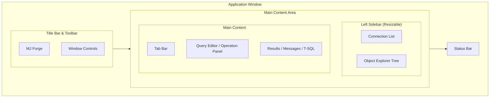

---

## Screen Mockups

### 1. Welcome / First Run Screen

```
┌─────────────────────────────────────────────────────────────────────────────┐
│  MJ Forge                                                    ─ □ ✕         │
├─────────────────────────────────────────────────────────────────────────────┤
│                                                                             │
│                                                                             │
│                         ╔═══════════════════════════════╗                   │
│                         ║                               ║                   │
│                         ║        ⚒️  MJ FORGE           ║                   │
│                         ║                               ║                   │
│                         ║   SQL Server Management       ║                   │
│                         ║        for macOS              ║                   │
│                         ║                               ║                   │
│                         ╚═══════════════════════════════╝                   │
│                                                                             │
│                                                                             │
│           ┌─────────────────────────────────────────────────┐               │
│           │                                                 │               │
│           │  🐳  Detect Docker SQL Server                   │               │
│           │      Automatically find local containers        │               │
│           │                                                 │               │
│           └─────────────────────────────────────────────────┘               │
│                                                                             │
│           ┌─────────────────────────────────────────────────┐               │
│           │                                                 │               │
│           │  ➕  Add Connection Manually                    │               │
│           │      Connect to any SQL Server                  │               │
│           │                                                 │               │
│           └─────────────────────────────────────────────────┘               │
│                                                                             │
│                                                                             │
│                       Recent Connections                                    │
│                       ──────────────────                                    │
│                       No recent connections                                 │
│                                                                             │
│                                                                             │
└─────────────────────────────────────────────────────────────────────────────┘
```

### 2. Docker Detection Screen

```
┌─────────────────────────────────────────────────────────────────────────────┐
│  MJ Forge                                                    ─ □ ✕         │
├─────────────────────────────────────────────────────────────────────────────┤
│                                                                             │
│     🐳 Docker SQL Server Detection                                          │
│     ━━━━━━━━━━━━━━━━━━━━━━━━━━━━━━                                          │
│                                                                             │
│     Found 2 SQL Server containers:                                          │
│                                                                             │
│     ┌───────────────────────────────────────────────────────────────────┐   │
│     │  ● RUNNING                                                        │   │
│     │                                                                   │   │
│     │  📦 sql-server-dev                                                │   │
│     │     Image: mcr.microsoft.com/mssql/server:2022-latest             │   │
│     │     Port:  localhost:1433                                         │   │
│     │                                                                   │   │
│     │     Volume Mounts:                                                │   │
│     │     • ~/backups → /var/opt/mssql/backups                          │   │
│     │                                                                   │   │
│     │                               [ Test Connection ]  [ Connect → ]  │   │
│     └───────────────────────────────────────────────────────────────────┘   │
│                                                                             │
│     ┌───────────────────────────────────────────────────────────────────┐   │
│     │  ○ STOPPED                                                        │   │
│     │                                                                   │   │
│     │  📦 sql-server-old                                                │   │
│     │     Image: mcr.microsoft.com/mssql/server:2019-latest             │   │
│     │     Port:  localhost:1434 (when running)                          │   │
│     │                                                                   │   │
│     │                                        [ Start Container ]        │   │
│     └───────────────────────────────────────────────────────────────────┘   │
│                                                                             │
│     ──────────────────────────────────────────────────────────────────────  │
│                                                                             │
│     [ ← Back ]                                    [ Add Manually Instead ]  │
│                                                                             │
└─────────────────────────────────────────────────────────────────────────────┘
```

### 3. Connection Form

```
┌─────────────────────────────────────────────────────────────────────────────┐
│  MJ Forge                                                    ─ □ ✕         │
├─────────────────────────────────────────────────────────────────────────────┤
│                                                                             │
│     New Connection                                                          │
│     ━━━━━━━━━━━━━━━                                                         │
│                                                                             │
│     Connection Name                                                         │
│     ┌───────────────────────────────────────────────────────────────────┐   │
│     │ Dev Server                                                        │   │
│     └───────────────────────────────────────────────────────────────────┘   │
│                                                                             │
│     ┌─────────────────────────────────────┐ ┌─────────────────────────────┐ │
│     │ Host                                │ │ Port                        │ │
│     │ ┌─────────────────────────────────┐ │ │ ┌─────────────────────────┐ │ │
│     │ │ localhost                       │ │ │ │ 1433                    │ │ │
│     │ └─────────────────────────────────┘ │ │ └─────────────────────────┘ │ │
│     └─────────────────────────────────────┘ └─────────────────────────────┘ │
│                                                                             │
│     Authentication                                                          │
│     ┌───────────────────────────────────────────────────────────────────┐   │
│     │ ○ SQL Server Authentication                                       │   │
│     │ ○ Azure Active Directory (coming soon)                            │   │
│     └───────────────────────────────────────────────────────────────────┘   │
│                                                                             │
│     ┌─────────────────────────────────────┐ ┌─────────────────────────────┐ │
│     │ Username                            │ │ Password                    │ │
│     │ ┌─────────────────────────────────┐ │ │ ┌─────────────────────────┐ │ │
│     │ │ sa                              │ │ │ │ ••••••••••              │ │ │
│     │ └─────────────────────────────────┘ │ │ └─────────────────────────┘ │ │
│     └─────────────────────────────────────┘ └─────────────────────────────┘ │
│                                                                             │
│     ▶ Advanced Options                                                      │
│     ┌───────────────────────────────────────────────────────────────────┐   │
│     │ ☑ Encrypt connection                                              │   │
│     │ ☑ Trust server certificate                                        │   │
│     │                                                                   │   │
│     │ Connection Timeout     Request Timeout                            │   │
│     │ ┌───────────────────┐  ┌───────────────────┐                      │   │
│     │ │ 15 seconds        │  │ 30 seconds        │                      │   │
│     │ └───────────────────┘  └───────────────────┘                      │   │
│     │                                                                   │   │
│     │ Default Database (optional)                                       │   │
│     │ ┌───────────────────────────────────────────────────────────────┐ │   │
│     │ │                                                               │ │   │
│     │ └───────────────────────────────────────────────────────────────┘ │   │
│     └───────────────────────────────────────────────────────────────────┘   │
│                                                                             │
│     ┌────────────────┐                    ┌────────────┐ ┌────────────────┐ │
│     │ Test Connection│                    │   Cancel   │ │ Save & Connect │ │
│     └────────────────┘                    └────────────┘ └────────────────┘ │
│                                                                             │
└─────────────────────────────────────────────────────────────────────────────┘
```

### 4. Main Workspace with Object Explorer

```
┌─────────────────────────────────────────────────────────────────────────────┐
│  MJ Forge                                                    ─ □ ✕         │
├─────────────────────────────────────────────────────────────────────────────┤
│  ┌─ Connections ──────┐  ┌─────────────────────────────────────────────────┐│
│  │                    │  │ + New Query │ Query 1 ✕│ customers.sql ✕│      ││
│  │ ▼ 🐳 Local Docker  │  ├─────────────────────────────────────────────────┤│
│  │   ├─ ● Dev (conn.) │  │ Connection: Dev@localhost  │  DB: [Northwind ▼]││
│  │   │                │  ├─────────────────────────────────────────────────┤│
│  │   └─ ○ Test        │  │                                                 ││
│  │                    │  │  1 │ -- Get top customers by order value        ││
│  │ ▶ 🌐 Remote        │  │  2 │ SELECT TOP 20                              ││
│  │                    │  │  3 │   c.CustomerID,                            ││
│  ├────────────────────┤  │  4 │   c.CompanyName,                           ││
│  │ 🔍 Filter objects  │  │  5 │   SUM(od.Quantity * od.UnitPrice) as Total ││
│  ├────────────────────┤  │  6 │ FROM Customers c                           ││
│  │                    │  │  7 │ JOIN Orders o ON c.CustomerID = o.Customer ││
│  │ ▼ 📊 Northwind     │  │  8 │ JOIN [Order Details] od ON o.OrderID = od. ││
│  │   ├─ 📋 Tables     │  │  9 │ GROUP BY c.CustomerID, c.CompanyName       ││
│  │   │   ├─ Categories│  │ 10 │ ORDER BY Total DESC                        ││
│  │   │   ├─ Customers │  │                                                 ││
│  │   │   ├─ Employees │  │                                                 ││
│  │   │   ├─ Orders    │  │ [ ▶ Run (⌘↵) ]  [ Run Selection ]  [ 💾 Save ] ││
│  │   │   ├─ Products  │  ├─────────────────────────────────────────────────┤│
│  │   │   └─ ...       │  │ Results │ Messages │ T-SQL                      ││
│  │   ├─ 👁 Views      │  ├─────────────────────────────────────────────────┤│
│  │   │   ├─ vwSales   │  │ CustomerID │ CompanyName          │ Total      ││
│  │   │   └─ ...       │  │────────────┼──────────────────────┼────────────││
│  │   └─ ⚙ Procedures │  │ QUICK      │ QUICK-Stop           │ $117,483   ││
│  │       ├─ CustOrder │  │ SAVEA      │ Save-a-lot Markets   │ $115,673   ││
│  │       └─ ...       │  │ ERNSH      │ Ernst Handel         │ $104,874   ││
│  │                    │  │ RATTC      │ Rattlesnake Canyon   │ $52,245    ││
│  │ ▶ 📊 master        │  │ HUNGO      │ Hungry Owl Stores    │ $49,979    ││
│  │ ▶ 📊 AdventureWrks │  │            │                      │            ││
│  │                    │  │ ◀ 1 2 3 4 5 ▶        Showing 1-20 of 89 rows   ││
│  └────────────────────┘  └─────────────────────────────────────────────────┘│
├─────────────────────────────────────────────────────────────────────────────┤
│ ● Connected: Dev@localhost:1433 │ Northwind │ Query: 45ms │ 89 rows        │
└─────────────────────────────────────────────────────────────────────────────┘
```

### 5. Database Context Menu (Right-Click)

```
┌─────────────────────────────────────────────────────────────────────────────┐
│                                                                             │
│  ▼ 📊 Northwind ◄───────────────────────────┐                               │
│    ├─ 📋 Tables     ┌───────────────────────┴─────────────────────┐         │
│    │   ├─ Categor   │                                             │         │
│    │   ├─ Customer  │  📝  New Query                    ⌘N        │         │
│    │   ├─ Employees │  ──────────────────────────────────────     │         │
│    │   ├─ Orders    │  ➕  Create Database...                     │         │
│    │   ├─ Products  │  ✏️   Rename Database...                    │         │
│    │   └─ ...       │  🗑️  Delete Database...           ⌘⌫       │         │
│    ├─ 👁 Views      │  ──────────────────────────────────────     │         │
│    └─ ⚙ Procedures │  💾  Backup Database...            ⌘B        │         │
│                     │  📥  Restore Database...           ⌘R        │         │
│                     │  ──────────────────────────────────────     │         │
│                     │  🔄  Refresh                       ⌘⇧R      │         │
│                     │  📋  Copy Connection String                  │         │
│                     │                                             │         │
│                     └─────────────────────────────────────────────┘         │
│                                                                             │
└─────────────────────────────────────────────────────────────────────────────┘
```

### 6. Create Database Dialog

```
┌─────────────────────────────────────────────────────────────────────────────┐
│                                                                             │
│  ┌───────────────────────────────────────────────────────────────────────┐  │
│  │                                                                       │  │
│  │   ➕ Create New Database                                              │  │
│  │   ━━━━━━━━━━━━━━━━━━━━━                                               │  │
│  │                                                                       │  │
│  │   Server: Dev@localhost:1433                                          │  │
│  │                                                                       │  │
│  │   Database Name *                                                     │  │
│  │   ┌───────────────────────────────────────────────────────────────┐   │  │
│  │   │ MyNewDatabase                                                 │   │  │
│  │   └───────────────────────────────────────────────────────────────┘   │  │
│  │                                                                       │  │
│  │   ▶ Advanced Options                                                  │  │
│  │   ┌───────────────────────────────────────────────────────────────┐   │  │
│  │   │                                                               │   │  │
│  │   │  Collation                                                    │   │  │
│  │   │  ┌─────────────────────────────────────────────────────────┐  │   │  │
│  │   │  │ SQL_Latin1_General_CP1_CI_AS (server default)        ▼ │  │   │  │
│  │   │  └─────────────────────────────────────────────────────────┘  │   │  │
│  │   │                                                               │   │  │
│  │   │  Recovery Model                                               │   │  │
│  │   │  ┌─────────────────────────────────────────────────────────┐  │   │  │
│  │   │  │ Simple (recommended for dev)                         ▼ │  │   │  │
│  │   │  └─────────────────────────────────────────────────────────┘  │   │  │
│  │   │                                                               │   │  │
│  │   └───────────────────────────────────────────────────────────────┘   │  │
│  │                                                                       │  │
│  │   ┌─ T-SQL Preview ───────────────────────────────────────────────┐   │  │
│  │   │                                                               │   │  │
│  │   │  CREATE DATABASE [MyNewDatabase]                              │   │  │
│  │   │  COLLATE SQL_Latin1_General_CP1_CI_AS;                        │   │  │
│  │   │                                                               │   │  │
│  │   │  ALTER DATABASE [MyNewDatabase]                               │   │  │
│  │   │  SET RECOVERY SIMPLE;                                         │   │  │
│  │   │                                                    [ 📋 Copy ]│   │  │
│  │   └───────────────────────────────────────────────────────────────┘   │  │
│  │                                                                       │  │
│  │                                      ┌──────────┐  ┌────────────────┐ │  │
│  │                                      │  Cancel  │  │    Create      │ │  │
│  │                                      └──────────┘  └────────────────┘ │  │
│  │                                                                       │  │
│  └───────────────────────────────────────────────────────────────────────┘  │
│                                                                             │
└─────────────────────────────────────────────────────────────────────────────┘
```

### 7. Delete Database Confirmation (Safety-First Design)

```
┌─────────────────────────────────────────────────────────────────────────────┐
│                                                                             │
│  ┌───────────────────────────────────────────────────────────────────────┐  │
│  │                                                                       │  │
│  │   ⚠️  Delete Database                                                 │  │
│  │   ━━━━━━━━━━━━━━━━━━━                                                 │  │
│  │                                                                       │  │
│  │   ┌───────────────────────────────────────────────────────────────┐   │  │
│  │   │                                                               │   │  │
│  │   │   🗄️  Northwind                                               │   │  │
│  │   │                                                               │   │  │
│  │   │   Size: 156 MB                                                │   │  │
│  │   │   Tables: 13                                                  │   │  │
│  │   │   Last Modified: 2 hours ago                                  │   │  │
│  │   │                                                               │   │  │
│  │   └───────────────────────────────────────────────────────────────┘   │  │
│  │                                                                       │  │
│  │   ⚠️  This action cannot be undone. The database and all its data    │  │
│  │       will be permanently deleted.                                    │  │
│  │                                                                       │  │
│  │   ☑ Close existing connections (required for delete)                  │  │
│  │                                                                       │  │
│  │   Type the database name to confirm:                                  │  │
│  │   ┌───────────────────────────────────────────────────────────────┐   │  │
│  │   │                                                               │   │  │
│  │   └───────────────────────────────────────────────────────────────┘   │  │
│  │                                                                       │  │
│  │   ┌─ T-SQL Preview ───────────────────────────────────────────────┐   │  │
│  │   │                                                               │   │  │
│  │   │  ALTER DATABASE [Northwind]                                   │   │  │
│  │   │  SET SINGLE_USER WITH ROLLBACK IMMEDIATE;                     │   │  │
│  │   │                                                               │   │  │
│  │   │  DROP DATABASE [Northwind];                                   │   │  │
│  │   │                                                    [ 📋 Copy ]│   │  │
│  │   └───────────────────────────────────────────────────────────────┘   │  │
│  │                                                                       │  │
│  │                                      ┌──────────┐  ┌────────────────┐ │  │
│  │                                      │  Cancel  │  │ Delete Forever │ │  │
│  │                                      └──────────┘  └────────────────┘ │  │
│  │                                                           ▲           │  │
│  │                                              (disabled until name     │  │
│  │                                               is typed correctly)     │  │
│  │                                                                       │  │
│  └───────────────────────────────────────────────────────────────────────┘  │
│                                                                             │
└─────────────────────────────────────────────────────────────────────────────┘
```

### 8. Backup Database Panel

```
┌─────────────────────────────────────────────────────────────────────────────┐
│  MJ Forge                                                    ─ □ ✕         │
├─────────────────────────────────────────────────────────────────────────────┤
│  ┌─ Connections ──────┐  ┌─────────────────────────────────────────────────┐│
│  │                    │  │ Query 1 │ 💾 Backup: Northwind ✕│              ││
│  │ ▼ 🐳 Local Docker  │  ├─────────────────────────────────────────────────┤│
│  │   └─ ● Dev (conn.) │  │                                                 ││
│  │                    │  │  💾 Backup Database                             ││
│  ├────────────────────┤  │  ━━━━━━━━━━━━━━━━━━                              ││
│  │                    │  │                                                 ││
│  │ ▼ 📊 Northwind ◄─  │  │  Source Database                                ││
│  │   ├─ 📋 Tables     │  │  ┌───────────────────────────────────────────┐  ││
│  │   ├─ 👁 Views      │  │  │ 🗄️  Northwind  (156 MB)                   │  ││
│  │   └─ ⚙ Procedures │  │  └───────────────────────────────────────────┘  ││
│  │                    │  │                                                 ││
│  └────────────────────┘  │  Backup Type                                    ││
│                          │  ○ Full Backup (complete copy)                  ││
│                          │  ○ Full Backup with COPY_ONLY (no log chain)    ││
│                          │                                                 ││
│                          │  Destination                                    ││
│                          │  ┌───────────────────────────────────────────┐  ││
│                          │  │ 📁 /var/opt/mssql/backups/                │  ││
│                          │  │    Northwind_20260122_143052.bak          │  ││
│                          │  │                                           │  ││
│                          │  │    [ 📂 Browse... ]                       │  ││
│                          │  └───────────────────────────────────────────┘  ││
│                          │                                                 ││
│                          │  🐳 Docker Volume Detected                      ││
│                          │  ┌───────────────────────────────────────────┐  ││
│                          │  │ Container path: /var/opt/mssql/backups/   │  ││
│                          │  │ Maps to local:  ~/sql-backups/            │  ││
│                          │  │                                           │  ││
│                          │  │ ✓ Backup will be accessible on your Mac   │  ││
│                          │  └───────────────────────────────────────────┘  ││
│                          │                                                 ││
│                          │  ▶ Advanced Options                             ││
│                          │  ┌───────────────────────────────────────────┐  ││
│                          │  │ ☑ Use compression                         │  ││
│                          │  │ ☐ Verify backup after completion          │  ││
│                          │  └───────────────────────────────────────────┘  ││
│                          │                                                 ││
│                          │  ┌─ T-SQL ───────────────────────────────────┐  ││
│                          │  │ BACKUP DATABASE [Northwind]               │  ││
│                          │  │ TO DISK = N'/var/opt/mssql/backups/       │  ││
│                          │  │   Northwind_20260122_143052.bak'          │  ││
│                          │  │ WITH COMPRESSION, INIT;          [ 📋 ]   │  ││
│                          │  └───────────────────────────────────────────┘  ││
│                          │                                                 ││
│                          │           [ Cancel ]  [ ▶ Start Backup ]        ││
│                          │                                                 ││
│                          └─────────────────────────────────────────────────┘│
├─────────────────────────────────────────────────────────────────────────────┤
│ ● Connected: Dev@localhost:1433                                             │
└─────────────────────────────────────────────────────────────────────────────┘
```

### 9. Backup In Progress

```
┌─────────────────────────────────────────────────────────────────────────────┐
│  MJ Forge                                                    ─ □ ✕         │
├─────────────────────────────────────────────────────────────────────────────┤
│  ┌─ Connections ──────┐  ┌─────────────────────────────────────────────────┐│
│  │                    │  │ Query 1 │ 💾 Backup: Northwind ✕│              ││
│  │ ...                │  ├─────────────────────────────────────────────────┤│
│  │                    │  │                                                 ││
│  └────────────────────┘  │  💾 Backing Up: Northwind                       ││
│                          │  ━━━━━━━━━━━━━━━━━━━━━━━━━━                      ││
│                          │                                                 ││
│                          │  ┌───────────────────────────────────────────┐  ││
│                          │  │                                           │  ││
│                          │  │   ████████████████████████░░░░░░  67%     │  ││
│                          │  │                                           │  ││
│                          │  │   Processed: 104 MB / 156 MB              │  ││
│                          │  │   Elapsed: 00:12                          │  ││
│                          │  │   Speed: 8.7 MB/s                         │  ││
│                          │  │                                           │  ││
│                          │  └───────────────────────────────────────────┘  ││
│                          │                                                 ││
│                          │  ┌─ Live Log ────────────────────────────────┐  ││
│                          │  │ [14:30:52] Starting backup...             │  ││
│                          │  │ [14:30:52] Database: Northwind            │  ││
│                          │  │ [14:30:52] Destination: /var/opt/mssql/.. │  ││
│                          │  │ [14:30:53] Processed 10%                  │  ││
│                          │  │ [14:30:55] Processed 20%                  │  ││
│                          │  │ [14:30:58] Processed 30%                  │  ││
│                          │  │ [14:31:01] Processed 40%                  │  ││
│                          │  │ [14:31:03] Processed 50%                  │  ││
│                          │  │ [14:31:05] Processed 60%                  │  ││
│                          │  │ [14:31:07] Processed 67%                  │  ││
│                          │  │                                           │  ││
│                          │  │                               [ 📋 Copy ] │  ││
│                          │  └───────────────────────────────────────────┘  ││
│                          │                                                 ││
│                          │                      [ Cancel Backup ]          ││
│                          │                                                 ││
│                          └─────────────────────────────────────────────────┘│
├─────────────────────────────────────────────────────────────────────────────┤
│ ● Connected: Dev@localhost:1433  │  ⏳ Backup in progress: 67%             │
└─────────────────────────────────────────────────────────────────────────────┘
```

### 10. Restore Database Wizard - Step 1: Select Source

```
┌─────────────────────────────────────────────────────────────────────────────┐
│  MJ Forge                                                    ─ □ ✕         │
├─────────────────────────────────────────────────────────────────────────────┤
│                                                                             │
│     📥 Restore Database                                        Step 1 of 3 │
│     ━━━━━━━━━━━━━━━━━━━                                                     │
│                                                                             │
│     ┌─────────────────────────────────────────────────────────────────────┐ │
│     │  ○ Step 1          ○ Step 2          ○ Step 3                       │ │
│     │  Select Source     Configure         Review & Execute               │ │
│     │  ─────────────     ─────────         ────────────────               │ │
│     └─────────────────────────────────────────────────────────────────────┘ │
│                                                                             │
│     Select Backup Source                                                    │
│                                                                             │
│     ○ Browse server paths                                                   │
│       (backup files accessible to SQL Server)                               │
│                                                                             │
│     ● Browse local files                                                    │
│       (if using Docker with volume mounts)                                  │
│                                                                             │
│     ┌─────────────────────────────────────────────────────────────────────┐ │
│     │                                                                     │ │
│     │   📂 ~/sql-backups/                                                 │ │
│     │   ───────────────────────────────────────────────────────────────   │ │
│     │                                                                     │ │
│     │   📄 Northwind_20260120_093045.bak          245 MB    Jan 20       │ │
│     │   📄 Northwind_20260115_143022.bak          238 MB    Jan 15       │ │
│     │   📄 AdventureWorks_20260118_110000.bak     1.2 GB    Jan 18       │ │
│     │   📄 TestDB_backup.bak                       45 MB    Jan 10       │ │
│     │                                                                     │ │
│     │                                             [ 📂 Choose Folder ]    │ │
│     │                                                                     │ │
│     └─────────────────────────────────────────────────────────────────────┘ │
│                                                                             │
│     Selected: Northwind_20260120_093045.bak                                 │
│                                                                             │
│     🐳 Docker Volume Mapping                                                │
│     ┌─────────────────────────────────────────────────────────────────────┐ │
│     │ Local:     ~/sql-backups/Northwind_20260120_093045.bak              │ │
│     │ Container: /var/opt/mssql/backups/Northwind_20260120_093045.bak     │ │
│     │                                                                     │ │
│     │ ✓ Path is accessible to SQL Server in container                     │ │
│     └─────────────────────────────────────────────────────────────────────┘ │
│                                                                             │
│                                                  [ Cancel ]  [ Next → ]     │
│                                                                             │
└─────────────────────────────────────────────────────────────────────────────┘
```

### 11. Restore Database Wizard - Step 2: Configure

```
┌─────────────────────────────────────────────────────────────────────────────┐
│  MJ Forge                                                    ─ □ ✕         │
├─────────────────────────────────────────────────────────────────────────────┤
│                                                                             │
│     📥 Restore Database                                        Step 2 of 3 │
│     ━━━━━━━━━━━━━━━━━━━                                                     │
│                                                                             │
│     ┌─────────────────────────────────────────────────────────────────────┐ │
│     │  ● Step 1          ○ Step 2          ○ Step 3                       │ │
│     │  Select Source     Configure         Review & Execute               │ │
│     │  ✓ Complete        ─────────         ────────────────               │ │
│     └─────────────────────────────────────────────────────────────────────┘ │
│                                                                             │
│     Backup Information                                                      │
│     ┌─────────────────────────────────────────────────────────────────────┐ │
│     │ Database Name:    Northwind                                         │ │
│     │ Backup Date:      Jan 20, 2026 09:30:45 AM                          │ │
│     │ Backup Size:      245 MB                                            │ │
│     │ SQL Server Ver:   16.0.1135.2 (SQL Server 2022)                     │ │
│     └─────────────────────────────────────────────────────────────────────┘ │
│                                                                             │
│     Restore As                                                              │
│     ┌─────────────────────────────────────────────────────────────────────┐ │
│     │ Database Name                                                       │ │
│     │ ┌───────────────────────────────────────────────────────────────┐   │ │
│     │ │ Northwind_restored                                            │   │ │
│     │ └───────────────────────────────────────────────────────────────┘   │ │
│     │                                                                     │ │
│     │ ☐ Overwrite existing database (WITH REPLACE)                        │ │
│     │   ⚠️ Warning: This will delete all current data in Northwind        │ │
│     └─────────────────────────────────────────────────────────────────────┘ │
│                                                                             │
│     File Locations                                                          │
│     ┌─────────────────────────────────────────────────────────────────────┐ │
│     │                                                                     │ │
│     │ Logical Name          Type    Original Path              Restore To │ │
│     │ ─────────────────────────────────────────────────────────────────── │ │
│     │ Northwind             Data    D:\Data\Northwind.mdf                 │ │
│     │                               ┌─────────────────────────────────┐   │ │
│     │                               │ /var/opt/mssql/data/Northwind_ │   │ │
│     │                               │ restored.mdf                   │   │ │
│     │                               └─────────────────────────────────┘   │ │
│     │                                                                     │ │
│     │ Northwind_log         Log     D:\Data\Northwind_log.ldf             │ │
│     │                               ┌─────────────────────────────────┐   │ │
│     │                               │ /var/opt/mssql/data/Northwind_ │   │ │
│     │                               │ restored_log.ldf               │   │ │
│     │                               └─────────────────────────────────┘   │ │
│     │                                                                     │ │
│     │                                          [ Reset to Defaults ]      │ │
│     └─────────────────────────────────────────────────────────────────────┘ │
│                                                                             │
│                                         [ ← Back ]  [ Cancel ]  [ Next → ] │
│                                                                             │
└─────────────────────────────────────────────────────────────────────────────┘
```

### 12. Restore Database Wizard - Step 3: Review & Execute

```
┌─────────────────────────────────────────────────────────────────────────────┐
│  MJ Forge                                                    ─ □ ✕         │
├─────────────────────────────────────────────────────────────────────────────┤
│                                                                             │
│     📥 Restore Database                                        Step 3 of 3 │
│     ━━━━━━━━━━━━━━━━━━━                                                     │
│                                                                             │
│     ┌─────────────────────────────────────────────────────────────────────┐ │
│     │  ● Step 1          ● Step 2          ○ Step 3                       │ │
│     │  Select Source     Configure         Review & Execute               │ │
│     │  ✓ Complete        ✓ Complete        ────────────────               │ │
│     └─────────────────────────────────────────────────────────────────────┘ │
│                                                                             │
│     Review Restore Operation                                                │
│                                                                             │
│     ┌─────────────────────────────────────────────────────────────────────┐ │
│     │                                                                     │ │
│     │ Source:     Northwind_20260120_093045.bak                           │ │
│     │ Target DB:  Northwind_restored (new database)                       │ │
│     │ Overwrite:  No                                                      │ │
│     │                                                                     │ │
│     │ Data File:  /var/opt/mssql/data/Northwind_restored.mdf              │ │
│     │ Log File:   /var/opt/mssql/data/Northwind_restored_log.ldf          │ │
│     │                                                                     │ │
│     └─────────────────────────────────────────────────────────────────────┘ │
│                                                                             │
│     T-SQL to Execute                                                        │
│     ┌─────────────────────────────────────────────────────────────────────┐ │
│     │                                                                     │ │
│     │  RESTORE DATABASE [Northwind_restored]                              │ │
│     │  FROM DISK = N'/var/opt/mssql/backups/                              │ │
│     │      Northwind_20260120_093045.bak'                                 │ │
│     │  WITH                                                               │ │
│     │      MOVE N'Northwind' TO                                           │ │
│     │          N'/var/opt/mssql/data/Northwind_restored.mdf',             │ │
│     │      MOVE N'Northwind_log' TO                                       │ │
│     │          N'/var/opt/mssql/data/Northwind_restored_log.ldf',         │ │
│     │      STATS = 10;                                                    │ │
│     │                                                                     │ │
│     │                                                         [ 📋 Copy ] │ │
│     └─────────────────────────────────────────────────────────────────────┘ │
│                                                                             │
│     ☑ I understand this operation may take several minutes                  │
│                                                                             │
│                              [ ← Back ]  [ Cancel ]  [ ▶ Start Restore ]   │
│                                                                             │
└─────────────────────────────────────────────────────────────────────────────┘
```

---

## User Flow Diagrams

### Overall Application Flow

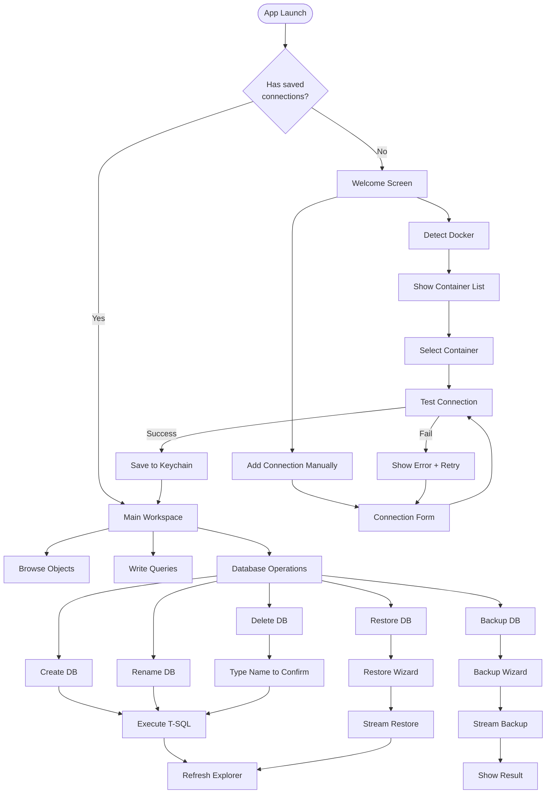

### Connection Establishment Flow

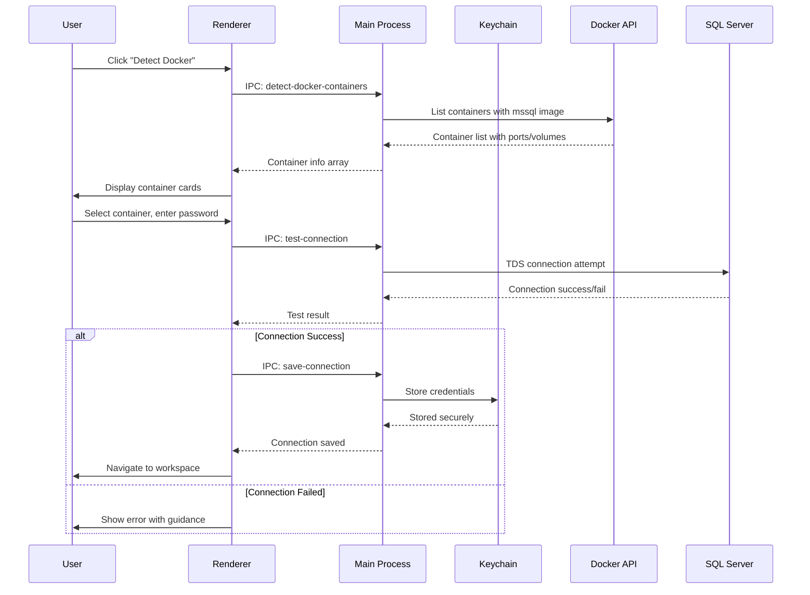

### Backup Flow

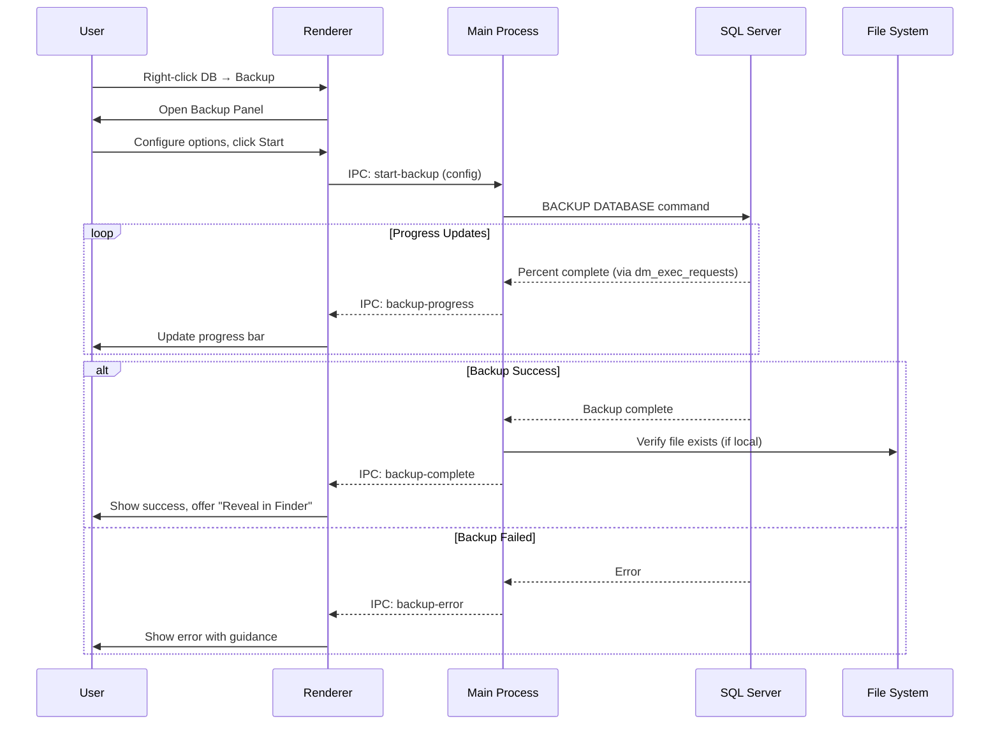

### Restore Flow

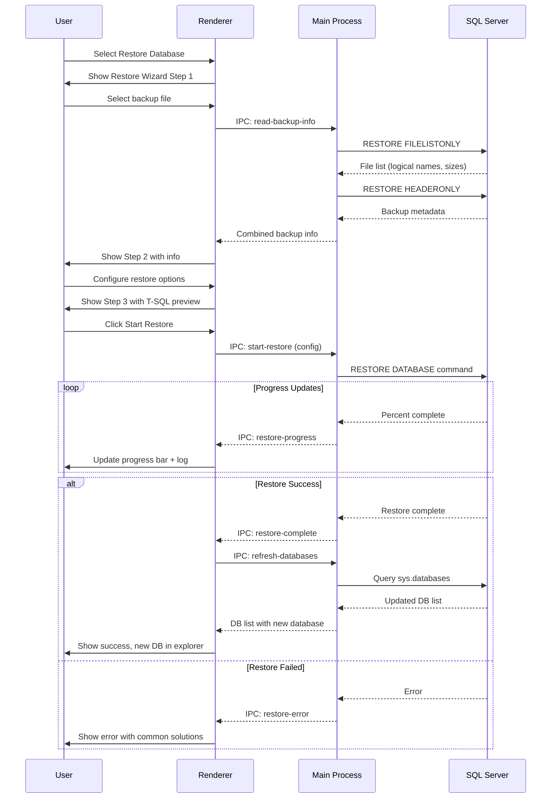

---

## Component Specifications

### Status Bar States

```
┌─────────────────────────────────────────────────────────────────────────────┐
│ CONNECTED STATE                                                             │
│ ● Connected: DevServer@localhost:1433 │ DB: Northwind │ Query: 45ms │ 89 rows│
├─────────────────────────────────────────────────────────────────────────────┤
│ DISCONNECTED STATE                                                          │
│ ○ Not connected │ Click to connect...                                       │
├─────────────────────────────────────────────────────────────────────────────┤
│ CONNECTING STATE                                                            │
│ ◐ Connecting to DevServer@localhost:1433...                                 │
├─────────────────────────────────────────────────────────────────────────────┤
│ OPERATION IN PROGRESS                                                       │
│ ● Connected: Dev@localhost │ ⏳ Backup in progress: 67% (Northwind)         │
├─────────────────────────────────────────────────────────────────────────────┤
│ ERROR STATE                                                                 │
│ ⚠ Connection lost: DevServer@localhost:1433 │ [Reconnect]                   │
└─────────────────────────────────────────────────────────────────────────────┘
```

### Toast Notifications

```
┌───────────────────────────────────────────┐
│  ✓ Database Created                       │
│                                           │
│  "MyNewDatabase" created successfully     │
│                              [ Dismiss ]  │
└───────────────────────────────────────────┘

┌───────────────────────────────────────────┐
│  ✓ Backup Complete                        │
│                                           │
│  Northwind backed up to:                  │
│  ~/sql-backups/Northwind_20260122.bak     │
│                                           │
│  [ Reveal in Finder ]       [ Dismiss ]   │
└───────────────────────────────────────────┘

┌───────────────────────────────────────────┐
│  ✗ Restore Failed                         │
│                                           │
│  Cannot access backup file. Check that    │
│  the path is mounted in the container.    │
│                                           │
│  [ View Details ]           [ Dismiss ]   │
└───────────────────────────────────────────┘
```

---

## Keyboard Shortcuts

| Action            | Shortcut | Context           |
| ----------------- | -------- | ----------------- |
| New Query Tab     | ⌘N       | Global            |
| Run Query         | ⌘↵       | Query Editor      |
| Run Selection     | ⌘⇧↵      | Query Editor      |
| Save Query        | ⌘S       | Query Editor      |
| Close Tab         | ⌘W       | Any Tab           |
| Backup Database   | ⌘B       | Database Selected |
| Restore Database  | ⌘R       | Server Selected   |
| Delete Database   | ⌘⌫       | Database Selected |
| Refresh Explorer  | ⌘⇧R      | Global            |
| Toggle Sidebar    | ⌘\       | Global            |
| Command Palette   | ⌘K       | Global            |
| Switch Connection | ⌘⇧C      | Global            |
| Find in Results   | ⌘F       | Results Grid      |
| Copy Cell         | ⌘C       | Results Grid      |
| Export Results    | ⌘E       | Results Grid      |

---

_Continue to [Part III: Interaction Design →](03-interaction-design.md)_

# Part III: Interaction Design

## Design System

### Color Palette

```
┌─────────────────────────────────────────────────────────────────────────────┐
│                           MJ FORGE COLOR SYSTEM                             │
├─────────────────────────────────────────────────────────────────────────────┤
│                                                                             │
│  PRIMARY                                                                    │
│  ─────────────────────────────────────────────────────────────────────────  │
│  ██████  #0078D4    Primary Blue       Actions, links, focus states         │
│  ██████  #106EBE    Primary Dark       Hover states                         │
│  ██████  #C7E0F4    Primary Light      Backgrounds, highlights              │
│                                                                             │
│  SEMANTIC                                                                   │
│  ─────────────────────────────────────────────────────────────────────────  │
│  ██████  #107C10    Success Green      Completed operations, connected      │
│  ██████  #FCE100    Warning Yellow     Caution states, pending              │
│  ██████  #D13438    Error Red          Failed operations, destructive       │
│  ██████  #00B7C3    Info Cyan          Informational, Docker                │
│                                                                             │
│  NEUTRAL                                                                    │
│  ─────────────────────────────────────────────────────────────────────────  │
│  ██████  #FFFFFF    Background         Main content area                    │
│  ██████  #F3F3F3    Surface            Panels, cards                        │
│  ██████  #E1E1E1    Border             Dividers, outlines                   │
│  ██████  #616161    Text Secondary     Labels, hints                        │
│  ██████  #323130    Text Primary       Main text, headings                  │
│  ██████  #1B1A19    Text Emphasis      Code, important text                 │
│                                                                             │
│  DARK MODE (v1.1)                                                           │
│  ─────────────────────────────────────────────────────────────────────────  │
│  ██████  #1E1E1E    Background         Main content area                    │
│  ██████  #252526    Surface            Panels, cards                        │
│  ██████  #3C3C3C    Border             Dividers, outlines                   │
│  ██████  #CCCCCC    Text Primary       Main text                            │
│                                                                             │
└─────────────────────────────────────────────────────────────────────────────┘
```

### Typography

```
┌─────────────────────────────────────────────────────────────────────────────┐
│                           MJ FORGE TYPOGRAPHY                               │
├─────────────────────────────────────────────────────────────────────────────┤
│                                                                             │
│  FONT FAMILIES                                                              │
│  ─────────────────────────────────────────────────────────────────────────  │
│                                                                             │
│  System UI    -apple-system, BlinkMacSystemFont, 'Segoe UI', Roboto        │
│               Used for: All UI text, labels, buttons                        │
│                                                                             │
│  Monospace    'SF Mono', 'Monaco', 'Menlo', 'Consolas', monospace           │
│               Used for: Query editor, T-SQL preview, results grid           │
│                                                                             │
│  TYPE SCALE                                                                 │
│  ─────────────────────────────────────────────────────────────────────────  │
│                                                                             │
│  Display      24px / 600    Page titles, welcome screen                     │
│  Heading 1    20px / 600    Section headers                                 │
│  Heading 2    16px / 600    Panel titles, dialog titles                     │
│  Body         14px / 400    Default text, labels                            │
│  Body Small   12px / 400    Secondary text, hints                           │
│  Code         13px / 400    Editor, T-SQL, results                          │
│  Caption      11px / 400    Timestamps, metadata                            │
│                                                                             │
└─────────────────────────────────────────────────────────────────────────────┘
```

### Spacing System

```
┌─────────────────────────────────────────────────────────────────────────────┐
│                           SPACING SCALE (8px base)                          │
├─────────────────────────────────────────────────────────────────────────────┤
│                                                                             │
│  --space-1     4px      Tight spacing, inline elements                      │
│  --space-2     8px      Default gap between related elements                │
│  --space-3    12px      Form field gaps                                     │
│  --space-4    16px      Section padding, card padding                       │
│  --space-5    24px      Large section gaps                                  │
│  --space-6    32px      Page margins, major sections                        │
│  --space-8    48px      Feature sections                                    │
│                                                                             │
│  LAYOUT                                                                     │
│  ─────────────────────────────────────────────────────────────────────────  │
│                                                                             │
│  Sidebar width:        260px (min) - 400px (max)                            │
│  Panel min height:     200px                                                │
│  Dialog max width:     600px (standard), 800px (wizard)                     │
│  Toast width:          360px                                                │
│  Button min width:     80px                                                 │
│                                                                             │
└─────────────────────────────────────────────────────────────────────────────┘
```

---

## Component Library

### Button Variants

```
┌─────────────────────────────────────────────────────────────────────────────┐
│                              BUTTON STYLES                                  │
├─────────────────────────────────────────────────────────────────────────────┤
│                                                                             │
│  PRIMARY                                                                    │
│  ┌────────────────┐  ┌────────────────┐  ┌────────────────┐                │
│  │    Connect     │  │    Connect     │  │    Connect     │                │
│  │                │  │   (hover)      │  │   (disabled)   │                │
│  └────────────────┘  └────────────────┘  └────────────────┘                │
│  bg: #0078D4         bg: #106EBE         bg: #C7E0F4                        │
│  text: white         text: white         text: #A0A0A0                      │
│                                                                             │
│  SECONDARY                                                                  │
│  ┌────────────────┐  ┌────────────────┐  ┌────────────────┐                │
│  │    Cancel      │  │    Cancel      │  │    Cancel      │                │
│  │                │  │   (hover)      │  │   (disabled)   │                │
│  └────────────────┘  └────────────────┘  └────────────────┘                │
│  bg: transparent     bg: #F3F3F3         bg: transparent                    │
│  border: #E1E1E1     border: #0078D4     border: #E1E1E1                    │
│  text: #323130       text: #323130       text: #A0A0A0                      │
│                                                                             │
│  DESTRUCTIVE                                                                │
│  ┌────────────────┐  ┌────────────────┐  ┌────────────────┐                │
│  │ Delete Forever │  │ Delete Forever │  │ Delete Forever │                │
│  │                │  │   (hover)      │  │   (disabled)   │                │
│  └────────────────┘  └────────────────┘  └────────────────┘                │
│  bg: #D13438         bg: #A4262C         bg: #F4C7C7                        │
│  text: white         text: white         text: #A0A0A0                      │
│                                                                             │
│  GHOST (Icon buttons, toolbar actions)                                      │
│  ┌────┐  ┌────┐  ┌────┐                                                    │
│  │ 🔄 │  │ 🔄 │  │ 🔄 │                                                    │
│  └────┘  └────┘  └────┘                                                    │
│  bg: transparent     bg: #F3F3F3         bg: transparent                    │
│                                                                             │
└─────────────────────────────────────────────────────────────────────────────┘
```

### Form Controls

```
┌─────────────────────────────────────────────────────────────────────────────┐
│                             FORM CONTROLS                                   │
├─────────────────────────────────────────────────────────────────────────────┤
│                                                                             │
│  TEXT INPUT                                                                 │
│  ─────────────────────────────────────────────────────────────────────────  │
│                                                                             │
│  Default                 Focused                  Error                     │
│  Database Name           Database Name            Database Name             │
│  ┌──────────────────┐    ┌──────────────────┐    ┌──────────────────┐      │
│  │ MyDatabase       │    │ MyDatabase       │    │ My Database!     │      │
│  └──────────────────┘    └──────────────────┘    └──────────────────┘      │
│  border: #E1E1E1         border: #0078D4         border: #D13438           │
│                          shadow: focus ring      ⚠ Invalid characters       │
│                                                                             │
│  SELECT / DROPDOWN                                                          │
│  ─────────────────────────────────────────────────────────────────────────  │
│                                                                             │
│  Collation                                                                  │
│  ┌──────────────────────────────────────────────────────────────┬───┐      │
│  │ SQL_Latin1_General_CP1_CI_AS                                 │ ▼ │      │
│  └──────────────────────────────────────────────────────────────┴───┘      │
│                                                                             │
│  Expanded:                                                                  │
│  ┌──────────────────────────────────────────────────────────────────┐      │
│  │ SQL_Latin1_General_CP1_CI_AS (Server default)              ✓    │      │
│  │ Latin1_General_CI_AS                                            │      │
│  │ Latin1_General_CS_AS                                            │      │
│  │ SQL_Latin1_General_CP1_CS_AS                                    │      │
│  └──────────────────────────────────────────────────────────────────┘      │
│                                                                             │
│  CHECKBOX                                                                   │
│  ─────────────────────────────────────────────────────────────────────────  │
│                                                                             │
│  ☐ Unchecked              ☑ Checked               ☐ Disabled               │
│    Use compression          Use compression         Use compression        │
│                                                                             │
│  RADIO                                                                      │
│  ─────────────────────────────────────────────────────────────────────────  │
│                                                                             │
│  ○ Full Backup                                                              │
│  ● Full Backup with COPY_ONLY                                               │
│                                                                             │
└─────────────────────────────────────────────────────────────────────────────┘
```

### Tree View Component

```
┌─────────────────────────────────────────────────────────────────────────────┐
│                             TREE VIEW STATES                                │
├─────────────────────────────────────────────────────────────────────────────┤
│                                                                             │
│  STANDARD STATE                                                             │
│  ─────────────────────────────────────────────────────────────────────────  │
│                                                                             │
│  ▼ 📊 Northwind                    ◄── Expanded node                        │
│    ├─ 📋 Tables                                                             │
│    │   ├─ Customers                ◄── Leaf node                            │
│    │   ├─ Orders                                                            │
│    │   └─ Products                                                          │
│    ├─ 👁 Views                                                              │
│    └─ ⚙ Stored Procedures                                                  │
│  ▶ 📊 AdventureWorks               ◄── Collapsed node                       │
│  ▶ 📊 master                       ◄── System DB (dimmed)                   │
│                                                                             │
│  HOVER STATE                                                                │
│  ─────────────────────────────────────────────────────────────────────────  │
│                                                                             │
│  ▼ 📊 Northwind                                                             │
│    ├─ 📋 Tables                                                             │
│    │   ┌─────────────────────────────┐                                      │
│    │   │ ├─ Customers              │ ◄── Highlighted row                   │
│    │   └─────────────────────────────┘                                      │
│    │   ├─ Orders                                                            │
│                                                                             │
│  SELECTED STATE                                                             │
│  ─────────────────────────────────────────────────────────────────────────  │
│                                                                             │
│  ▼ 📊 Northwind                                                             │
│    ├─ 📋 Tables                                                             │
│    │   ███████████████████████████████                                      │
│    │   ██ Customers              ██  ◄── Selected (bg: primary light)      │
│    │   ███████████████████████████████                                      │
│    │   ├─ Orders                                                            │
│                                                                             │
│  LOADING STATE                                                              │
│  ─────────────────────────────────────────────────────────────────────────  │
│                                                                             │
│  ▼ 📊 Northwind                                                             │
│    ├─ 📋 Tables                                                             │
│    │   ○ Loading...                ◄── Spinner + text                       │
│                                                                             │
│  CONTEXT MENU ACTIVE                                                        │
│  ─────────────────────────────────────────────────────────────────────────  │
│                                                                             │
│  ▼ 📊 Northwind ◄────────────────┐                                          │
│    ├─ 📋 Tables  ┌───────────────┴─────────────────┐                        │
│    │   ├─ Custo  │  📝 New Query              ⌘N   │                        │
│    │   ├─ Orders │  ───────────────────────────    │                        │
│    │   └─ Produ  │  💾 Backup Database...      ⌘B   │                        │
│                  │  📥 Restore Database...     ⌘R   │                        │
│                  └─────────────────────────────────┘                        │
│                                                                             │
└─────────────────────────────────────────────────────────────────────────────┘
```

### Progress Indicators

```
┌─────────────────────────────────────────────────────────────────────────────┐
│                           PROGRESS INDICATORS                               │
├─────────────────────────────────────────────────────────────────────────────┤
│                                                                             │
│  DETERMINATE PROGRESS BAR                                                   │
│  ─────────────────────────────────────────────────────────────────────────  │
│                                                                             │
│  0%    ░░░░░░░░░░░░░░░░░░░░░░░░░░░░░░░░░░░░░░░░░░░░░░░░░░                   │
│                                                                             │
│  35%   ████████████████░░░░░░░░░░░░░░░░░░░░░░░░░░░░░░░░░░                   │
│                                                                             │
│  67%   ██████████████████████████████████░░░░░░░░░░░░░░░░                   │
│                                                                             │
│  100%  ██████████████████████████████████████████████████                   │
│                                                                             │
│  INDETERMINATE (Shimmer animation)                                          │
│  ─────────────────────────────────────────────────────────────────────────  │
│                                                                             │
│        ░░░░░░░░████████░░░░░░░░░░░░░░░░░░░░░░░░░░░░░░░░░░                   │
│               ─────────▶ (animating left to right)                          │
│                                                                             │
│  SPINNER (for quick operations)                                             │
│  ─────────────────────────────────────────────────────────────────────────  │
│                                                                             │
│        ◐  ◓  ◑  ◒    (rotating animation)                                   │
│                                                                             │
│  COMBINED PROGRESS DISPLAY                                                  │
│  ─────────────────────────────────────────────────────────────────────────  │
│                                                                             │
│  ┌───────────────────────────────────────────────────────────────────────┐ │
│  │                                                                       │ │
│  │   Backing up Northwind...                                             │ │
│  │                                                                       │ │
│  │   ██████████████████████████████████░░░░░░░░░░░░░░░░   67%            │ │
│  │                                                                       │ │
│  │   104 MB / 156 MB    •    00:12 elapsed    •    8.7 MB/s              │ │
│  │                                                                       │ │
│  └───────────────────────────────────────────────────────────────────────┘ │
│                                                                             │
└─────────────────────────────────────────────────────────────────────────────┘
```

---

## Interaction Patterns

### Confirmation Levels

```mermaid
flowchart TD
    subgraph Level1["Level 1: Simple Confirmation"]
        A1[Action: Create Database] --> B1[Single Click Confirm]
        B1 --> C1[Execute Immediately]
    end

    subgraph Level2["Level 2: Double Confirmation"]
        A2[Action: Rename Database] --> B2[Confirm Dialog]
        B2 --> C2[Check: Understands impact]
        C2 --> D2[Execute on Confirm]
    end

    subgraph Level3["Level 3: Triple Confirmation"]
        A3[Action: Delete Database] --> B3[Warning Dialog]
        B3 --> C3[Show DB Info]
        C3 --> D3[Type Name to Confirm]
        D3 -->|Name Matches| E3[Enable Delete Button]
        E3 --> F3[Execute on Click]
    end
```

### Error Handling Flow

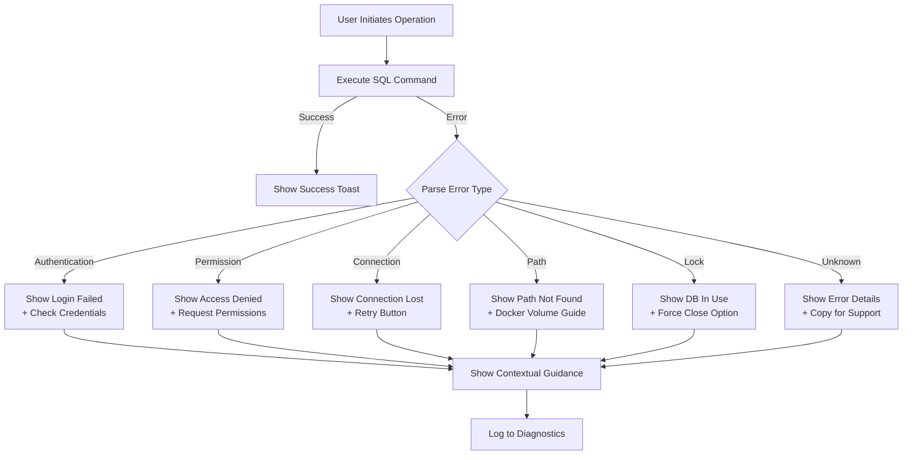

### Drag and Drop Interactions

```
┌─────────────────────────────────────────────────────────────────────────────┐
│                         DRAG AND DROP INTERACTIONS                          │
├─────────────────────────────────────────────────────────────────────────────┤
│                                                                             │
│  SCENARIO 1: Drop .bak file onto app                                        │
│  ─────────────────────────────────────────────────────────────────────────  │
│                                                                             │
│  ┌───────────────────────────────────────────────────────────────────────┐ │
│  │                                                                       │ │
│  │                    ╔═══════════════════════════════╗                  │ │
│  │                    ║                               ║                  │ │
│  │                    ║   📥 Drop to Restore          ║                  │ │
│  │                    ║                               ║                  │ │
│  │                    ║   Northwind_backup.bak        ║                  │ │
│  │                    ║                               ║                  │ │
│  │                    ╚═══════════════════════════════╝                  │ │
│  │                                                                       │ │
│  │  (Overlay appears when dragging .bak file over window)                │ │
│  │                                                                       │ │
│  └───────────────────────────────────────────────────────────────────────┘ │
│                                                                             │
│  Result: Opens Restore Wizard with file pre-selected                        │
│                                                                             │
│                                                                             │
│  SCENARIO 2: Drop .sql file onto app                                        │
│  ─────────────────────────────────────────────────────────────────────────  │
│                                                                             │
│  ┌───────────────────────────────────────────────────────────────────────┐ │
│  │                                                                       │ │
│  │                    ╔═══════════════════════════════╗                  │ │
│  │                    ║                               ║                  │ │
│  │                    ║   📝 Drop to Open Query       ║                  │ │
│  │                    ║                               ║                  │ │
│  │                    ║   create_tables.sql           ║                  │ │
│  │                    ║                               ║                  │ │
│  │                    ╚═══════════════════════════════╝                  │ │
│  │                                                                       │ │
│  └───────────────────────────────────────────────────────────────────────┘ │
│                                                                             │
│  Result: Opens new query tab with file contents                             │
│                                                                             │
│                                                                             │
│  SCENARIO 3: Drag table from explorer to query editor                       │
│  ─────────────────────────────────────────────────────────────────────────  │
│                                                                             │
│  ┌──────────────────┬────────────────────────────────────────────────────┐ │
│  │                  │                                                    │ │
│  │   📋 Tables      │   SELECT * FROM [Customers]█                       │ │
│  │      └─ Custo... │                ▲                                   │ │
│  │          ─────▶  │   (Inserts table name at cursor)                   │ │
│  │      └─ Orders   │                                                    │ │
│  │                  │                                                    │ │
│  └──────────────────┴────────────────────────────────────────────────────┘ │
│                                                                             │
└─────────────────────────────────────────────────────────────────────────────┘
```

### State Persistence

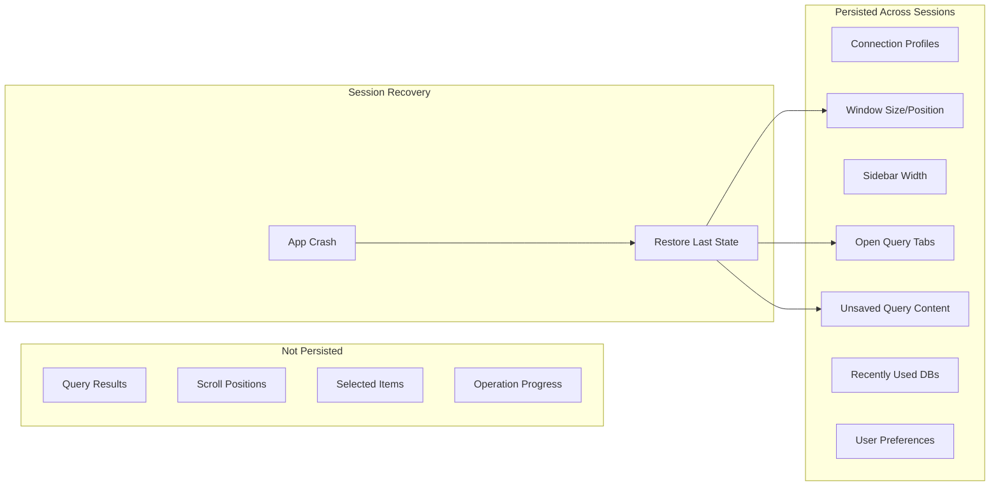

---

## Error States & Messages

### Error Message Templates

```
┌─────────────────────────────────────────────────────────────────────────────┐
│                          ERROR MESSAGE PATTERNS                             │
├─────────────────────────────────────────────────────────────────────────────┤
│                                                                             │
│  STRUCTURE:                                                                 │
│  ─────────────────────────────────────────────────────────────────────────  │
│                                                                             │
│  ┌───────────────────────────────────────────────────────────────────────┐ │
│  │  ⚠️  [Error Title - What went wrong]                                  │ │
│  │                                                                       │ │
│  │  [Explanation in plain language - Why it happened]                    │ │
│  │                                                                       │ │
│  │  What you can try:                                                    │ │
│  │  • [Actionable step 1]                                                │ │
│  │  • [Actionable step 2]                                                │ │
│  │                                                                       │ │
│  │  ┌─ Technical Details ────────────────────────────────────────────┐   │ │
│  │  │ Error 18456: Login failed for user 'sa'                        │   │ │
│  │  │ State: 1, Server: localhost:1433                               │   │ │
│  │  │                                                    [ 📋 Copy ] │   │ │
│  │  └────────────────────────────────────────────────────────────────┘   │ │
│  │                                                                       │ │
│  │                                          [ Try Again ]  [ Cancel ]   │ │
│  └───────────────────────────────────────────────────────────────────────┘ │
│                                                                             │
└─────────────────────────────────────────────────────────────────────────────┘
```

### Common Error Scenarios

```
┌─────────────────────────────────────────────────────────────────────────────┐
│                                                                             │
│  CONNECTION FAILED                                                          │
│  ─────────────────────────────────────────────────────────────────────────  │
│                                                                             │
│  ┌───────────────────────────────────────────────────────────────────────┐ │
│  │  ⚠️  Cannot Connect to Server                                         │ │
│  │                                                                       │ │
│  │  The server at localhost:1433 is not responding. This usually means  │ │
│  │  SQL Server isn't running or the port is blocked.                     │ │
│  │                                                                       │ │
│  │  What you can try:                                                    │ │
│  │  • Make sure your SQL Server Docker container is running              │ │
│  │  • Verify the port number is correct (default: 1433)                  │ │
│  │  • Check if a firewall is blocking the connection                     │ │
│  │                                                                       │ │
│  │                                  [ Check Docker ]  [ Edit Connection ] │ │
│  └───────────────────────────────────────────────────────────────────────┘ │
│                                                                             │
│                                                                             │
│  BACKUP PATH ERROR                                                          │
│  ─────────────────────────────────────────────────────────────────────────  │
│                                                                             │
│  ┌───────────────────────────────────────────────────────────────────────┐ │
│  │  ⚠️  Cannot Write Backup File                                         │ │
│  │                                                                       │ │
│  │  SQL Server cannot access the path:                                   │ │
│  │  /Users/alex/backups/db.bak                                           │ │
│  │                                                                       │ │
│  │  🐳 Docker Detected: SQL Server runs inside a container and can only  │ │
│  │  access paths that are mounted as volumes.                            │ │
│  │                                                                       │ │
│  │  What you can try:                                                    │ │
│  │  • Use a path inside the container (e.g., /var/opt/mssql/backups/)    │ │
│  │  • Mount ~/backups to /var/opt/mssql/backups in your container        │ │
│  │                                                                       │ │
│  │  ┌─ How to Mount a Volume ────────────────────────────────────────┐   │ │
│  │  │ docker run ... -v ~/backups:/var/opt/mssql/backups ...         │   │ │
│  │  └────────────────────────────────────────────────────────────────┘   │ │
│  │                                                                       │ │
│  │                              [ Choose Different Path ]  [ Cancel ]    │ │
│  └───────────────────────────────────────────────────────────────────────┘ │
│                                                                             │
│                                                                             │
│  DATABASE IN USE                                                            │
│  ─────────────────────────────────────────────────────────────────────────  │
│                                                                             │
│  ┌───────────────────────────────────────────────────────────────────────┐ │
│  │  ⚠️  Database Is Currently In Use                                     │ │
│  │                                                                       │ │
│  │  The database "Northwind" has active connections that prevent this    │ │
│  │  operation.                                                           │ │
│  │                                                                       │ │
│  │  Active connections: 3                                                │ │
│  │                                                                       │ │
│  │  What you can try:                                                    │ │
│  │  • Close other applications using this database                       │ │
│  │  • Force close all connections (may interrupt active work)            │ │
│  │                                                                       │ │
│  │              [ Force Close Connections ]  [ Cancel Operation ]        │ │
│  └───────────────────────────────────────────────────────────────────────┘ │
│                                                                             │
└─────────────────────────────────────────────────────────────────────────────┘
```

---

## Accessibility

### Keyboard Navigation

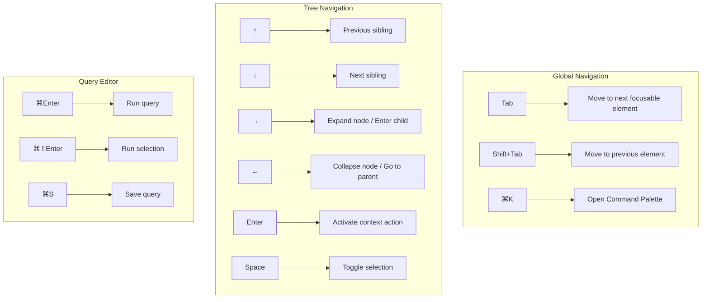

### Screen Reader Announcements

| Action                | Announcement                                  |
| --------------------- | --------------------------------------------- |
| Connection successful | "Connected to [server name]"                  |
| Connection failed     | "Connection failed: [error summary]"          |
| Database created      | "Database [name] created successfully"        |
| Backup started        | "Backup started for [database]"               |
| Backup progress       | "[percent]% complete" (every 10%)             |
| Backup complete       | "Backup complete. File saved to [path]"       |
| Query complete        | "[count] rows returned in [time]"             |
| Error occurred        | "Error: [message]. Press Tab to view details" |

### Focus Management

```
┌─────────────────────────────────────────────────────────────────────────────┐
│                          FOCUS MANAGEMENT RULES                             │
├─────────────────────────────────────────────────────────────────────────────┤
│                                                                             │
│  DIALOGS                                                                    │
│  ─────────────────────────────────────────────────────────────────────────  │
│  • Focus moves to first interactive element when dialog opens               │
│  • Focus is trapped within dialog until closed                              │
│  • Escape key closes dialog and returns focus to trigger                    │
│  • Focus returns to triggering element when dialog closes                   │
│                                                                             │
│  TOASTS                                                                     │
│  ─────────────────────────────────────────────────────────────────────────  │
│  • Toasts announce via aria-live but don't steal focus                      │
│  • Dismiss button is focusable for keyboard users                           │
│  • Auto-dismiss after 5 seconds (10s for errors)                            │
│                                                                             │
│  TAB SWITCHING                                                              │
│  ─────────────────────────────────────────────────────────────────────────  │
│  • Focus moves to tab content when tab is activated                         │
│  • For query tabs: focus moves to editor                                    │
│  • For operation tabs: focus moves to first form field                      │
│                                                                             │
│  CONTEXT MENUS                                                              │
│  ─────────────────────────────────────────────────────────────────────────  │
│  • Opens with focus on first item                                           │
│  • Arrow keys navigate items                                                │
│  • Enter activates, Escape closes                                           │
│  • Focus returns to trigger on close                                        │
│                                                                             │
└─────────────────────────────────────────────────────────────────────────────┘
```

---

## Animation & Motion

### Timing Curves

```
┌─────────────────────────────────────────────────────────────────────────────┐
│                           ANIMATION SPECIFICATIONS                          │
├─────────────────────────────────────────────────────────────────────────────┤
│                                                                             │
│  EASING CURVES                                                              │
│  ─────────────────────────────────────────────────────────────────────────  │
│                                                                             │
│  ease-out       cubic-bezier(0, 0, 0.2, 1)     Entering elements            │
│  ease-in        cubic-bezier(0.4, 0, 1, 1)     Exiting elements             │
│  ease-in-out    cubic-bezier(0.4, 0, 0.2, 1)   Moving elements              │
│                                                                             │
│  DURATIONS                                                                  │
│  ─────────────────────────────────────────────────────────────────────────  │
│                                                                             │
│  instant        0ms          Immediate feedback (button press)              │
│  fast           100ms        Micro-interactions (hover, focus)              │
│  normal         200ms        Standard transitions (panel slide)             │
│  slow           300ms        Complex transitions (dialog open)              │
│  deliberate     500ms        Emphasized transitions (wizard steps)          │
│                                                                             │
│  ANIMATIONS                                                                 │
│  ─────────────────────────────────────────────────────────────────────────  │
│                                                                             │
│  Sidebar collapse:    200ms ease-in-out                                     │
│  Dialog open:         300ms ease-out (scale 0.95 → 1.0, opacity 0 → 1)      │
│  Dialog close:        200ms ease-in (reverse)                               │
│  Toast enter:         300ms ease-out (translate Y 100% → 0)                 │
│  Toast exit:          200ms ease-in (opacity 1 → 0)                         │
│  Progress bar:        100ms linear (width change)                           │
│  Tree expand:         200ms ease-out (height 0 → auto)                      │
│  Hover highlight:     100ms ease-out                                        │
│                                                                             │
│  REDUCED MOTION                                                             │
│  ─────────────────────────────────────────────────────────────────────────  │
│                                                                             │
│  When prefers-reduced-motion is enabled:                                    │
│  • All durations reduced to 0ms or instant                                  │
│  • Animations replaced with opacity crossfades                              │
│  • Progress spinners use static indicators                                  │
│                                                                             │
└─────────────────────────────────────────────────────────────────────────────┘
```

---

_Continue to [Part IV: Technical Architecture →](04-architecture.md)_

# Part IV: Technical Architecture

## System Overview

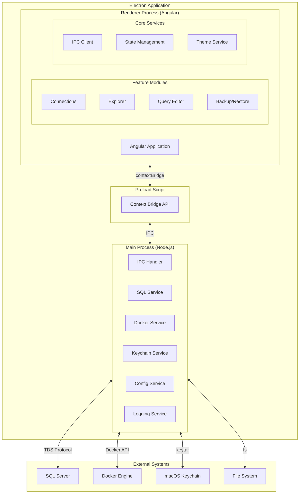

---

## Directory Structure

```
mj-forge/
├── src/
│   ├── main/                          # Electron main process
│   │   ├── index.ts                   # Main entry point
│   │   ├── window.ts                  # Window management
│   │   ├── menu.ts                    # Application menu
│   │   ├── ipc/                       # IPC handlers
│   │   │   ├── index.ts               # Handler registration
│   │   │   ├── connection.ipc.ts      # Connection operations
│   │   │   ├── database.ipc.ts        # Database CRUD
│   │   │   ├── backup.ipc.ts          # Backup operations
│   │   │   ├── restore.ipc.ts         # Restore operations
│   │   │   ├── query.ipc.ts           # Query execution
│   │   │   ├── explorer.ipc.ts        # Object explorer
│   │   │   └── docker.ipc.ts          # Docker detection
│   │   ├── services/                  # Backend services
│   │   │   ├── sql/
│   │   │   │   ├── connection-pool.ts # Connection pooling
│   │   │   │   ├── query-executor.ts  # Query execution
│   │   │   │   ├── metadata.ts        # Schema introspection
│   │   │   │   ├── backup.ts          # Backup operations
│   │   │   │   ├── restore.ts         # Restore operations
│   │   │   │   └── tsql-builder.ts    # T-SQL generation
│   │   │   ├── docker/
│   │   │   │   ├── detector.ts        # Container detection
│   │   │   │   └── volume-mapper.ts   # Volume path resolution
│   │   │   ├── keychain/
│   │   │   │   └── credential-store.ts# Secure storage
│   │   │   ├── config/
│   │   │   │   ├── settings.ts        # App settings
│   │   │   │   └── connections.ts     # Connection profiles
│   │   │   └── logging/
│   │   │       └── logger.ts          # Structured logging
│   │   └── utils/
│   │       ├── singleton.ts           # Singleton base (from MJ)
│   │       ├── object-cache.ts        # Caching (from MJ)
│   │       └── json-utils.ts          # JSON helpers (from MJ)
│   │
│   ├── preload/                       # Preload scripts
│   │   ├── index.ts                   # Main preload
│   │   └── api.ts                     # Exposed API definition
│   │
│   ├── renderer/                      # Angular application
│   │   ├── app/
│   │   │   ├── app.component.ts       # Root component
│   │   │   ├── app.config.ts          # App configuration
│   │   │   ├── app.routes.ts          # Route definitions
│   │   │   │
│   │   │   ├── core/                  # Singleton services
│   │   │   │   ├── services/
│   │   │   │   │   ├── ipc.service.ts # IPC communication
│   │   │   │   │   ├── connection.service.ts
│   │   │   │   │   ├── database.service.ts
│   │   │   │   │   ├── query.service.ts
│   │   │   │   │   ├── backup.service.ts
│   │   │   │   │   ├── notification.service.ts
│   │   │   │   │   └── theme.service.ts
│   │   │   │   ├── state/
│   │   │   │   │   ├── connection.state.ts
│   │   │   │   │   ├── explorer.state.ts
│   │   │   │   │   └── query.state.ts
│   │   │   │   └── guards/
│   │   │   │       └── connection.guard.ts
│   │   │   │
│   │   │   ├── shared/                # Shared components
│   │   │   │   ├── components/
│   │   │   │   │   ├── tree-view/
│   │   │   │   │   ├── dialog/
│   │   │   │   │   ├── toast/
│   │   │   │   │   ├── progress-bar/
│   │   │   │   │   ├── button/
│   │   │   │   │   ├── input/
│   │   │   │   │   └── tsql-preview/
│   │   │   │   ├── directives/
│   │   │   │   │   └── auto-focus.directive.ts
│   │   │   │   └── pipes/
│   │   │   │       ├── file-size.pipe.ts
│   │   │   │       └── duration.pipe.ts
│   │   │   │
│   │   │   ├── features/              # Feature modules
│   │   │   │   ├── welcome/
│   │   │   │   │   ├── welcome.component.ts
│   │   │   │   │   └── welcome.routes.ts
│   │   │   │   ├── connections/
│   │   │   │   │   ├── connection-list/
│   │   │   │   │   ├── connection-form/
│   │   │   │   │   ├── docker-detect/
│   │   │   │   │   └── connections.routes.ts
│   │   │   │   ├── explorer/
│   │   │   │   │   ├── explorer-tree/
│   │   │   │   │   ├── database-node/
│   │   │   │   │   ├── table-node/
│   │   │   │   │   └── context-menu/
│   │   │   │   ├── query/
│   │   │   │   │   ├── query-tabs/
│   │   │   │   │   ├── query-editor/
│   │   │   │   │   ├── results-grid/
│   │   │   │   │   ├── messages-panel/
│   │   │   │   │   └── query.routes.ts
│   │   │   │   ├── database/
│   │   │   │   │   ├── create-dialog/
│   │   │   │   │   ├── rename-dialog/
│   │   │   │   │   └── delete-dialog/
│   │   │   │   ├── backup/
│   │   │   │   │   ├── backup-panel/
│   │   │   │   │   └── backup-progress/
│   │   │   │   └── restore/
│   │   │   │       ├── restore-wizard/
│   │   │   │       ├── source-step/
│   │   │   │       ├── config-step/
│   │   │   │       ├── review-step/
│   │   │   │       └── restore-progress/
│   │   │   │
│   │   │   └── layout/                # App shell
│   │   │       ├── shell/
│   │   │       ├── sidebar/
│   │   │       ├── tab-bar/
│   │   │       └── status-bar/
│   │   │
│   │   ├── assets/
│   │   │   ├── icons/
│   │   │   └── themes/
│   │   ├── styles/
│   │   │   ├── _variables.scss
│   │   │   ├── _mixins.scss
│   │   │   └── global.scss
│   │   └── environments/
│   │       ├── environment.ts
│   │       └── environment.prod.ts
│   │
│   └── shared/                        # Shared between main/renderer
│       ├── types/
│       │   ├── connection.types.ts
│       │   ├── database.types.ts
│       │   ├── query.types.ts
│       │   ├── backup.types.ts
│       │   └── docker.types.ts
│       ├── constants/
│       │   ├── ipc-channels.ts
│       │   └── defaults.ts
│       └── validators/
│           └── db-name.validator.ts
│
├── resources/                         # Build resources
│   ├── icon.icns                      # macOS app icon
│   ├── icon.png                       # Source icon
│   └── entitlements.mac.plist         # macOS entitlements
│
├── scripts/                           # Build scripts
│   ├── build.ts
│   ├── package.ts
│   └── notarize.ts
│
├── tests/
│   ├── unit/
│   ├── integration/
│   └── e2e/
│
├── plans/                             # Planning documents
│   └── system-plan.md
│
├── package.json
├── tsconfig.json
├── angular.json
├── electron-builder.json
└── README.md
```

---

## IPC Architecture

### Channel Definitions

```typescript
// src/shared/constants/ipc-channels.ts

export const IPC_CHANNELS = {
  // Connection Management
  CONNECTION: {
    TEST: 'connection:test',
    SAVE: 'connection:save',
    DELETE: 'connection:delete',
    LIST: 'connection:list',
    CONNECT: 'connection:connect',
    DISCONNECT: 'connection:disconnect',
  },

  // Docker Detection
  DOCKER: {
    DETECT: 'docker:detect',
    GET_VOLUMES: 'docker:get-volumes',
    START_CONTAINER: 'docker:start-container',
  },

  // Database Operations
  DATABASE: {
    LIST: 'database:list',
    CREATE: 'database:create',
    RENAME: 'database:rename',
    DELETE: 'database:delete',
    GET_INFO: 'database:get-info',
  },

  // Object Explorer
  EXPLORER: {
    GET_TABLES: 'explorer:get-tables',
    GET_VIEWS: 'explorer:get-views',
    GET_PROCEDURES: 'explorer:get-procedures',
    GET_DEFINITION: 'explorer:get-definition',
  },

  // Query Execution
  QUERY: {
    EXECUTE: 'query:execute',
    CANCEL: 'query:cancel',
  },

  // Backup Operations
  BACKUP: {
    START: 'backup:start',
    CANCEL: 'backup:cancel',
    PROGRESS: 'backup:progress', // Main → Renderer
    COMPLETE: 'backup:complete', // Main → Renderer
    ERROR: 'backup:error', // Main → Renderer
  },

  // Restore Operations
  RESTORE: {
    READ_INFO: 'restore:read-info',
    START: 'restore:start',
    CANCEL: 'restore:cancel',
    PROGRESS: 'restore:progress', // Main → Renderer
    COMPLETE: 'restore:complete', // Main → Renderer
    ERROR: 'restore:error', // Main → Renderer
  },

  // Settings
  SETTINGS: {
    GET: 'settings:get',
    SET: 'settings:set',
  },
} as const;
```

### Type Definitions

```typescript
// src/shared/types/connection.types.ts

export interface ConnectionProfile {
  id: string;
  name: string;
  host: string;
  port: number;
  authType: 'sql' | 'aad';
  username?: string;
  // password stored in Keychain, never in profile
  encrypt: boolean;
  trustServerCertificate: boolean;
  connectionTimeout: number;
  requestTimeout: number;
  defaultDatabase?: string;
  isDocker: boolean;
  dockerContainerId?: string;
  volumeMappings?: VolumeMapping[];
}

export interface VolumeMapping {
  hostPath: string;
  containerPath: string;
}

export interface ConnectionTestResult {
  success: boolean;
  serverVersion?: string;
  error?: ConnectionError;
}

export interface ConnectionError {
  code: string;
  message: string;
  guidance: string[];
}

// src/shared/types/database.types.ts

export interface DatabaseInfo {
  name: string;
  sizeBytes: number;
  state: 'online' | 'offline' | 'restoring' | 'recovering';
  recoveryModel: 'simple' | 'full' | 'bulk_logged';
  collation: string;
  compatibilityLevel: number;
  isSystemDb: boolean;
  createdAt: Date;
  lastBackup?: Date;
}

export interface CreateDatabaseOptions {
  name: string;
  collation?: string;
  recoveryModel?: 'simple' | 'full';
}

export interface RenameDatabaseOptions {
  currentName: string;
  newName: string;
  closeConnections: boolean;
}

// src/shared/types/backup.types.ts

export interface BackupOptions {
  connectionId: string;
  databaseName: string;
  destinationPath: string;
  backupType: 'full' | 'full_copy_only';
  compression: boolean;
  verify: boolean;
}

export interface BackupProgress {
  percent: number;
  processedBytes: number;
  totalBytes: number;
  elapsedMs: number;
  estimatedRemainingMs?: number;
}

export interface BackupResult {
  success: boolean;
  filePath: string;
  sizeBytes: number;
  durationMs: number;
  error?: string;
}

// src/shared/types/restore.types.ts

export interface BackupFileInfo {
  databaseName: string;
  backupDate: Date;
  backupSizeBytes: number;
  compressedSizeBytes: number;
  serverVersion: string;
  files: BackupLogicalFile[];
}

export interface BackupLogicalFile {
  logicalName: string;
  physicalName: string;
  type: 'data' | 'log';
  sizeBytes: number;
}

export interface RestoreOptions {
  connectionId: string;
  sourcePath: string;
  targetDatabaseName: string;
  overwriteExisting: boolean;
  fileMoves: FileMove[];
}

export interface FileMove {
  logicalName: string;
  destinationPath: string;
}
```

### IPC Handler Pattern

```typescript
// src/main/ipc/database.ipc.ts

import { ipcMain, IpcMainInvokeEvent } from 'electron';
import { IPC_CHANNELS } from '@shared/constants/ipc-channels';
import { SqlService } from '../services/sql/sql.service';
import { TsqlBuilder } from '../services/sql/tsql-builder';
import {
  CreateDatabaseOptions,
  RenameDatabaseOptions,
  DatabaseInfo,
} from '@shared/types/database.types';

export function registerDatabaseHandlers(sqlService: SqlService): void {
  ipcMain.handle(
    IPC_CHANNELS.DATABASE.LIST,
    async (event: IpcMainInvokeEvent, connectionId: string): Promise<DatabaseInfo[]> => {
      const connection = await sqlService.getConnection(connectionId);

      const result = await connection.query<DatabaseInfo[]>`
        SELECT
          name,
          CAST(SUM(size) * 8 * 1024 AS BIGINT) as sizeBytes,
          state_desc as state,
          recovery_model_desc as recoveryModel,
          collation_name as collation,
          compatibility_level as compatibilityLevel,
          CASE WHEN database_id <= 4 THEN 1 ELSE 0 END as isSystemDb,
          create_date as createdAt
        FROM sys.databases d
        LEFT JOIN sys.master_files f ON d.database_id = f.database_id
        GROUP BY d.name, d.state_desc, d.recovery_model_desc,
                 d.collation_name, d.compatibility_level, d.database_id, d.create_date
        ORDER BY d.name
      `;

      return result.recordset;
    }
  );

  ipcMain.handle(
    IPC_CHANNELS.DATABASE.CREATE,
    async (
      event: IpcMainInvokeEvent,
      connectionId: string,
      options: CreateDatabaseOptions
    ): Promise<{ success: boolean; tsql: string; error?: string }> => {
      const connection = await sqlService.getConnection(connectionId);
      const tsql = TsqlBuilder.createDatabase(options);

      try {
        await connection.query(tsql);
        return { success: true, tsql };
      } catch (error) {
        return {
          success: false,
          tsql,
          error: error instanceof Error ? error.message : 'Unknown error',
        };
      }
    }
  );

  ipcMain.handle(
    IPC_CHANNELS.DATABASE.DELETE,
    async (
      event: IpcMainInvokeEvent,
      connectionId: string,
      databaseName: string,
      closeConnections: boolean
    ): Promise<{ success: boolean; tsql: string; error?: string }> => {
      const connection = await sqlService.getConnection(connectionId);
      const tsql = TsqlBuilder.dropDatabase(databaseName, closeConnections);

      try {
        await connection.query(tsql);
        return { success: true, tsql };
      } catch (error) {
        return {
          success: false,
          tsql,
          error: error instanceof Error ? error.message : 'Unknown error',
        };
      }
    }
  );
}
```

### Preload Bridge

```typescript
// src/preload/api.ts

import { contextBridge, ipcRenderer } from 'electron';
import { IPC_CHANNELS } from '@shared/constants/ipc-channels';

export interface ForgeAPI {
  // Connection
  connection: {
    test: (profile: ConnectionProfile) => Promise<ConnectionTestResult>;
    save: (profile: ConnectionProfile) => Promise<void>;
    delete: (id: string) => Promise<void>;
    list: () => Promise<ConnectionProfile[]>;
    connect: (id: string) => Promise<void>;
    disconnect: (id: string) => Promise<void>;
  };

  // Docker
  docker: {
    detect: () => Promise<DockerContainer[]>;
    getVolumes: (containerId: string) => Promise<VolumeMapping[]>;
  };

  // Database
  database: {
    list: (connectionId: string) => Promise<DatabaseInfo[]>;
    create: (connectionId: string, options: CreateDatabaseOptions) => Promise<OperationResult>;
    rename: (connectionId: string, options: RenameDatabaseOptions) => Promise<OperationResult>;
    delete: (connectionId: string, name: string, force: boolean) => Promise<OperationResult>;
  };

  // Backup
  backup: {
    start: (options: BackupOptions) => Promise<void>;
    cancel: (operationId: string) => Promise<void>;
    onProgress: (callback: (progress: BackupProgress) => void) => () => void;
    onComplete: (callback: (result: BackupResult) => void) => () => void;
    onError: (callback: (error: string) => void) => () => void;
  };

  // Restore
  restore: {
    readInfo: (path: string) => Promise<BackupFileInfo>;
    start: (options: RestoreOptions) => Promise<void>;
    cancel: (operationId: string) => Promise<void>;
    onProgress: (callback: (progress: RestoreProgress) => void) => () => void;
    onComplete: (callback: (result: RestoreResult) => void) => () => void;
    onError: (callback: (error: string) => void) => () => void;
  };

  // Query
  query: {
    execute: (connectionId: string, database: string, sql: string) => Promise<QueryResult>;
    cancel: (queryId: string) => Promise<void>;
  };
}

const api: ForgeAPI = {
  connection: {
    test: profile => ipcRenderer.invoke(IPC_CHANNELS.CONNECTION.TEST, profile),
    save: profile => ipcRenderer.invoke(IPC_CHANNELS.CONNECTION.SAVE, profile),
    delete: id => ipcRenderer.invoke(IPC_CHANNELS.CONNECTION.DELETE, id),
    list: () => ipcRenderer.invoke(IPC_CHANNELS.CONNECTION.LIST),
    connect: id => ipcRenderer.invoke(IPC_CHANNELS.CONNECTION.CONNECT, id),
    disconnect: id => ipcRenderer.invoke(IPC_CHANNELS.CONNECTION.DISCONNECT, id),
  },
  // ... rest of implementation
};

contextBridge.exposeInMainWorld('forge', api);

// Type declaration for renderer
declare global {
  interface Window {
    forge: ForgeAPI;
  }
}
```

---

## SQL Service Architecture

### Connection Pool Management

```typescript
// src/main/services/sql/connection-pool.ts

import sql, { ConnectionPool, config as SqlConfig } from 'mssql';
import { BaseSingleton } from '@memberjunction/global';
import { ConnectionProfile } from '@shared/types/connection.types';
import { CredentialStore } from '../keychain/credential-store';

interface PoolEntry {
  pool: ConnectionPool;
  profile: ConnectionProfile;
  lastUsed: Date;
  activeQueries: number;
}

export class ConnectionPoolManager extends BaseSingleton<ConnectionPoolManager> {
  private pools: Map<string, PoolEntry> = new Map();
  private cleanupInterval: NodeJS.Timeout | null = null;

  constructor() {
    super();
    this.startCleanupTimer();
  }

  async getPool(profile: ConnectionProfile): Promise<ConnectionPool> {
    const existing = this.pools.get(profile.id);

    if (existing?.pool.connected) {
      existing.lastUsed = new Date();
      return existing.pool;
    }

    // Get password from Keychain
    const password = await CredentialStore.getInstance().get(profile.id);

    const config: SqlConfig = {
      server: profile.host,
      port: profile.port,
      user: profile.username,
      password,
      database: profile.defaultDatabase || 'master',
      options: {
        encrypt: profile.encrypt,
        trustServerCertificate: profile.trustServerCertificate,
      },
      connectionTimeout: profile.connectionTimeout * 1000,
      requestTimeout: profile.requestTimeout * 1000,
      pool: {
        max: 10,
        min: 0,
        idleTimeoutMillis: 30000,
      },
    };

    const pool = new ConnectionPool(config);
    await pool.connect();

    this.pools.set(profile.id, {
      pool,
      profile,
      lastUsed: new Date(),
      activeQueries: 0,
    });

    return pool;
  }

  async closePool(connectionId: string): Promise<void> {
    const entry = this.pools.get(connectionId);
    if (entry) {
      await entry.pool.close();
      this.pools.delete(connectionId);
    }
  }

  async closeAll(): Promise<void> {
    for (const [id] of this.pools) {
      await this.closePool(id);
    }
  }

  private startCleanupTimer(): void {
    // Clean up idle connections every 5 minutes
    this.cleanupInterval = setInterval(() => {
      const now = new Date();
      for (const [id, entry] of this.pools) {
        const idleMs = now.getTime() - entry.lastUsed.getTime();
        if (idleMs > 300000 && entry.activeQueries === 0) {
          // 5 minutes
          this.closePool(id);
        }
      }
    }, 60000);
  }
}
```

### T-SQL Builder

```typescript
// src/main/services/sql/tsql-builder.ts

import { CreateDatabaseOptions, BackupOptions, RestoreOptions } from '@shared/types';

export class TsqlBuilder {
  /**
   * Safely escape a SQL identifier (database name, table name, etc.)
   */
  static escapeIdentifier(name: string): string {
    // Remove any existing brackets and escape internal brackets
    const cleaned = name.replace(/\[/g, '[[').replace(/\]/g, ']]');
    return `[${cleaned}]`;
  }

  /**
   * Safely escape a string literal
   */
  static escapeString(value: string): string {
    return value.replace(/'/g, "''");
  }

  static createDatabase(options: CreateDatabaseOptions): string {
    const name = this.escapeIdentifier(options.name);
    let sql = `CREATE DATABASE ${name}`;

    if (options.collation) {
      sql += `\nCOLLATE ${options.collation}`;
    }

    sql += ';';

    if (options.recoveryModel && options.recoveryModel !== 'full') {
      sql += `\n\nALTER DATABASE ${name}\nSET RECOVERY ${options.recoveryModel.toUpperCase()};`;
    }

    return sql;
  }

  static renameDatabase(currentName: string, newName: string, closeConnections: boolean): string {
    const current = this.escapeIdentifier(currentName);
    const next = this.escapeIdentifier(newName);

    let sql = '';

    if (closeConnections) {
      sql += `ALTER DATABASE ${current}\nSET SINGLE_USER WITH ROLLBACK IMMEDIATE;\n\n`;
    }

    sql += `ALTER DATABASE ${current}\nMODIFY NAME = ${next};\n\n`;
    sql += `ALTER DATABASE ${next}\nSET MULTI_USER;`;

    return sql;
  }

  static dropDatabase(name: string, closeConnections: boolean): string {
    const escaped = this.escapeIdentifier(name);

    let sql = '';

    if (closeConnections) {
      sql += `ALTER DATABASE ${escaped}\nSET SINGLE_USER WITH ROLLBACK IMMEDIATE;\n\n`;
    }

    sql += `DROP DATABASE ${escaped};`;

    return sql;
  }

  static backup(options: BackupOptions): string {
    const dbName = this.escapeIdentifier(options.databaseName);
    const path = this.escapeString(options.destinationPath);

    let sql = `BACKUP DATABASE ${dbName}\nTO DISK = N'${path}'\nWITH`;

    const withOptions: string[] = [];

    if (options.backupType === 'full_copy_only') {
      withOptions.push('COPY_ONLY');
    }

    withOptions.push('INIT'); // Overwrite existing file

    if (options.compression) {
      withOptions.push('COMPRESSION');
    }

    withOptions.push('STATS = 10'); // Report progress every 10%

    sql += ' ' + withOptions.join(', ') + ';';

    return sql;
  }

  static restore(options: RestoreOptions): string {
    const dbName = this.escapeIdentifier(options.targetDatabaseName);
    const path = this.escapeString(options.sourcePath);

    let sql = `RESTORE DATABASE ${dbName}\nFROM DISK = N'${path}'\nWITH`;

    const withOptions: string[] = [];

    for (const move of options.fileMoves) {
      const logical = this.escapeString(move.logicalName);
      const dest = this.escapeString(move.destinationPath);
      withOptions.push(`MOVE N'${logical}' TO N'${dest}'`);
    }

    if (options.overwriteExisting) {
      withOptions.push('REPLACE');
    }

    withOptions.push('STATS = 10');

    sql += '\n    ' + withOptions.join(',\n    ') + ';';

    return sql;
  }

  static getBackupFileInfo(path: string): string {
    const escaped = this.escapeString(path);
    return `RESTORE FILELISTONLY FROM DISK = N'${escaped}';`;
  }

  static getBackupHeaderInfo(path: string): string {
    const escaped = this.escapeString(path);
    return `RESTORE HEADERONLY FROM DISK = N'${escaped}';`;
  }
}
```

---

## Docker Service

```typescript
// src/main/services/docker/detector.ts

import Dockerode from 'dockerode';
import { DockerContainer, VolumeMapping } from '@shared/types/docker.types';

export class DockerDetector {
  private docker: Dockerode;

  constructor() {
    this.docker = new Dockerode({ socketPath: '/var/run/docker.sock' });
  }

  async isDockerRunning(): Promise<boolean> {
    try {
      await this.docker.ping();
      return true;
    } catch {
      return false;
    }
  }

  async findSqlServerContainers(): Promise<DockerContainer[]> {
    if (!(await this.isDockerRunning())) {
      return [];
    }

    const containers = await this.docker.listContainers({ all: true });

    const sqlContainers: DockerContainer[] = [];

    for (const container of containers) {
      const isSqlServer =
        container.Image.includes('mssql') || container.Image.includes('sqlserver');

      if (isSqlServer) {
        const portBinding = container.Ports.find(p => p.PrivatePort === 1433);

        sqlContainers.push({
          id: container.Id,
          name: container.Names[0]?.replace(/^\//, '') || 'unknown',
          image: container.Image,
          state: container.State as 'running' | 'exited' | 'paused',
          port: portBinding?.PublicPort || null,
          hostBinding: portBinding?.IP || 'localhost',
          volumeMappings: this.parseVolumeMappings(container.Mounts),
        });
      }
    }

    return sqlContainers;
  }

  private parseVolumeMappings(mounts: Dockerode.MountSettings[]): VolumeMapping[] {
    return mounts
      .filter(m => m.Type === 'bind')
      .map(m => ({
        hostPath: m.Source,
        containerPath: m.Destination,
      }));
  }

  async startContainer(containerId: string): Promise<void> {
    const container = this.docker.getContainer(containerId);
    await container.start();
  }

  translatePath(
    localPath: string,
    mappings: VolumeMapping[]
  ): { containerPath: string; isAccessible: boolean } {
    for (const mapping of mappings) {
      if (localPath.startsWith(mapping.hostPath)) {
        const relativePath = localPath.slice(mapping.hostPath.length);
        return {
          containerPath: mapping.containerPath + relativePath,
          isAccessible: true,
        };
      }
    }

    return { containerPath: localPath, isAccessible: false };
  }
}
```

---

## Angular Service Layer

### IPC Service

```typescript
// src/renderer/app/core/services/ipc.service.ts

import { Injectable, NgZone } from '@angular/core';

@Injectable({ providedIn: 'root' })
export class IpcService {
  constructor(private ngZone: NgZone) {}

  get api() {
    return window.forge;
  }

  /**
   * Wrapper to ensure callbacks run inside Angular zone
   */
  subscribe<T>(
    register: (callback: (data: T) => void) => () => void,
    handler: (data: T) => void
  ): () => void {
    return register((data: T) => {
      this.ngZone.run(() => handler(data));
    });
  }
}
```

### Connection State

```typescript
// src/renderer/app/core/state/connection.state.ts

import { Injectable, signal, computed } from '@angular/core';
import { ConnectionProfile, ConnectionStatus } from '@shared/types/connection.types';
import { IpcService } from '../services/ipc.service';

@Injectable({ providedIn: 'root' })
export class ConnectionState {
  // Signals for reactive state
  private _profiles = signal<ConnectionProfile[]>([]);
  private _activeConnectionId = signal<string | null>(null);
  private _connectionStatuses = signal<Map<string, ConnectionStatus>>(new Map());
  private _loading = signal(false);
  private _error = signal<string | null>(null);

  // Public readonly signals
  readonly profiles = this._profiles.asReadonly();
  readonly activeConnectionId = this._activeConnectionId.asReadonly();
  readonly loading = this._loading.asReadonly();
  readonly error = this._error.asReadonly();

  // Computed values
  readonly activeProfile = computed(() => {
    const id = this._activeConnectionId();
    return this._profiles().find(p => p.id === id) ?? null;
  });

  readonly connectedProfiles = computed(() => {
    const statuses = this._connectionStatuses();
    return this._profiles().filter(p => statuses.get(p.id) === 'connected');
  });

  constructor(private ipc: IpcService) {}

  async loadProfiles(): Promise<void> {
    this._loading.set(true);
    this._error.set(null);

    try {
      const profiles = await this.ipc.api.connection.list();
      this._profiles.set(profiles);
    } catch (e) {
      this._error.set(e instanceof Error ? e.message : 'Failed to load connections');
    } finally {
      this._loading.set(false);
    }
  }

  async connect(profileId: string): Promise<void> {
    this.updateStatus(profileId, 'connecting');

    try {
      await this.ipc.api.connection.connect(profileId);
      this.updateStatus(profileId, 'connected');
      this._activeConnectionId.set(profileId);
    } catch (e) {
      this.updateStatus(profileId, 'error');
      throw e;
    }
  }

  async disconnect(profileId: string): Promise<void> {
    await this.ipc.api.connection.disconnect(profileId);
    this.updateStatus(profileId, 'disconnected');

    if (this._activeConnectionId() === profileId) {
      this._activeConnectionId.set(null);
    }
  }

  private updateStatus(profileId: string, status: ConnectionStatus): void {
    this._connectionStatuses.update(map => {
      const updated = new Map(map);
      updated.set(profileId, status);
      return updated;
    });
  }
}
```

---

## Security Architecture

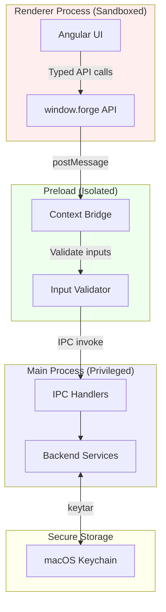

### Security Rules

```
┌─────────────────────────────────────────────────────────────────────────────┐
│                           SECURITY IMPLEMENTATION                           │
├─────────────────────────────────────────────────────────────────────────────┤
│                                                                             │
│  ELECTRON CONFIGURATION                                                     │
│  ─────────────────────────────────────────────────────────────────────────  │
│                                                                             │
│  new BrowserWindow({                                                        │
│    webPreferences: {                                                        │
│      nodeIntegration: false,        // ✓ No Node in renderer                │
│      contextIsolation: true,        // ✓ Separate contexts                  │
│      sandbox: true,                 // ✓ Renderer sandboxed                 │
│      preload: path.join(__dirname, 'preload.js'),                           │
│      webSecurity: true,             // ✓ Same-origin policy                 │
│    }                                                                        │
│  });                                                                        │
│                                                                             │
│  CREDENTIAL HANDLING                                                        │
│  ─────────────────────────────────────────────────────────────────────────  │
│                                                                             │
│  1. Passwords NEVER cross IPC boundary                                      │
│  2. Passwords stored ONLY in macOS Keychain via keytar                      │
│  3. Connection profiles store reference ID, not password                    │
│  4. Memory cleared after use (as much as JS allows)                         │
│                                                                             │
│  INPUT VALIDATION                                                           │
│  ─────────────────────────────────────────────────────────────────────────  │
│                                                                             │
│  1. All IPC inputs validated in main process                                │
│  2. Database names validated against SQL Server rules                       │
│  3. File paths validated and normalized                                     │
│  4. SQL injection prevented via parameterized queries                       │
│     (except for DDL which uses safe escaping)                               │
│                                                                             │
│  LOGGING                                                                    │
│  ─────────────────────────────────────────────────────────────────────────  │
│                                                                             │
│  1. Never log passwords or connection strings with passwords                │
│  2. Never log full SQL query results                                        │
│  3. Log connection attempts with sanitized info                             │
│  4. Log errors with context but not sensitive data                          │
│                                                                             │
└─────────────────────────────────────────────────────────────────────────────┘
```

---

## MemberJunction Integration

### Adopted Utilities

```typescript
// src/main/utils/singleton.ts
// Adapted from @memberjunction/global

const _globalObjectStore: Map<string, any> = new Map();

export abstract class BaseSingleton<T> {
  protected constructor() {}

  static getInstance<T extends BaseSingleton<T>>(this: new () => T): T {
    const className = this.name;

    if (!_globalObjectStore.has(className)) {
      _globalObjectStore.set(className, new this());
    }

    return _globalObjectStore.get(className) as T;
  }
}

// Usage:
// class ConnectionPoolManager extends BaseSingleton<ConnectionPoolManager> { ... }
// const manager = ConnectionPoolManager.getInstance();
```

```typescript
// src/main/utils/object-cache.ts
// Adapted from @memberjunction/global

export interface CacheOptions {
  ttlMs?: number;
  maxSize?: number;
}

export class ObjectCache<T> {
  private cache: Map<string, { value: T; timestamp: number }> = new Map();
  private ttlMs: number;
  private maxSize: number;

  constructor(options: CacheOptions = {}) {
    this.ttlMs = options.ttlMs ?? 300000; // 5 minutes default
    this.maxSize = options.maxSize ?? 1000;
  }

  get(key: string): T | undefined {
    const entry = this.cache.get(key);

    if (!entry) return undefined;

    if (Date.now() - entry.timestamp > this.ttlMs) {
      this.cache.delete(key);
      return undefined;
    }

    return entry.value;
  }

  set(key: string, value: T): void {
    if (this.cache.size >= this.maxSize) {
      // Remove oldest entry
      const oldestKey = this.cache.keys().next().value;
      if (oldestKey) this.cache.delete(oldestKey);
    }

    this.cache.set(key, { value, timestamp: Date.now() });
  }

  invalidate(key: string): void {
    this.cache.delete(key);
  }

  clear(): void {
    this.cache.clear();
  }
}

// Usage:
// const metadataCache = new ObjectCache<DatabaseInfo[]>({ ttlMs: 60000 });
// metadataCache.set(connectionId, databases);
```

```typescript
// src/main/utils/json-utils.ts
// Adapted from @memberjunction/global

/**
 * Safely parse JSON with fallback
 */
export function SafeJSONParse<T>(jsonString: string, fallback: T): T {
  try {
    return JSON.parse(jsonString) as T;
  } catch {
    return fallback;
  }
}

/**
 * Clean JSON string by removing common issues
 */
export function CleanJSON(jsonString: string): string {
  return jsonString
    .replace(/[\x00-\x1F\x7F]/g, '') // Remove control characters
    .replace(/,(\s*[}\]])/g, '$1') // Remove trailing commas
    .trim();
}

/**
 * Combined clean and parse
 */
export function CleanAndParseJSON<T>(jsonString: string, fallback: T): T {
  return SafeJSONParse(CleanJSON(jsonString), fallback);
}
```

---

## Build & Packaging

### Electron Builder Configuration

```json
// electron-builder.json
{
  "appId": "com.memberjunction.forge",
  "productName": "MJ Forge",
  "directories": {
    "output": "dist",
    "buildResources": "resources"
  },
  "files": ["dist/main/**/*", "dist/renderer/**/*", "dist/preload/**/*"],
  "mac": {
    "category": "public.app-category.developer-tools",
    "icon": "resources/icon.icns",
    "hardenedRuntime": true,
    "gatekeeperAssess": false,
    "entitlements": "resources/entitlements.mac.plist",
    "entitlementsInherit": "resources/entitlements.mac.plist",
    "target": [
      {
        "target": "dmg",
        "arch": ["x64", "arm64"]
      },
      {
        "target": "zip",
        "arch": ["x64", "arm64"]
      }
    ]
  },
  "dmg": {
    "contents": [
      { "x": 130, "y": 220 },
      { "x": 410, "y": 220, "type": "link", "path": "/Applications" }
    ]
  },
  "afterSign": "scripts/notarize.ts"
}
```

### macOS Entitlements

```xml
<!-- resources/entitlements.mac.plist -->
<?xml version="1.0" encoding="UTF-8"?>
<!DOCTYPE plist PUBLIC "-//Apple//DTD PLIST 1.0//EN" "http://www.apple.com/DTDs/PropertyList-1.0.dtd">
<plist version="1.0">
<dict>
    <key>com.apple.security.cs.allow-jit</key>
    <true/>
    <key>com.apple.security.cs.allow-unsigned-executable-memory</key>
    <true/>
    <key>com.apple.security.cs.allow-dyld-environment-variables</key>
    <true/>
    <key>com.apple.security.network.client</key>
    <true/>
    <key>com.apple.security.files.user-selected.read-write</key>
    <true/>
</dict>
</plist>
```

---

_Continue to [Part V: Implementation Task List →](05-task-list.md)_

# Part V: Implementation Task List

## Overview

This section provides a comprehensive, ordered task list for implementing MJ Forge. Tasks are organized into major phases, each with detailed sub-phases and individual work items.

### Task Priority Legend

| Priority | Meaning                              |
| -------- | ------------------------------------ |
| 🔴 P0    | Critical path - blocks other work    |
| 🟠 P1    | High priority - core functionality   |
| 🟡 P2    | Medium priority - important features |
| 🟢 P3    | Lower priority - nice to have for v1 |

### Task Status Tracking

```
[ ] Not started
[~] In progress
[x] Completed
[-] Blocked
[!] Needs review
```

---

## Phase 0: Project Foundation

**Goal:** Establish the development environment, project structure, and core infrastructure.

### 0.1 Project Initialization

```
[ ] 0.1.1  🔴 Initialize npm project with TypeScript
           - Create package.json with project metadata
           - Configure TypeScript (tsconfig.json) for both main/renderer
           - Set up path aliases (@main, @renderer, @shared, @preload)

[ ] 0.1.2  🔴 Install core dependencies
           Dependencies:
           - electron, electron-builder
           - @angular/core, @angular/cli (v18+)
           - mssql (SQL Server driver)
           - keytar (Keychain access)
           - dockerode (Docker API)
           - rxjs, uuid
           Dev dependencies:
           - typescript, ts-node
           - eslint, prettier
           - jest, @testing-library/*
           - concurrently, wait-on

[ ] 0.1.3  🔴 Create directory structure
           - Set up src/main, src/renderer, src/preload, src/shared
           - Create plans/, scripts/, resources/, tests/
           - Add .gitignore, .eslintrc, .prettierrc

[ ] 0.1.4  🟠 Configure build pipeline
           - Set up Angular CLI for renderer build
           - Configure electron-builder for packaging
           - Create npm scripts (dev, build, package)
           - Configure hot reload for development
```

### 0.2 Electron Shell

```
[ ] 0.2.1  🔴 Create main process entry point
           File: src/main/index.ts
           - Initialize Electron app
           - Handle app lifecycle events (ready, quit, activate)
           - Set up error handling and crash reporting

[ ] 0.2.2  🔴 Implement window management
           File: src/main/window.ts
           - Create BrowserWindow with security settings
           - Configure context isolation, sandbox
           - Handle window state persistence (size, position)
           - Implement minimize to dock behavior

[ ] 0.2.3  🔴 Create preload script
           File: src/preload/index.ts
           - Set up contextBridge
           - Define and expose ForgeAPI interface
           - Implement IPC wrapper functions
           - Add TypeScript declarations for window.forge

[ ] 0.2.4  🟠 Implement application menu
           File: src/main/menu.ts
           - Create macOS-native menu structure
           - Add standard Edit menu (copy/paste/undo)
           - Add View menu (reload, dev tools in dev mode)
           - Add Help menu (documentation, about)
           - Wire up keyboard shortcuts
```

### 0.3 Angular Application Bootstrap

```
[ ] 0.3.1  🔴 Initialize Angular application
           - Run ng new with standalone components
           - Configure for Electron (remove SSR, adjust base href)
           - Set up SCSS and global styles
           - Configure Angular build output for Electron

[ ] 0.3.2  🔴 Create app shell components
           Files:
           - src/renderer/app/layout/shell/shell.component.ts
           - src/renderer/app/layout/sidebar/sidebar.component.ts
           - src/renderer/app/layout/status-bar/status-bar.component.ts
           Implementation:
           - Three-column layout (sidebar, content, optional panel)
           - Resizable sidebar with drag handle
           - Fixed status bar at bottom

[ ] 0.3.3  🔴 Set up routing
           File: src/renderer/app/app.routes.ts
           - Define lazy-loaded feature routes
           - Implement route guards for connection state
           - Configure default route (welcome or workspace)

[ ] 0.3.4  🟠 Create IPC service
           File: src/renderer/app/core/services/ipc.service.ts
           - Wrap window.forge API
           - Handle NgZone for callbacks
           - Add error handling and logging
```

### 0.4 Shared Infrastructure

```
[ ] 0.4.1  🔴 Define IPC channels
           File: src/shared/constants/ipc-channels.ts
           - Define all channel names as constants
           - Group by feature (connection, database, backup, etc.)
           - Add TypeScript const assertion for type safety

[ ] 0.4.2  🔴 Create type definitions
           Files:
           - src/shared/types/connection.types.ts
           - src/shared/types/database.types.ts
           - src/shared/types/query.types.ts
           - src/shared/types/backup.types.ts
           - src/shared/types/docker.types.ts

[ ] 0.4.3  🟠 Port MJ utilities
           Files:
           - src/main/utils/singleton.ts (from @memberjunction/global)
           - src/main/utils/object-cache.ts
           - src/main/utils/json-utils.ts
           - Add unit tests for each utility
```

### 0.5 Development Workflow

```
[ ] 0.5.1  🟠 Set up development scripts
           - Create dev script (concurrent main + renderer)
           - Add hot reload for renderer
           - Configure source maps for debugging
           - Create debug configurations for VS Code

[ ] 0.5.2  🟠 Configure linting and formatting
           - Set up ESLint with TypeScript rules
           - Configure Prettier
           - Add pre-commit hooks with husky
           - Set up lint-staged

[ ] 0.5.3  🟡 Set up testing infrastructure
           - Configure Jest for unit tests
           - Set up Playwright for E2E tests
           - Create test utilities and mocks
           - Add CI configuration (GitHub Actions)

[ ] 0.5.4  🟡 Documentation setup
           - Create contributing guidelines
           - Add code of conduct
           - Set up JSDoc for public APIs
           - Create development setup guide
```

---

## Phase 1: Connection Management

**Goal:** Enable users to connect to SQL Server instances and manage connection profiles.

### 1.1 Keychain Integration

```
[ ] 1.1.1  🔴 Implement credential store
           File: src/main/services/keychain/credential-store.ts
           - Use keytar for macOS Keychain access
           - Store credentials keyed by connection ID
           - Implement get, set, delete operations
           - Handle Keychain access errors gracefully

[ ] 1.1.2  🟠 Add credential store IPC handlers
           - Implement save credential handler
           - Implement delete credential handler
           - Never expose passwords in IPC responses
           - Add logging (without sensitive data)
```

### 1.2 SQL Connection Service

```
[ ] 1.2.1  🔴 Create connection pool manager
           File: src/main/services/sql/connection-pool.ts
           - Extend BaseSingleton for singleton pattern
           - Implement pool creation with mssql config
           - Handle connection pooling and reuse
           - Implement cleanup of idle connections
           - Add connection health checks

[ ] 1.2.2  🔴 Implement connection testing
           File: src/main/services/sql/connection-tester.ts
           - Test connection with provided config
           - Retrieve server version on success
           - Parse and categorize connection errors
           - Return structured error guidance

[ ] 1.2.3  🔴 Create connection IPC handlers
           File: src/main/ipc/connection.ipc.ts
           - Handle connection:test
           - Handle connection:connect
           - Handle connection:disconnect
           - Handle connection:list
           - Handle connection:save
           - Handle connection:delete
```

### 1.3 Connection Profile Storage

```
[ ] 1.3.1  🔴 Implement profile storage
           File: src/main/services/config/connections.ts
           - Store profiles in app data directory
           - Use JSON file with encryption for at-rest security
           - Implement CRUD operations for profiles
           - Handle profile migrations (schema changes)

[ ] 1.3.2  🟠 Add profile validation
           File: src/shared/validators/connection.validator.ts
           - Validate hostname format
           - Validate port range
           - Validate required fields
           - Sanitize profile names
```

### 1.4 Connection UI

```
[ ] 1.4.1  🔴 Create connection list component
           File: src/renderer/app/features/connections/connection-list/
           - Display saved connections with status
           - Show connection/disconnection states
           - Enable quick connect via double-click
           - Support context menu (edit, delete)

[ ] 1.4.2  🔴 Create connection form component
           File: src/renderer/app/features/connections/connection-form/
           - Input fields for all connection properties
           - Password field with visibility toggle
           - Test connection button with feedback
           - Advanced options accordion
           - Form validation with error messages

[ ] 1.4.3  🟠 Create welcome screen
           File: src/renderer/app/features/welcome/welcome.component.ts
           - Hero section with app branding
           - "Detect Docker" prominent button
           - "Add Manually" secondary button
           - Recent connections list
           - Handle empty state gracefully

[ ] 1.4.4  🟠 Implement connection state management
           File: src/renderer/app/core/state/connection.state.ts
           - Use Angular signals for reactive state
           - Track connection profiles
           - Track active connection
           - Track connection statuses (connecting, connected, error)
```

### 1.5 Docker Detection

```
[ ] 1.5.1  🔴 Implement Docker detector service
           File: src/main/services/docker/detector.ts
           - Check if Docker is running
           - List containers with SQL Server images
           - Extract port mappings
           - Extract volume mappings
           - Handle Docker not installed/not running

[ ] 1.5.2  🔴 Create Docker detection IPC handlers
           File: src/main/ipc/docker.ipc.ts
           - Handle docker:detect
           - Handle docker:get-volumes
           - Handle docker:start-container

[ ] 1.5.3  🟠 Create Docker detection UI
           File: src/renderer/app/features/connections/docker-detect/
           - Show detected containers as cards
           - Display container state (running/stopped)
           - Show port and volume mappings
           - One-click connect for running containers
           - Option to start stopped containers
           - Fallback to manual if Docker not available
```

---

## Phase 2: Object Explorer

**Goal:** Display database objects in a navigable tree structure.

### 2.1 Metadata Service

```
[ ] 2.1.1  🔴 Create metadata query service
           File: src/main/services/sql/metadata.ts
           - Query sys.databases for database list
           - Query sys.tables for tables
           - Query sys.views for views
           - Query sys.procedures for stored procedures
           - Query sys.schemas for schema grouping (optional)

[ ] 2.1.2  🔴 Implement metadata caching
           - Use ObjectCache for database lists
           - Cache invalidation on database changes
           - TTL-based expiration (1 minute)
           - Manual refresh support

[ ] 2.1.3  🔴 Create explorer IPC handlers
           File: src/main/ipc/explorer.ipc.ts
           - Handle explorer:get-databases
           - Handle explorer:get-tables
           - Handle explorer:get-views
           - Handle explorer:get-procedures
           - Handle explorer:refresh
```

### 2.2 Tree View Component

```
[ ] 2.2.1  🔴 Create tree view base component
           File: src/renderer/app/shared/components/tree-view/
           - Generic tree node interface
           - Recursive tree rendering
           - Expand/collapse with arrow keys
           - Keyboard navigation (up/down/left/right)
           - Single and multi-select support

[ ] 2.2.2  🔴 Implement lazy loading for tree
           - Load children on expand only
           - Show loading indicator
           - Handle load errors
           - Retry mechanism for failed loads

[ ] 2.2.3  🟠 Add tree view accessibility
           - ARIA tree role and properties
           - Screen reader announcements
           - Focus management
           - Keyboard shortcuts
```

### 2.3 Explorer Implementation

```
[ ] 2.3.1  🔴 Create explorer tree component
           File: src/renderer/app/features/explorer/explorer-tree/
           - Root level: connections (grouped)
           - Second level: databases
           - Third level: object categories (Tables, Views, Procs)
           - Fourth level: individual objects

[ ] 2.3.2  🔴 Create database node component
           File: src/renderer/app/features/explorer/database-node/
           - Show database name and status
           - Icon indicating online/offline/system
           - Right-click context menu
           - Double-click to open query

[ ] 2.3.3  🟠 Create context menu component
           File: src/renderer/app/features/explorer/context-menu/
           - Dynamic menu based on node type
           - Database: Create, Rename, Delete, Backup, Restore
           - Table: Open definition, Select top 1000
           - Keyboard shortcut hints
           - Position near click location

[ ] 2.3.4  🟠 Add search/filter functionality
           - Filter input at top of explorer
           - Filter databases by name
           - Filter objects within database
           - Highlight matching text
           - Clear filter button

[ ] 2.3.5  🟠 Implement explorer state management
           File: src/renderer/app/core/state/explorer.state.ts
           - Track expanded nodes
           - Track selected node
           - Cache loaded object lists
           - Handle refresh operations
```

---

## Phase 3: Query Workspace

**Goal:** Provide a tabbed query editor with results and messages.

### 3.1 Query Execution

```
[ ] 3.1.1  🔴 Create query executor service
           File: src/main/services/sql/query-executor.ts
           - Execute SQL queries via connection pool
           - Handle multiple result sets
           - Capture row counts and messages
           - Support query cancellation
           - Measure execution time

[ ] 3.1.2  🔴 Create query IPC handlers
           File: src/main/ipc/query.ipc.ts
           - Handle query:execute
           - Handle query:cancel
           - Stream large result sets (future)
           - Return structured results with metadata
```

### 3.2 Query Editor

```
[ ] 3.2.1  🔴 Integrate code editor
           File: src/renderer/app/features/query/query-editor/
           Choice: Monaco Editor or CodeMirror 6
           - Basic SQL syntax highlighting
           - Line numbers
           - Basic key bindings
           - Selection support

[ ] 3.2.2  🔴 Create query editor component
           - Editor container with toolbar
           - Connection/database selector
           - Run button (full query)
           - Run selection button
           - Save query button
           - Connection status indicator

[ ] 3.2.3  🟠 Add editor enhancements
           - Multi-cursor support
           - Find and replace
           - Code folding
           - Bracket matching
           - Auto-indentation
```

### 3.3 Results Display

```
[ ] 3.3.1  🔴 Create results grid component
           File: src/renderer/app/features/query/results-grid/
           - Virtualized table for large results
           - Column headers from result metadata
           - Cell selection (single, row, column)
           - Copy selected cells
           - Resize columns

[ ] 3.3.2  🔴 Create messages panel component
           File: src/renderer/app/features/query/messages-panel/
           - Display row counts
           - Display PRINT output
           - Display errors with line numbers
           - Display warnings
           - Timestamp each message

[ ] 3.3.3  🟠 Add results panel features
           - Toggle between Results/Messages/T-SQL
           - Export results to CSV
           - Export results to JSON
           - Copy as INSERT statements
           - Column sorting
           - Null value display
```

### 3.4 Tab Management

```
[ ] 3.4.1  🔴 Create tab bar component
           File: src/renderer/app/layout/tab-bar/
           - Display query tabs
           - Close button on each tab
           - Unsaved indicator (dot)
           - Tab overflow handling (scroll or dropdown)
           - New tab button

[ ] 3.4.2  🔴 Implement tab state
           - Track open tabs
           - Track active tab
           - Track unsaved state per tab
           - Persist tabs across sessions
           - Confirm close on unsaved

[ ] 3.4.3  🟠 Add tab features
           - Drag to reorder tabs
           - Middle-click to close
           - Right-click context menu (Close, Close Others)
           - Pin tabs
           - Tab tooltips (full path)
```

### 3.5 Query State Management

```
[ ] 3.5.1  🔴 Implement query state
           File: src/renderer/app/core/state/query.state.ts
           - Track query tabs
           - Track query content per tab
           - Track execution state (idle, running, completed)
           - Track results per tab
           - Handle tab switching

[ ] 3.5.2  🟠 Add query history
           - Store recent queries (last 100)
           - Persist across sessions
           - Search history
           - Re-run from history
           - Clear history option
```

---

## Phase 4: Database Operations

**Goal:** Implement create, rename, and delete database operations.

### 4.1 T-SQL Builder

```
[ ] 4.1.1  🔴 Create T-SQL builder utility
           File: src/main/services/sql/tsql-builder.ts
           - Safe identifier escaping
           - Safe string escaping
           - CREATE DATABASE generation
           - ALTER DATABASE for rename
           - DROP DATABASE generation
           - Always return the T-SQL for transparency

[ ] 4.1.2  🔴 Create database IPC handlers
           File: src/main/ipc/database.ipc.ts
           - Handle database:create
           - Handle database:rename
           - Handle database:delete
           - Handle database:get-info
           - Return T-SQL with each operation
```

### 4.2 Create Database

```
[ ] 4.2.1  🔴 Create database dialog component
           File: src/renderer/app/features/database/create-dialog/
           - Database name input with validation
           - Collation dropdown (optional)
           - Recovery model dropdown (optional)
           - T-SQL preview panel
           - Create and Cancel buttons

[ ] 4.2.2  🟠 Implement database name validation
           - Check SQL Server naming rules
           - Check for reserved words
           - Check for duplicates
           - Real-time validation feedback

[ ] 4.2.3  🟠 Add create database flow
           - Open dialog from context menu
           - Validate inputs
           - Show T-SQL preview
           - Execute creation
           - Refresh explorer on success
           - Show success toast
           - Handle errors with guidance
```

### 4.3 Rename Database

```
[ ] 4.3.1  🔴 Create rename dialog component
           File: src/renderer/app/features/database/rename-dialog/
           - Current name (read-only)
           - New name input with validation
           - "Close connections" checkbox
           - Warning about active connections
           - T-SQL preview panel

[ ] 4.3.2  🟠 Implement rename flow
           - Check for active connections
           - Warn if connections exist
           - Execute SINGLE_USER, MODIFY NAME, MULTI_USER
           - Refresh explorer
           - Show success toast
           - Handle errors (file locks, permissions)
```

### 4.4 Delete Database

```
[ ] 4.4.1  🔴 Create delete confirmation dialog
           File: src/renderer/app/features/database/delete-dialog/
           - Database info panel (size, tables, last backup)
           - Warning message (cannot be undone)
           - "Type database name to confirm" input
           - Close connections checkbox
           - T-SQL preview panel
           - Delete button (disabled until name matches)

[ ] 4.4.2  🔴 Implement safety checks
           - Block deletion of system databases
           - Require exact name match
           - Show database size and object count
           - Suggest backup before delete

[ ] 4.4.3  🟠 Implement delete flow
           - Validate confirmation input
           - Execute SINGLE_USER if needed
           - Execute DROP DATABASE
           - Refresh explorer
           - Show success toast
           - Handle errors (files in use, permissions)
```

---

## Phase 5: Backup Operations

**Goal:** Enable full database backups with progress streaming.

### 5.1 Backup Service

```
[ ] 5.1.1  🔴 Create backup service
           File: src/main/services/sql/backup.ts
           - Generate backup T-SQL
           - Execute backup command
           - Poll dm_exec_requests for progress
           - Handle backup completion
           - Handle backup errors

[ ] 5.1.2  🔴 Implement progress polling
           - Query sys.dm_exec_requests for percent_complete
           - Calculate bytes processed
           - Estimate remaining time
           - Send progress updates via IPC

[ ] 5.1.3  🔴 Create backup IPC handlers
           File: src/main/ipc/backup.ipc.ts
           - Handle backup:start
           - Handle backup:cancel
           - Send backup:progress events
           - Send backup:complete event
           - Send backup:error event
```

### 5.2 Volume Path Handling

```
[ ] 5.2.1  🔴 Create volume mapper
           File: src/main/services/docker/volume-mapper.ts
           - Translate local paths to container paths
           - Detect if path is accessible to SQL Server
           - Suggest volume mount commands
           - Handle non-Docker servers

[ ] 5.2.2  🟠 Add path validation
           - Check path exists (for local)
           - Check path is writable
           - Validate path is within volume mount
           - Show clear guidance for path issues
```

### 5.3 Backup UI

```
[ ] 5.3.1  🔴 Create backup panel component
           File: src/renderer/app/features/backup/backup-panel/
           - Database info display
           - Backup type selection (Full, Copy Only)
           - Destination path input with browse
           - Docker volume mapping info
           - Compression checkbox
           - T-SQL preview panel
           - Start Backup button

[ ] 5.3.2  🔴 Create backup progress component
           File: src/renderer/app/features/backup/backup-progress/
           - Progress bar with percentage
           - Bytes processed / total
           - Elapsed time
           - Estimated remaining time
           - Live log display
           - Cancel button

[ ] 5.3.3  🟠 Implement backup completion UI
           - Success state with file info
           - "Reveal in Finder" button (if local)
           - "Copy Path" button
           - Error state with guidance
           - Retry button on error
```

### 5.4 Backup Flow

```
[ ] 5.4.1  🔴 Implement end-to-end backup flow
           - Validate destination path
           - Translate path if Docker
           - Build backup T-SQL
           - Execute backup
           - Stream progress to UI
           - Handle completion
           - Refresh explorer (update last backup time)

[ ] 5.4.2  🟠 Add backup history
           - Store recent backups (last 20)
           - Show backup history in panel
           - Quick restore from history
```

---

## Phase 6: Restore Operations

**Goal:** Enable database restore with file relocation wizard.

### 6.1 Restore Service

```
[ ] 6.1.1  🔴 Create restore service
           File: src/main/services/sql/restore.ts
           - Read backup file metadata (FILELISTONLY)
           - Read backup header (HEADERONLY)
           - Generate restore T-SQL with MOVE
           - Execute restore command
           - Poll for restore progress

[ ] 6.1.2  🔴 Create restore IPC handlers
           File: src/main/ipc/restore.ipc.ts
           - Handle restore:read-info
           - Handle restore:start
           - Handle restore:cancel
           - Send restore:progress events
           - Send restore:complete event
           - Send restore:error event
```

### 6.2 Restore Wizard

```
[ ] 6.2.1  🔴 Create restore wizard shell
           File: src/renderer/app/features/restore/restore-wizard/
           - Multi-step wizard layout
           - Step indicator (1. Source, 2. Configure, 3. Review)
           - Navigation buttons (Back, Next, Cancel)
           - State management across steps

[ ] 6.2.2  🔴 Create source selection step
           File: src/renderer/app/features/restore/source-step/
           - File picker for local files
           - Server path input for remote
           - List .bak files in selected directory
           - Show file size and date
           - Docker volume path translation
           - Validate backup file accessibility

[ ] 6.2.3  🔴 Create configuration step
           File: src/renderer/app/features/restore/config-step/
           - Display backup metadata
           - Target database name input
           - Overwrite existing checkbox (with warning)
           - File relocation table
             - Logical name, type, original path
             - Editable destination path
           - Reset to defaults button

[ ] 6.2.4  🔴 Create review step
           File: src/renderer/app/features/restore/review-step/
           - Summary of all options
           - Full T-SQL preview
           - Confirmation checkbox
           - Start Restore button

[ ] 6.2.5  🔴 Create restore progress component
           File: src/renderer/app/features/restore/restore-progress/
           - Similar to backup progress
           - Progress bar with percentage
           - Live log output
           - Cancel button
           - Completion state with next steps
```

### 6.3 Restore Flow

```
[ ] 6.3.1  🔴 Implement end-to-end restore flow
           - Read backup metadata
           - Validate target database name
           - Generate MOVE clauses for files
           - Check for existing database
           - Execute restore
           - Stream progress
           - Bring database online
           - Refresh explorer

[ ] 6.3.2  🟠 Handle restore edge cases
           - Backup from newer SQL version (warn)
           - Missing volume mounts (guide)
           - Existing database without REPLACE (block)
           - Corrupted backup file (error guidance)
           - Insufficient disk space (warning)
```

---

## Phase 7: Polish & Refinement

**Goal:** Enhance UX, fix edge cases, and prepare for release.

### 7.1 Notification System

```
[ ] 7.1.1  🟠 Create toast notification component
           File: src/renderer/app/shared/components/toast/
           - Success, error, warning, info variants
           - Auto-dismiss with configurable duration
           - Manual dismiss button
           - Action buttons (Reveal, Retry)
           - Stack multiple toasts
           - Animation enter/exit

[ ] 7.1.2  🟠 Create notification service
           File: src/renderer/app/core/services/notification.service.ts
           - Show toast from anywhere
           - Handle toast queue
           - Persist important notifications
           - Optional macOS native notifications
```

### 7.2 Error Handling

```
[ ] 7.2.1  🟠 Create error handler service
           - Categorize SQL Server errors
           - Map error codes to guidance
           - Format user-friendly messages
           - Log detailed errors for debugging

[ ] 7.2.2  🟠 Implement error guidance
           - Login failed: check credentials
           - Connection failed: check server/port
           - Path not found: Docker volume guide
           - Database in use: close connections option
           - Permission denied: admin guidance

[ ] 7.2.3  🟠 Add error dialogs
           - Detailed error view
           - Copy error details button
           - Technical details accordion
           - Suggested actions
           - Link to documentation
```

### 7.3 Drag and Drop

```
[ ] 7.3.1  🟡 Implement file drop handling
           - Detect .bak file drop → open restore wizard
           - Detect .sql file drop → open in query tab
           - Show drop overlay during drag
           - Validate file types on drop

[ ] 7.3.2  🟡 Implement tree drag to editor
           - Drag table → insert table name
           - Drag column → insert column name
           - Drag procedure → insert EXEC
           - Visual feedback during drag
```

### 7.4 Keyboard Shortcuts

```
[ ] 7.4.1  🟠 Implement global shortcuts
           - Cmd+N: New query
           - Cmd+W: Close tab
           - Cmd+S: Save query
           - Cmd+Shift+R: Refresh explorer
           - Cmd+K: Command palette (future)

[ ] 7.4.2  🟠 Implement context shortcuts
           - Cmd+Enter: Run query
           - Cmd+Shift+Enter: Run selection
           - Cmd+B: Backup (database selected)
           - Cmd+R: Restore (server selected)

[ ] 7.4.3  🟡 Create shortcuts reference
           - Shortcuts dialog (Cmd+/)
           - Display all available shortcuts
           - Group by context
```

### 7.5 Session Persistence

```
[ ] 7.5.1  🟠 Persist window state
           - Save window size and position
           - Save sidebar width
           - Restore on next launch

[ ] 7.5.2  🟠 Persist workspace state
           - Save open tabs
           - Save query content (including unsaved)
           - Save active tab
           - Restore on next launch
           - Handle file changes while closed

[ ] 7.5.3  🟡 Implement crash recovery
           - Auto-save query content periodically
           - Detect unclean shutdown
           - Offer to restore tabs on restart
```

### 7.6 Performance Optimization

```
[ ] 7.6.1  🟡 Optimize large result sets
           - Implement virtual scrolling in grid
           - Limit initial fetch (1000 rows)
           - Load more on scroll
           - Memory management for results

[ ] 7.6.2  🟡 Optimize explorer loading
           - Lazy load tree nodes
           - Cache metadata with TTL
           - Background refresh
           - Efficient diff updates

[ ] 7.6.3  🟡 Optimize startup
           - Defer non-critical initialization
           - Lazy load features
           - Minimize initial bundle size
           - Preload critical resources
```

---

## Phase 8: Testing & Documentation

**Goal:** Ensure quality and provide comprehensive documentation.

### 8.1 Unit Testing

```
[ ] 8.1.1  🟠 Test main process services
           - Connection pool manager tests
           - T-SQL builder tests
           - Credential store tests (mocked)
           - Docker detector tests (mocked)
           - Metadata service tests

[ ] 8.1.2  🟠 Test Angular components
           - Connection form tests
           - Tree view tests
           - Results grid tests
           - Dialog tests
           - State management tests

[ ] 8.1.3  🟠 Test shared utilities
           - Validator tests
           - Type guard tests
           - JSON utility tests
           - Cache tests
```

### 8.2 Integration Testing

```
[ ] 8.2.1  🟠 Test IPC communication
           - Round-trip IPC tests
           - Error propagation tests
           - Cancellation tests
           - Progress streaming tests

[ ] 8.2.2  🟡 Test with real SQL Server
           - Connection tests with Docker SQL
           - CRUD operation tests
           - Backup/restore tests
           - Performance tests with large DBs
```

### 8.3 E2E Testing

```
[ ] 8.3.1  🟡 Set up E2E framework
           - Configure Playwright for Electron
           - Create test utilities
           - Set up test fixtures

[ ] 8.3.2  🟡 Implement critical path tests
           - First run to connection
           - Create database workflow
           - Backup database workflow
           - Restore database workflow
           - Query execution workflow
```

### 8.4 Documentation

```
[ ] 8.4.1  🟠 Create user documentation
           - Getting started guide
           - Connection setup (Docker and remote)
           - Backup/restore guide
           - Troubleshooting guide

[ ] 8.4.2  🟠 Create developer documentation
           - Architecture overview
           - Development setup
           - Code organization
           - Contributing guidelines

[ ] 8.4.3  🟡 Create in-app help
           - Contextual help tooltips
           - Error guidance integration
           - Link to documentation
```

---

## Phase 9: Build & Distribution

**Goal:** Package and distribute the application.

### 9.1 Build Configuration

```
[ ] 9.1.1  🔴 Configure production builds
           - Optimize Angular build
           - Minify and tree-shake
           - Configure source maps
           - Set production environment

[ ] 9.1.2  🔴 Configure electron-builder
           - Set up macOS build
           - Configure code signing
           - Set up notarization
           - Create DMG installer

[ ] 9.1.3  🟠 Create build scripts
           - Build all targets
           - Run pre-build checks
           - Version management
           - Changelog generation
```

### 9.2 Distribution

```
[ ] 9.2.1  🟠 Set up code signing
           - Obtain Apple Developer certificate
           - Configure Keychain access
           - Integrate with build

[ ] 9.2.2  🟠 Set up notarization
           - Configure Apple notarization
           - Automate in build process
           - Handle notarization failures

[ ] 9.2.3  🟡 Configure auto-update
           - Set up update server (GitHub releases)
           - Integrate electron-updater
           - Test update flow
           - Handle update errors
```

### 9.3 Release Process

```
[ ] 9.3.1  🟠 Create release checklist
           - Version bump
           - Changelog update
           - Final testing
           - Build and sign
           - GitHub release
           - Announce release

[ ] 9.3.2  🟡 Set up CI/CD
           - GitHub Actions for builds
           - Automated testing
           - Release automation
           - Asset publishing
```

---

## Summary: Milestone Mapping

| Phase | Milestone               | Priority | Dependency |
| ----- | ----------------------- | -------- | ---------- |
| 0     | Project Foundation      | 🔴 P0    | None       |
| 1     | Connection Management   | 🔴 P0    | Phase 0    |
| 2     | Object Explorer         | 🔴 P0    | Phase 1    |
| 3     | Query Workspace         | 🔴 P0    | Phase 1    |
| 4     | Database Operations     | 🟠 P1    | Phase 2    |
| 5     | Backup Operations       | 🟠 P1    | Phase 4    |
| 6     | Restore Operations      | 🟠 P1    | Phase 5    |
| 7     | Polish & Refinement     | 🟡 P2    | Phase 6    |
| 8     | Testing & Documentation | 🟠 P1    | Phase 7    |
| 9     | Build & Distribution    | 🟠 P1    | Phase 8    |

---

## Appendix: Quick Reference

### Critical Path (Minimum Viable Product)

```
Phase 0 → Phase 1.1-1.4 → Phase 2.1-2.3 → Phase 3.1-3.4 →
Phase 4.1-4.4 → Phase 5.1-5.4 → Phase 6.1-6.3 → Phase 9.1-9.2
```

### Parallelizable Work

```
After Phase 0:
├── Phase 1 (Connections)
│   └── Phase 2 (Explorer) ──┐
│                            ├── Phase 4 (DB Operations)
│   └── Phase 3 (Queries) ───┘

After Phase 4:
├── Phase 5 (Backup)
└── Phase 6 (Restore) [after Phase 5]

Parallel throughout:
├── Phase 8 (Testing)
└── Phase 7 (Polish)
```

---

_End of Implementation Task List_
